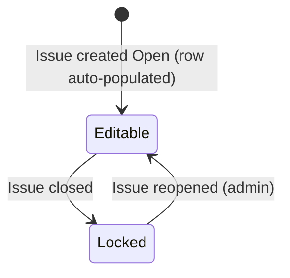
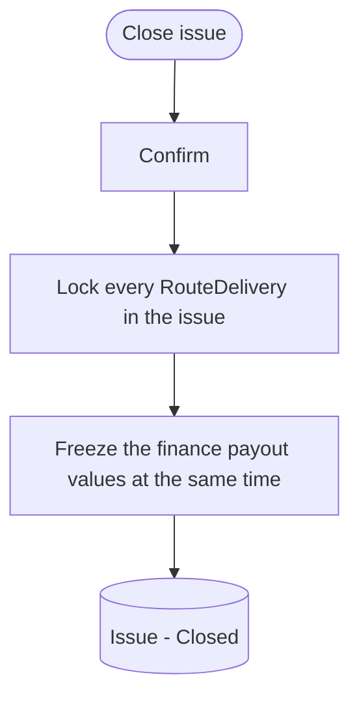

# Delivery Recording Flow

A prose-and-diagram walkthrough of how the distribution manager records what
actually happened for each publication run (issue): the per-route paper, bundle,
drop, and missed counts. This is the data that the finance payout math consumes
and that the reporting dashboard reads ("papers to order").

Scope: the shared Issue lifecycle (open / closed), the per-route-per-issue
delivery actuals (paper, bundle, drop, and missed counts), and the derived
"papers to order" total per issue.

Out of scope here and owned by other flows:

- Payout calculation, overrides, paid/unpaid, yearly tables, and captain pay
  substitution: finance flow. Delivery actuals are recorded here and
  consumed there.
- Route, territory, and volunteer definitions, and the standing house/paper/bundle
  counts per route: route management and people management. Read
  here, owned there.
- The reporting dashboard layout (papers to order, active counts, running cost):
  a separate reporting flow; it reads the totals derived here.
- Label printing: a separate flow.

Values that are not yet confirmed are marked `[OPEN]` and left for interpretation
later.

---

## 1. Object overview

**Issue (shared with finance).** One publication run (the paper goes out 1 to 3
times per month, about 23 per year). This is the _same_ Issue entity used by the
finance flow, not a copy: an issue is created once and appears in both the finance
yearly table and the delivery recording view, and both read and write the same
record. It moves from Open to Closed (canonical state machine in
`finances_flow.md` section 3a; restated in section 3 here for standalone
readability). An issue is created Open, which begins delivery recording and
auto-populates a delivery row for every active route; closing it locks both the
delivery actuals and the finance payouts together. Name and date are set manually.

**RouteDelivery.** The core entity of this flow: one record per route per issue.
It holds the actuals delivered on that route for that issue — paper count, bundle
count, drop count, and missed count. When the issue is created, each RouteDelivery
auto-populates from the route's standing counts (house count to paper count to
bundle auto-calc); the manager adjusts the figures to what actually happened.
Records are editable only while the issue is Open and are locked when it is Closed.
We store actuals only — there is no separate stored "assigned/planned" figure, so
the auto-populated standing count is just the editable starting value, not a
retained baseline.

- **Paper count.** Actual papers delivered on the route. Auto-populated from the
  route's standing paper count, then adjusted.
- **Bundle count.** Actual bundles, derived from the paper count via the bundle
  auto-calc (section 5), or entered manually.
- **Drop count.** Actual drops made on the route.
- **Missed count.** Units not delivered, recorded in the unit that matches the
  route's captain pay type (bundles, papers, or drops) — no cross-unit conversion,
  consistent with the finance flow. Reduces the captain's billable quantity.

**Standing route counts (referenced, owned by route management).** Per route:
house count (auto-calculated with a manual override) and the derived paper and
bundle counts. These seed each RouteDelivery when an issue is created. See
`route_management_flow.md` section 3b.

**Captain pay config (referenced, owned by people management).** Pay type and rate
on the captain. Determines the unit the missed count is recorded in and how the
route's delivery rolls up into pay. See `people_management_flow.md`.

**Papers to order (derived, per issue).** The total papers needed for the issue,
summed from the route paper counts. Feeds the reporting dashboard.

**Key relationships.**

- An Issue has many RouteDelivery records — one per active route.
- A RouteDelivery belongs to exactly one route and one issue.
- A RouteDelivery rolls up to a captain through route to volunteer to captain to
  territory, contributing to that captain's payout for the issue (finance flow).
- The Issue lifecycle is shared: creating and closing an issue affect delivery
  recording and finance payouts at the same time.

Two things have state: the Issue (Open, Closed) and a RouteDelivery's
editability, which is derived entirely from its issue's state.

---

## 2. Diagram legend

- Round / stadium shape = start or end of a flow
- Rectangle = an action or system step
- Diamond = a decision or branch
- Bracketed rectangle = a resulting state of the entity, e.g. `(Issue - Open)`

---

## 3. State machines

### 3a. Issue lifecycle (shared; canonical in the finance flow)

```mermaid
stateDiagram-v2
    [*] --> Open: Issue created (single or batch, in the finance table; recording starts, deliveries auto-populate)
    Open --> Closed: Close the issue (delivery actuals and payouts lock together)
    Closed --> Open: Reopen (admin correction)
```

**Open.** Recording is in progress. An issue is created directly in this state;
creating it auto-populates a RouteDelivery for every active route, and the manager
enters actuals progressively while it stays open. Payouts in finance recalculate
live over the same period.

**Closed.** The run is complete. Closing locks every RouteDelivery in the issue and
freezes the finance payout values at the same moment — there is a single close, not
one per flow. Reopening is a guarded admin correction.

### 3b. RouteDelivery editability (derived from the issue)



**Editable.** The issue is Open; the manager can adjust paper, bundle, drop, and
missed counts.

**Locked.** The issue is Closed; the row is frozen. As with finance, locked means
the value no longer auto-updates, but an admin can reopen the issue to correct it.

---

## 4. Flows

### 4a. Record and adjust route deliveries


When an issue is created, the system auto-populates a RouteDelivery for every route
currently being carried — Active-Assigned with the assigned volunteer not on
vacation — seeded from the route's standing paper count (and the bundle auto-calc
from it). Vacant and suspended routes are skipped (no row; they contribute nothing
to the issue). The delivery grid then lists one row per route for the issue. The
manager edits the actuals progressively while the issue is open. Changing the paper
count cascades a new bundle count via the auto-calc (section 5) unless the bundle
count was entered manually. The missed count is captured in the unit matching that
route's captain pay type. Saved counts feed the captain payout calculations in the
finance flow.

### 4b. Review the papers-to-order total

The delivery grid surfaces the issue's total papers to order, summed from the route
paper counts. This is the figure the reporting dashboard reads to drive ordering.

### 4c. Close the issue



Closing marks the run complete. It locks every delivery row and freezes the finance
payouts in one action — there is a single shared close, not a delivery close and a
finance close. After close, delivery actuals no longer auto-update; correcting them
requires a guarded admin reopen (which also reopens the finance side).

---

## 5. Calculations and derived values

Bundle auto-calc (paper count to bundles):

- Greedy: take 50s first, then 25s, then the remainder as a final tied bundle.
  Bundle paper counts are stored individually and never assumed to be 25 or 50.
  Manual entry of bundle counts is available as a fallback. This is the same
  auto-calc as the finance flow (`finances_flow.md` section 5); it lives on the
  delivery input and the finance payout reads the result.

Missed deduction:

- The missed count reduces the captain's billable quantity, measured in the same
  unit as that captain's pay type (bundles, papers, or drops). No cross-unit
  conversion. The payout math itself lives in the finance flow.

Rollup to captain payout:

- A captain's billable quantity for an issue aggregates the relevant counts across
  all routes in their territory (route to volunteer to captain). The per-route
  delivery actuals recorded here are the inputs; the per-captain payout is computed
  and shown in the finance flow.

Papers to order (per issue):

- Sum of the route paper counts for the issue.

---

## 6. State transition quick reference

**Issue (shared with finance).**

- (none) -> Open: issue created in the finance table (single or batch; delivery rows auto-populate; finance calc starts)
- Open -> Closed: close the issue (delivery actuals and payouts lock together)
- Closed -> Open: admin reopen (guarded; reopens both sides)

**RouteDelivery editability (derived from the issue).**

- Editable (issue Open) -> Locked (issue Closed)
- Locked -> Editable only via an admin reopen of the issue

---

## 7. Edge cases and open questions

- **One close, two effects.** There is a single shared close that locks delivery
  actuals and freezes finance payouts together; there is no separate per-flow close.
  Reopening is a guarded admin correction that reopens both.
- **Actuals only.** No planned/assigned figure is stored. The auto-populated
  standing count is the editable starting value, not a retained baseline, so P0
  does not surface planned-vs-actual variance.
- **Suspended routes (volunteer on vacation).** Suspension is a derived indicator
  on the route (its assigned volunteer is On-vacation), not a route state. A
  suppressed route is skipped: no delivery row is created, it is not delivered, its
  labels are suppressed, and it contributes nothing to the issue's totals or any
  payout. It resumes automatically when the vacation window ends.
- **Vacant routes.** A route with no assigned volunteer is not delivered and is
  likewise skipped (no delivery row).
- **Routes added or retired mid-year.** New active routes appear in the recording
  for subsequent issues; retired routes drop out of new issues. Already-closed
  issues are unaffected.
- **No unscoped messaging.** The needs-attention indicators inherited from the route
  and people flows are scoped; do not add other notifications or badges unless a
  spec calls for one.
