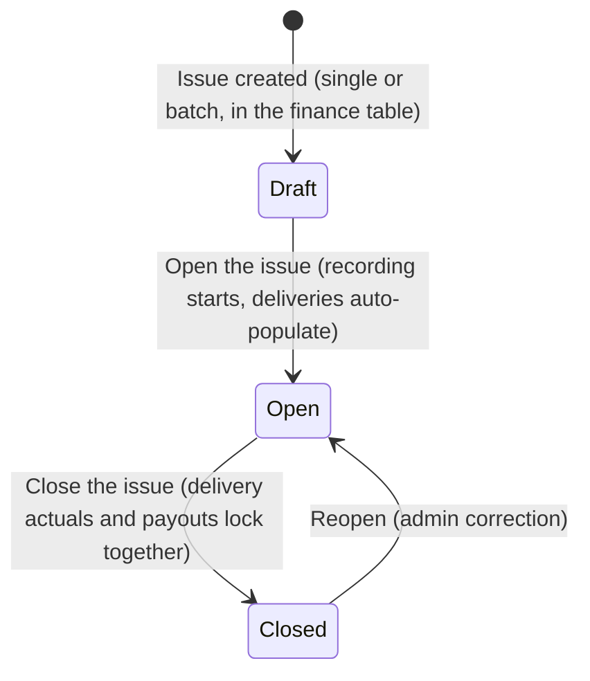
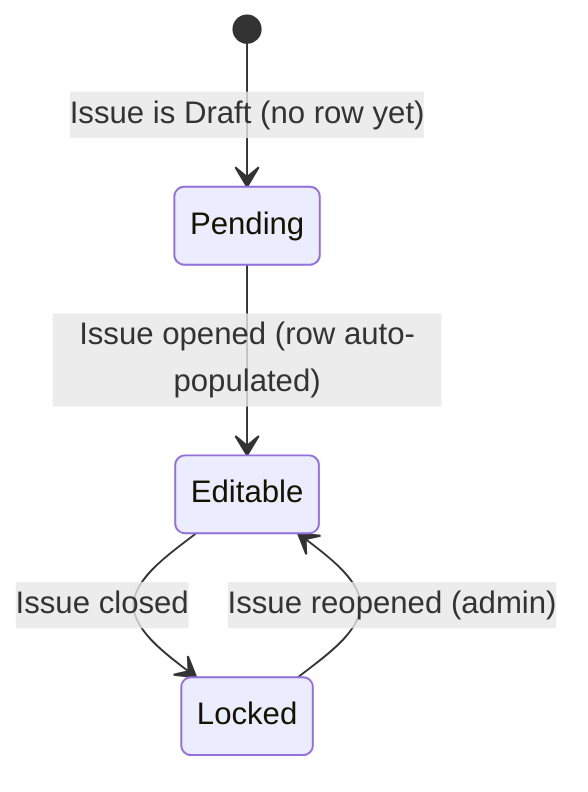
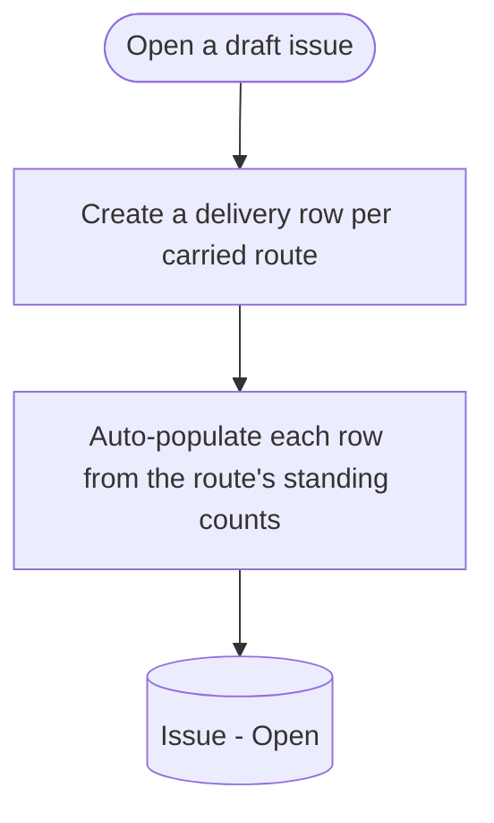
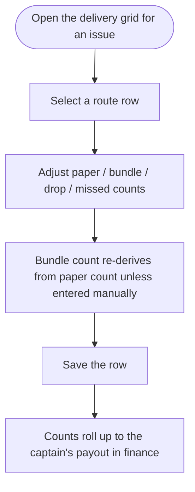
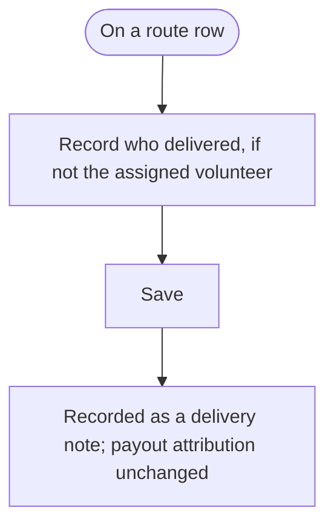

# Delivery Recording Flow

A prose-and-diagram walkthrough of how the distribution manager records what
actually happened for each publication run (issue): the per-route paper, bundle,
drop, and missed counts, plus any substitute deliverer. This is the data that the
finance payout math (BM-25) consumes and that the reporting dashboard reads
("papers to order"). Diagrams are Mermaid so they render in Notion, GitHub, and
most markdown viewers, and stay editable as text. This reuses the conventions
established by `route_management_flow.md` (BM-12); read that, `people_management_flow_v1.md`
(BM-24), and `finances_flow_v1.md` (BM-25) first.

Ticket: TBD (PRD Flow 5 — Issue Lifecycle & Delivery Recording). Scope: the shared
Issue lifecycle (draft / open / closed), the per-route-per-issue delivery actuals
(paper, bundle, drop, and missed counts), the optional route-level substitute
deliverer, and the derived "papers to order" total per issue.

Out of scope here and owned by other flows:
- Payout calculation, overrides, paid/unpaid, yearly tables, and captain pay
  substitution: finance flow (BM-25). Delivery actuals are recorded here and
  consumed there.
- Route, territory, and volunteer definitions, and the standing house/paper/bundle
  counts per route: route management (BM-12) and people management (BM-24). Read
  here, owned there.
- The reporting dashboard layout (papers to order, active counts, running cost):
  a separate reporting flow; it reads the totals derived here.
- Label printing: a separate flow (PRD Flow 6).

This flow owns the per-issue delivery inputs that the finance doc captured
provisionally in its section 6. When this spec merges, that section can be reduced
to a cross-reference.

Values that are not yet confirmed are marked `[OPEN]` and left for interpretation
later.

---

## 1. Object overview

**Issue (shared with finance).** One publication run (the paper goes out 1 to 3
times per month, about 23 per year). This is the *same* Issue entity used by the
finance flow, not a copy: an issue is created once and appears in both the finance
yearly table and the delivery recording view, and both read and write the same
record. It moves through Draft, Open, and Closed (canonical state machine in
`finances_flow_v1.md` section 3a; restated in section 3 here for standalone
readability). Opening an issue begins delivery recording and auto-populates a
delivery row for every active route; closing it locks both the delivery actuals
and the finance payouts together. Name and date are set manually.

**RouteDelivery.** The core entity of this flow: one record per route per issue.
It holds the actuals delivered on that route for that issue — paper count, bundle
count, drop count, and missed count — plus an optional substitute deliverer. When
the issue is opened, each RouteDelivery auto-populates from the route's standing
counts (house count to paper count to bundle auto-calc); the manager adjusts the
figures to what actually happened. Records are editable only while the issue is
Open and are locked when it is Closed. We store actuals only — there is no
separate stored "assigned/planned" figure, so the auto-populated standing count is
just the editable starting value, not a retained baseline.

- **Paper count.** Actual papers delivered on the route. Auto-populated from the
  route's standing paper count, then adjusted.
- **Bundle count.** Actual bundles, derived from the paper count via the bundle
  auto-calc (section 5), or entered manually.
- **Drop count.** Actual drops made on the route.
- **Missed count.** Units not delivered, recorded in the unit that matches the
  route's captain pay type (bundles, papers, or drops) — no cross-unit conversion,
  consistent with the finance flow. Reduces the captain's billable quantity.
- **Substitute deliverer (optional).** Who actually delivered this route this
  issue when it was not the assigned volunteer (for example a neighbour covering).
  This is a delivery-side note only: it does not change payout attribution (pay
  follows the captain, not the route's deliverer) and is separate from the finance
  captain substitution. Stored as a free-text note, since informal coverers (a
  neighbour) are not necessarily in the system.

**Standing route counts (referenced, owned by route management).** Per route:
house count (auto-calculated with a manual override) and the derived paper and
bundle counts. These seed each RouteDelivery when an issue opens. See
`route_management_flow.md` section 3b.

**Captain pay config (referenced, owned by people management).** Pay type and rate
on the captain. Determines the unit the missed count is recorded in and how the
route's delivery rolls up into pay. See `people_management_flow_v1.md`.

**Papers to order (derived, per issue).** The total papers needed for the issue,
summed from the route paper counts. Feeds the reporting dashboard. `[OPEN]` whether
a spare / office allowance is added on top.

**Key relationships.**
- An Issue has many RouteDelivery records — one per active route.
- A RouteDelivery belongs to exactly one route and one issue.
- A RouteDelivery rolls up to a captain through route to volunteer to captain to
  territory, contributing to that captain's payout for the issue (finance flow).
- The Issue lifecycle is shared: opening and closing affect delivery recording and
  finance payouts at the same time.

Two things have state: the Issue (Draft, Open, Closed) and a RouteDelivery's
editability, which is derived entirely from its issue's state.

---

## 2. Diagram legend

Same conventions as the route and finance flows:
- Round / stadium shape = start or end of a flow
- Rectangle = an action or system step
- Diamond = a decision or branch
- Bracketed rectangle = a resulting state of the entity, e.g. `(Issue - Open)`

State diagrams use Mermaid stateDiagram-v2; flow diagrams use flowchart TD.

---

## 3. State machines

### 3a. Issue lifecycle (shared; canonical in the finance flow)

**Draft.** The issue exists (created in the finance yearly table, single or batch)
but is not yet being recorded. No RouteDelivery rows are active yet.

**Open.** Recording is in progress. Opening the issue creates and auto-populates a
RouteDelivery for every active route; the manager enters actuals progressively
while it stays open. Payouts in finance recalculate live over the same period.

**Closed.** The run is complete. Closing locks every RouteDelivery in the issue and
freezes the finance payout values at the same moment — there is a single close, not
one per flow. Reopening is a guarded admin correction.

### 3b. RouteDelivery editability (derived from the issue)

**Pending.** The issue is Draft; the route has no delivery row yet.

**Editable.** The issue is Open; the manager can adjust paper, bundle, drop, and
missed counts and note a substitute deliverer.

**Locked.** The issue is Closed; the row is frozen. As with finance, locked means
the value no longer auto-updates, but an admin can reopen the issue to correct it.

---

## 4. Flows

### 4a. Open an issue for recording

Opening a draft issue starts recording. The system creates a RouteDelivery for
every route currently being carried — Active-Assigned with the assigned volunteer
not on vacation — and seeds each with the route's standing paper count (and the
bundle auto-calc from it). Vacant routes and suspended routes are skipped (no row;
they contribute nothing to the issue). This is the same open action as the finance
flow — it also starts live payout calculation there.

### 4b. Record and adjust route deliveries

The delivery grid lists one row per route for the issue. The manager edits the
actuals progressively while the issue is open. Changing the paper count cascades a
new bundle count via the auto-calc (section 5) unless the bundle count was entered
manually. The missed count is captured in the unit matching that route's captain
pay type. Saved counts feed the captain payout calculations in the finance flow.

### 4c. Note a substitute deliverer

When someone other than the route's assigned volunteer delivered it for this issue,
the manager records that on the route's delivery row. It is a record of what
happened on the ground; it does not reassign the captain payout (that is the
finance captain substitution, a separate action). The deliverer is stored as a
free-text note, since informal coverers are not necessarily in the system.

### 4d. Review the papers-to-order total

The delivery grid surfaces the issue's total papers to order, summed from the route
paper counts. This is the figure the reporting dashboard reads to drive ordering.
`[OPEN]` whether a spare / office allowance is added on top of the route sum.

### 4e. Close the issue

Closing marks the run complete. It locks every delivery row and freezes the finance
payouts in one action — there is a single shared close, not a delivery close and a
finance close. After close, delivery actuals no longer auto-update; correcting them
requires a guarded admin reopen (which also reopens the finance side).

---

## 5. Calculations and derived values

Bundle auto-calc (paper count to bundles):
- Greedy: take 50s first, then 25s, then the remainder as a final tied bundle.
  Bundle paper counts are stored individually and never assumed to be 25 or 50.
  Manual entry of bundle counts is available as a fallback. This is the same
  auto-calc as the finance flow (`finances_flow_v1.md` section 5); it lives on the
  delivery input and the finance payout reads the result.

Missed deduction:
- The missed count reduces the captain's billable quantity, measured in the same
  unit as that captain's pay type (bundles, papers, or drops). No cross-unit
  conversion. The payout math itself lives in the finance flow.

Rollup to captain payout:
- A captain's billable quantity for an issue aggregates the relevant counts across
  all routes in their territory (route to volunteer to captain). The per-route
  delivery actuals recorded here are the inputs; the per-captain payout is computed
  and shown in the finance flow.

Papers to order (per issue):
- Sum of the route paper counts for the issue. `[OPEN]` whether a spare / office
  allowance is added. Feeds the reporting dashboard.

---

## 6. State transition quick reference

**Issue (shared with finance).**
- (none) -> Draft: issue created in the finance table (single or batch)
- Draft -> Open: open the issue (delivery rows auto-populate; finance calc starts)
- Open -> Closed: close the issue (delivery actuals and payouts lock together)
- Closed -> Open: admin reopen (guarded; reopens both sides)

**RouteDelivery editability (derived from the issue).**
- Pending (issue Draft) -> Editable (issue Open) -> Locked (issue Closed)
- Locked -> Editable only via an admin reopen of the issue

---

## 7. Edge cases and open questions

- **One close, two effects.** There is a single shared close that locks delivery
  actuals and freezes finance payouts together; there is no separate per-flow close.
  Reopening is a guarded admin correction that reopens both.
- **Actuals only.** No planned/assigned figure is stored. The auto-populated
  standing count is the editable starting value, not a retained baseline, so v1
  does not surface planned-vs-actual variance.
- **Suspended routes (volunteer on vacation).** Suspension is a derived indicator
  on the route (its assigned volunteer is On-vacation), not a route state. A
  suppressed route is skipped: no delivery row is created, it is not delivered, its
  labels are suppressed, and it contributes nothing to the issue's totals or any
  payout. It resumes automatically when the vacation window ends.
- **Vacant routes.** A route with no assigned volunteer is not delivered and is
  likewise skipped (no delivery row).
- **Substitute deliverer.** A delivery-side free-text note only; does not change
  payout attribution and is separate from the finance captain substitution.
- **Routes added or retired mid-year.** New active routes appear in the recording
  for subsequent issues; retired routes drop out of new issues. Already-closed
  issues are unaffected.
- **Papers to order allowance.** `[OPEN]` whether a spare / office count is added on
  top of the route sum.
- **No unscoped messaging.** The needs-attention indicators inherited from the route
  and people flows are scoped; do not add other notifications or badges unless a
  spec calls for one.
