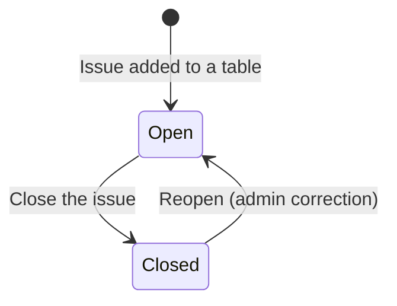
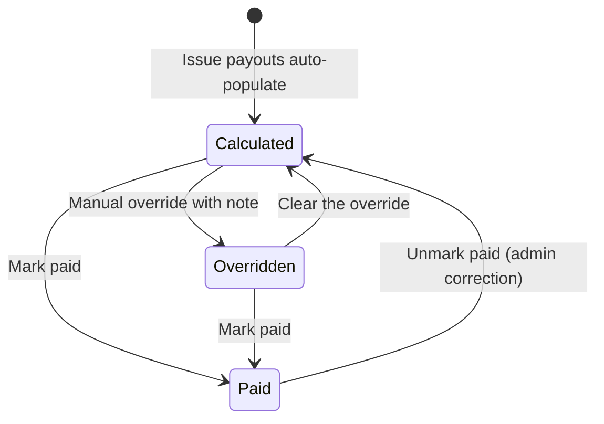
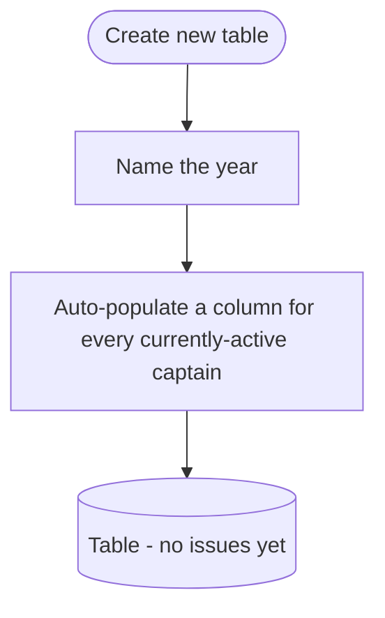
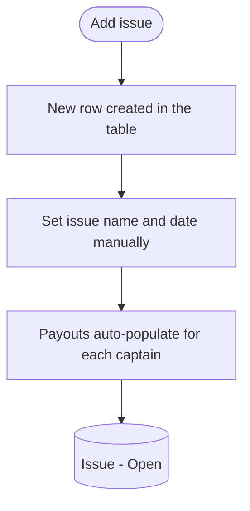
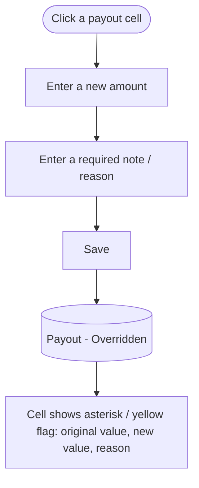
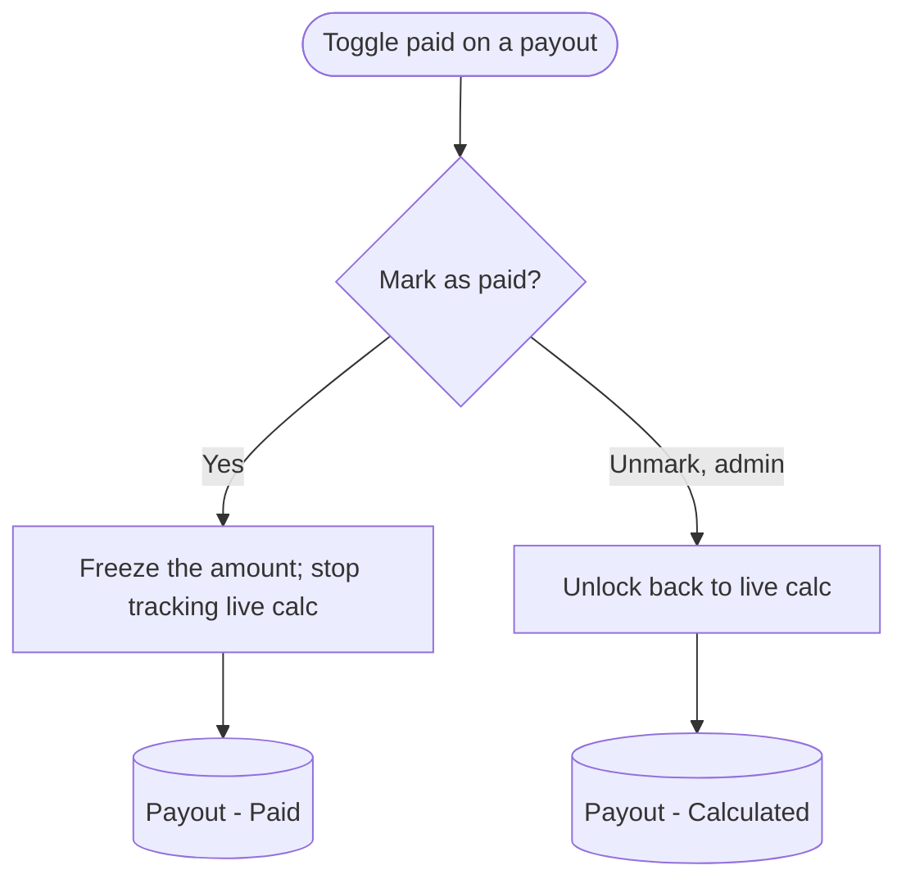
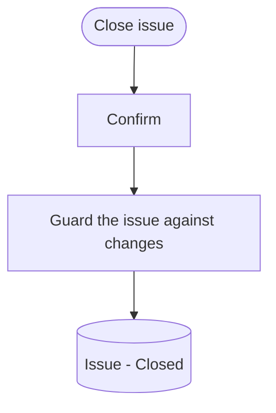
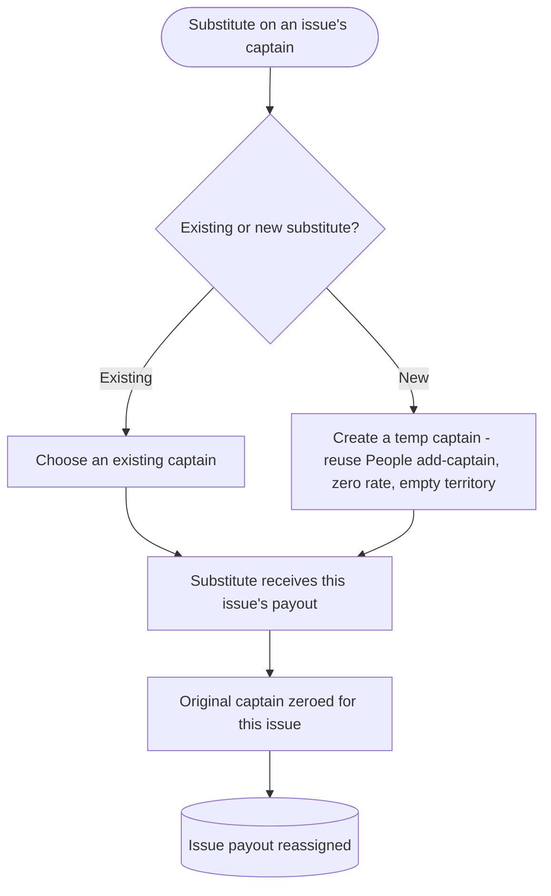

# Finance Management Flow

A prose-and-diagram walkthrough of how the accounts manager runs captain payments: organizing issues into yearly tables, computing per-captain payouts, overriding and marking them paid, and handling captain substitutions. Diagrams are Mermaid so they render in Notion, GitHub, and most markdown viewers, and stay editable as text. This reuses the conventions established by `route_management_flow.md` (BM-12); read that and `people_management_flow_v1.md` (BM-24) first.

Ticket: BM-25. Scope: the financial year "tables", issues, captain payouts (calculation, override, paid/unpaid), captain substitution for payment, and the per-issue delivery inputs the payout math consumes.

Out of scope here and owned by other flows:
- Captain and volunteer profiles, and the captain pay config (pay type, rate, cadence): people management flow (BM-24). Set there, consumed here.
- Route definition and assignment: route management flow (BM-12).
- The reporting dashboard (papers to order, running cost, active counts): a separate reporting flow; its cost figures tie back to the payouts computed here.

Calculations that are not yet confirmed are marked `[OPEN]` and left blank for interpretation later, per the client's note that some formulas are still being reverse-engineered.

---

## 1. Object overview

**Financial year (table).** A yearly grouping of issues, shown as one table. Created by naming the year; on creation it auto-populates a column for every captain who is active at that moment. The accounts manager's year runs roughly March to February and is not locked to the calendar year, so a table can be created or archived at any time. Holds up to about 23 issues. Archived tables stay fully accessible.

**Issue.** One publication run (the paper goes out 1 to 3 times per month, about 23 per year). An issue is a row in a table; its name and date are set manually (labeled by date/week, for example I01 / I02 with a year suffix, or "June 9" and "June 23"), not by an auto number. An issue has an open/closed status: closing it prevents further change to that completed run.

**CaptainPayout.** One cell per captain per issue: the reimbursement amount for that captain on that issue. It is auto-calculated from the captain's pay config and the issue's delivery inputs, can be manually overridden, and carries a paid/unpaid status. Marking it paid locks the value permanently so it no longer tracks the live calculation (this replaces the spreadsheet's copy-paste-of-formula-results).

**Captain pay config (referenced, owned by people management).** Pay type (per bundle, per paper, or per drop), a rate, and a pay cadence. Stored on the captain, not the route. Edited in the people management flow and consumed here. A captain with a zero rate is still tracked for bundle and paper counts (used in paper reporting) but pays out zero.

**Delivery inputs (RouteDelivery, consumed; see section 6).** Per route per issue: paper count, bundle count, drop count, and a missed count. These feed the payout math. Bundle counts come from paper counts via the bundle auto-calc (section 5).

**Substitute captain.** A stand-in who receives a captain's payout for an issue. Modeled as a regular captain created on the spot via the people add-captain flow (zero rate, empty territory by default). Finance-only for now: the substitute is paid for the issue and the original captain is zeroed for that issue; routes and territory are untouched. (Subject to change.)

**Key relationships.**
- A table contains many issues (rows) and a column per captain; each (issue, captain) pair is one CaptainPayout cell.
- A CaptainPayout is computed from one captain's pay config and that issue's delivery inputs for the captain's territory.
- Pay config lives on the captain (people management); payouts and their history live here.
- A substitution redirects a single issue's payout from the original captain to the substitute.

Two state machines matter: the Issue (Open, Closed) and the CaptainPayout (Calculated, Overridden, Paid). They are surfaced separately.

---

## 2. Diagram legend

Same conventions as the route management flow:
- Round / stadium shape = start or end of a flow
- Rectangle = an action or system step
- Diamond = a decision or branch
- Bracketed rectangle = a resulting state of the entity, e.g. `(Payout - Paid)`

State diagrams use Mermaid stateDiagram-v2; flow diagrams use flowchart TD.

---

## 3. State machines

### 3a. Issue status

**Open.** The run is in progress. Delivery inputs and payouts can still change; payouts recalculate live.

**Closed.** The run is complete. Closing guards the issue against further change. Reopening is an admin correction and should be guarded; whether it is allowed once any payout is paid is `[OPEN]`.

### 3b. Captain payout status

**Calculated.** The amount is computed live from pay config + delivery inputs. A breakdown is viewable (for example 16 bundles x $1.25 = $20).

**Overridden.** The accounts manager entered a manual amount with a required note. The cell is flagged (asterisk / yellow) and shows the original value, the new value, and the reason. Still unpaid until marked paid.

**Paid.** Locked: the amount is frozen and no longer tracks the live calculation, even if delivery inputs or rates later change. Unmarking paid is an admin correction (guarded); the client describes paid as permanent, so this transition should be rare and confirmed. `[OPEN]` whether unmark is allowed at all.

---

## 4. Flows

### 4a. Create a yearly table

Entry: Create new table on the finance page. Naming the year creates the table and snapshots the set of active captains into columns. Tables are independent of the calendar year and can be created or archived at any time. New captains added later (people management) appear in subsequent issues; retired captains stop appearing in new issues.

### 4b. Add an issue

Entry: Add issue button. A new row appears; the manager sets the issue name/date. Each captain's payout cell auto-populates from their pay config and the issue's delivery inputs (section 6). The issue starts Open.

### 4c. Review a captain payout

Data view per cell. Clicking a payout shows the calculation breakdown (quantity x rate, with any missed-drop deduction). Zero-rate captains still show their bundle/paper counts even though the amount is zero. Actions on a cell: Override (4d), Mark paid / unpaid (4e).

### 4d. Manual override a payout

Override is how irregular cases are handled without special-casing the model: captains who invoice externally or self-calculate (for example Wally), donate-back arrangements, or legacy mixed rates. The override carries a note and keeps the original calculated value visible alongside the new one. The exact external formulas (for example Wally's invoice) are not computed by the system; they are entered as overrides. `[OPEN]` any rounding or validation rules on override amounts.

### 4e. Mark a payout paid or unpaid

Marking paid locks the amount permanently (the legacy spreadsheet showed this as yellow highlighting). A paid payout no longer changes if rates or delivery inputs change later. Unmarking is a guarded admin correction (see 3b). Paid/unpaid is tracked per captain per issue.

### 4f. Close an issue

Closing marks a run complete and prevents further edits to its delivery inputs and payouts. Paid payouts are already locked individually (4e); closing guards the whole issue. Reopening is an admin correction.

### 4g. Captain substitution (finance-only, subject to change)

For a given issue, the manager assigns a substitute who receives that issue's payout while the original captain is zeroed for that issue only. The substitute is either an existing captain or a temporary one created on the spot through the people add-captain flow (zero rate, empty territory by default). A substitution can span multiple issues (for example surgery recovery); reverting to the original captain is handled manually for now. Routes and territory are not changed by a substitution. This placement is finance-only and `[OPEN] / subject to change` (it may later also touch routes).

### 4h. Filter, compact, and export

Data view. The table supports filtering by paid/unpaid, by date range, and toggling captain visibility (a compact view). Export to CSV / spreadsheet is available for any table or filtered view. Export is read-only.

### 4i. Archive and historical access

A table can be archived; archived tables remain fully accessible and intact for historical lookup and budget planning. Historical years predating the system are migrated by manual entry from cloud backups (`[OPEN]` migration mechanics).

---

## 5. Calculations

Confirmed math:
- **Per bundle:** billable bundle count x rate.
- **Per paper:** paper count x rate.
- **Per drop:** drop count x rate.
- **Each bundle counts as one** for per-bundle pay regardless of its size. Example: 70 papers becomes a 50-bundle plus a 20-paper bundle, which is 2 bundles, paid as 2.
- **Missed-drop deduction:** the missed count reduces the billable quantity. Example: 20 bundles with 3 missed pays for 17. `[OPEN]` exactly how missed applies to per-paper and per-drop pay.
- **Zero-rate captains:** counts are tracked, amount is zero.

Bundle auto-calc (paper count to bundles):
- Greedy: take 50s first, then 25s, then the remainder as a final tied bundle. Bundle paper counts are stored individually and never assumed to be 25 or 50 (some 25/50 bundles are labeled, some are not).
- `[OPEN]` verify the greedy split is actually optimal for cost; an alternative is manual entry of bundle counts. The client leans toward auto-calculation so counts cascade when paper counts change.

Not computed by the system (entered via override, 4d):
- External / self-invoiced captains (for example Wally): `[OPEN]` exact formula, intentionally not modeled.
- Donate-back (for example a $0.50 rate returned as effectively $0) and legacy mixed rates (for example Surge's shared-route history): handled by the per-captain rate plus override; `[OPEN]` specifics to resolve during transition.

Disbursement cadence:
- Payouts are computed and tracked per issue. Captains are paid on different cadences (some bi-weekly, most monthly after the final issue of the month). Aggregating per-issue payouts into a single disbursement is `[OPEN]` / a post-MVP refinement; the per-issue payout is the unit of record.

---

## 6. Delivery and bundle inputs (consumed here, documented to retain context)

The payout math consumes per-issue delivery data that conceptually belongs to the route/delivery side (the distribution manager's work). There is no dedicated delivery doc yet, so the inputs are captured here so the context is not lost; they can move to a route/delivery flow later.

Per route, per issue:
- **Paper count** (drives the bundle auto-calc and per-paper pay).
- **Bundle count** (from the auto-calc, or manual entry).
- **Drop count** (per-drop pay; commercial and residential drops are not tracked differently).
- **Missed count** (deducted from the billable quantity).

These roll up per captain (across the routes/territory they cover) into that captain's payout for the issue. The system is also expected to provide the total papers to order per issue, which feeds the reporting dashboard.

---

## 7. State transition quick reference

**Issue.**
- (none) -> Open: issue added to a table
- Open -> Closed: close the issue (guards it against changes)
- Closed -> Open: admin reopen (guarded; `[OPEN]` whether allowed once any payout is paid)

**Captain payout.**
- (none) -> Calculated: auto-populates when the issue is added
- Calculated <-> Overridden: manual override with a note (flagged), or clear it
- Calculated or Overridden -> Paid: mark paid (locks the amount permanently)
- Paid -> Calculated: admin unmark (guarded; `[OPEN]`)

Substitution (finance-only): an issue's payout is redirected from the original captain to a substitute, and the original is zeroed for that issue.

---

## 8. Edge cases and open questions

- **Paid locks permanently.** A paid payout stops tracking the live calculation; later changes to rates or delivery inputs do not affect it. Unmarking is a guarded admin correction.
- **Override keeps history.** An overridden cell shows the original value, the new value, and the reason, so the change is auditable.
- **External / self-invoiced captains.** Not auto-computed; entered as overrides. The system only needs adjustable rates plus override, not a special flag.
- **Zero-rate captains.** Still tracked for bundle/paper counts (paper reporting) even though they pay out zero; some captains decline reimbursement.
- **Substitution scope.** Finance-only for now (payout reassignment); may span multiple issues with manual revert. `[OPEN] / subject to change` whether it should also reassign route/territory coverage.
- **No unscoped messaging.** The paid highlight, override flag, and breakdown popover are explicit, scoped indicators called for by the design. Do not add other notifications or badges unless a spec calls for one.
- **`[OPEN]` calculations.** Greedy bundle optimality; missed-drop handling for per-paper/per-drop pay; rounding rules; legacy mixed-rate and donate-back specifics; disbursement aggregation by cadence; historical data migration mechanics. Left blank for interpretation once the client's formulas are confirmed.
