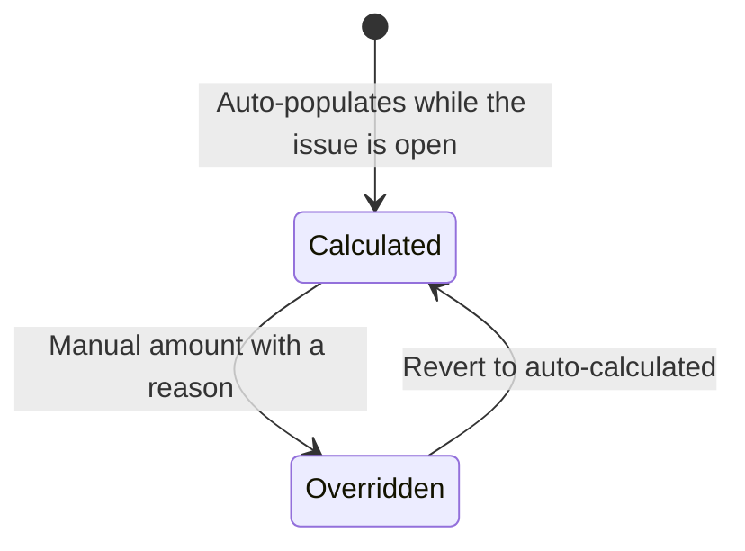
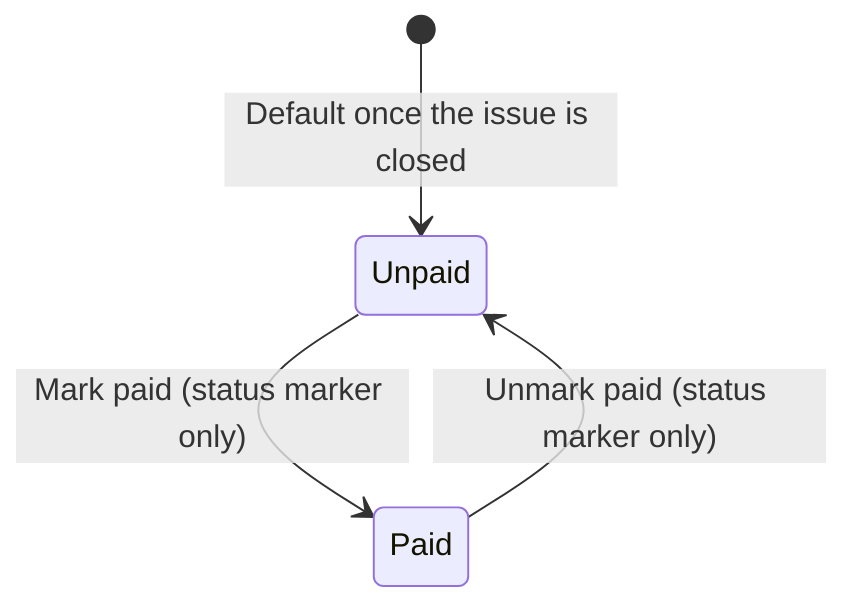
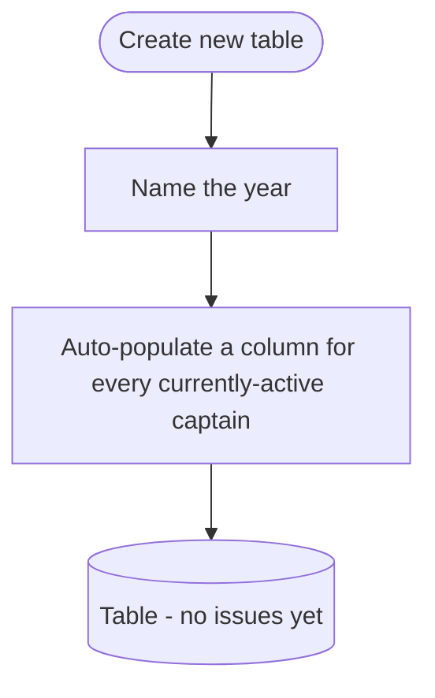
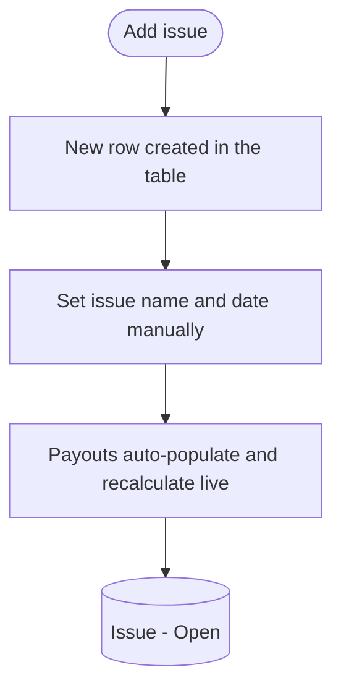
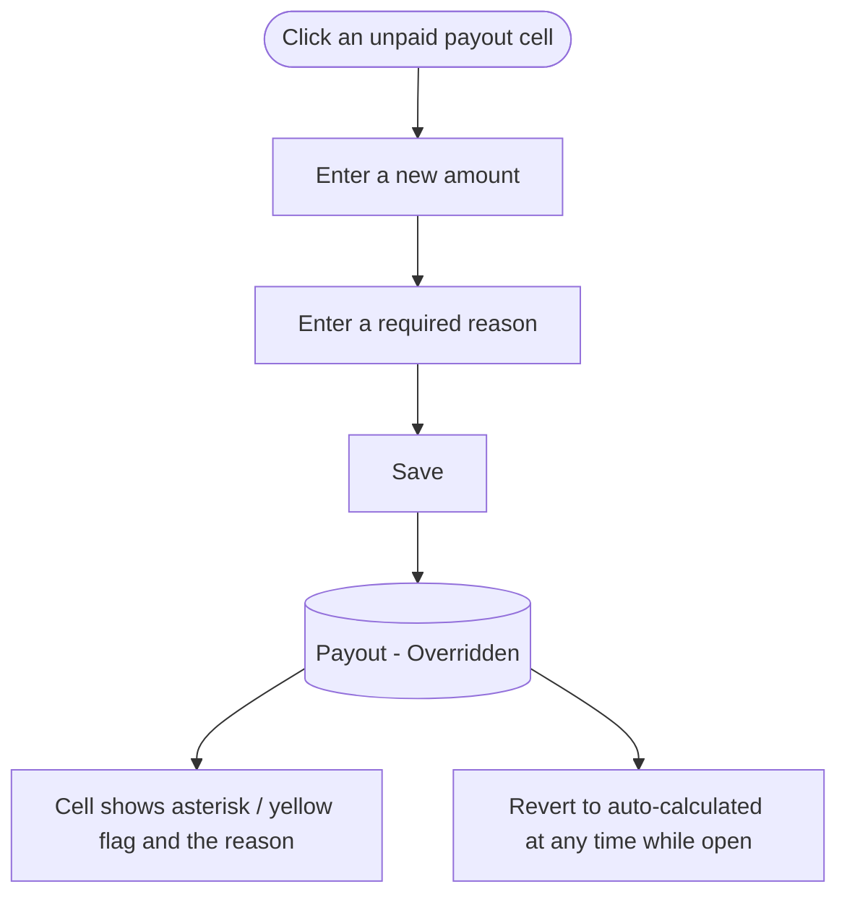
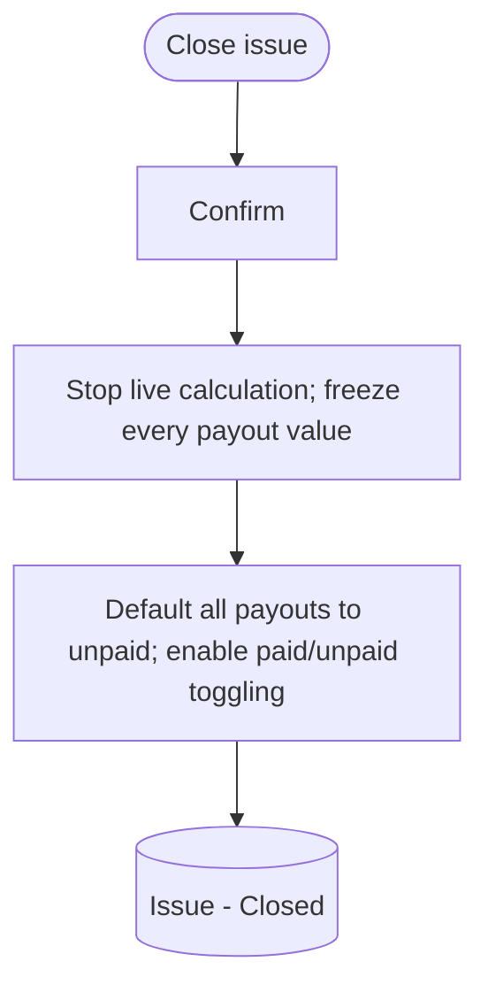
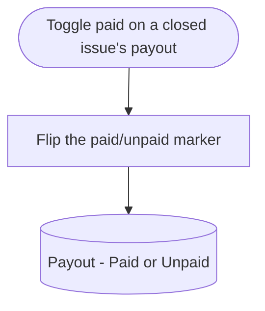
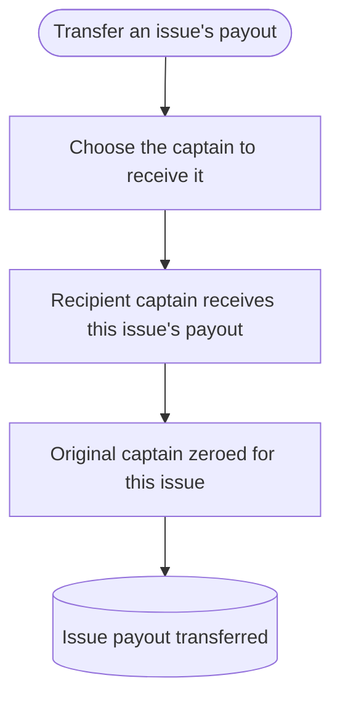

# Finance Management Flow

A prose-and-diagram walkthrough of how the accounts manager runs captain payments: organizing issues into yearly tables, computing per-captain payouts, overriding and marking them paid, and transferring a payout to another captain.

Out of scope here and owned by other flows:

- Captain and volunteer profiles, and the captain pay config (pay type, rate, cadence): people management flow.
- Route definition and assignment: route management flow.
- The reporting dashboard (papers to order, running cost, active counts): a separate reporting flow; its cost figures tie back to the payouts computed here.

Calculations that are not yet confirmed are marked `[OPEN]` and left blank for interpretation later, as some formulas are still being reverse-engineered.

---

## 1. Object overview

**Financial year (table).** A yearly grouping of issues, shown as one table. Created by naming the year; on creation it auto-populates a column for every captain who is active at that moment. The accounts manager's year runs roughly March to February and is not locked to the calendar year, so a table can be created or archived at any time. Archived tables stay fully accessible.

**Issue.** One publication run (the paper goes out 1 to 3 times per month, about 23 per year). An issue is a row in a table; its name and date are set manually (labeled by date/week, for example I01 / I02 with a year suffix, or "June 9" and "June 23"), not by an auto number. An issue moves from Open to Closed: it is created Open and closed manually when complete. Multiple issues can be Open at once, and adding a new issue never closes a prior one — closing is always a manual action. Payouts calculate live while the issue is Open; closing stops the calculation and locks the values.

**CaptainPayout.** One cell per captain per issue: the reimbursement amount for that captain on that issue. While the issue is Open it is auto-calculated live from the captain's pay config and the issue's delivery inputs, and it can be manually overridden. Closing the issue stops the calculation and freezes the cell's value so it no longer auto-updates (this replaces the spreadsheet's copy-paste-of-formula-results). A cell can be edited as long as it is unpaid; marking it paid locks it from any further edits. A separate paid/unpaid marker records whether the captain has been paid; it only becomes toggleable once the issue is closed and does not itself change the amount.

**Captain pay config (referenced, owned by people management).** Pay type (per bundle, per paper, or per drop), a rate, and a pay cadence (weekly or bi-weekly). Stored on the captain, not the route. Edited in the people management flow and consumed here. The cadence is informational only; the system does not aggregate per-issue payouts into scheduled disbursements. A captain with a zero rate is still tracked for bundle and paper counts (used in paper reporting) but pays out zero.

**Delivery inputs (RouteDelivery, consumed).** Per route per issue: paper count, bundle count, drop count, and a missed count. These feed the payout math. Bundle counts come from paper counts via the bundle auto-calc (section 5).

**Key relationships.**

- A table contains many issues (rows) and a column per captain; each (issue, captain) pair is one CaptainPayout cell.
- A CaptainPayout is computed from one captain's pay config and that issue's delivery inputs for the captain's territory.
- Pay config lives on the captain (people management); payouts and their history live here.
- A transfer of payment redirects a single issue's payout from the original captain to another captain (acting as a substitute).

Three status dimensions matter and are surfaced separately: the issue lifecycle (Open, Closed), the payout's calculation status (Calculated, Overridden), and the payout's payment status (Unpaid, Paid). Calculation is driven by the issue's open/closed state, not by payment status; the paid/unpaid marker only becomes toggleable once the issue is closed and never changes the amount.

---

## 2. Diagram legend

- Round / stadium shape = start or end of a flow
- Rectangle = an action or system step
- Diamond = a decision or branch
- Bracketed rectangle = a resulting state of the entity, e.g. `(Payout - Paid)`

---

## 3. State machines

### 3a. Issue lifecycle

```mermaid
stateDiagram-v2
    [*] --> Open: Issue created (single or batch); calculations start
    Open --> Closed: Close the issue (calculations stop, values lock)
    Closed --> Open: Reopen (admin correction)
```

**Open.** The run is in progress. An issue is created directly in this state. Delivery inputs and payouts can change; payouts recalculate live from pay config + delivery inputs. Multiple issues can be Open at the same time without conflict, and every Open issue's cells stay attached to the live formula — so identical pay config and delivery inputs produce the same amount across cells.

**Closed.** The run is complete. Closing stops the live calculation and freezes every payout value in the issue (frozen means a value no longer auto-updates from the live calculation, though the manager can still manually override an unpaid cell), then makes the paid/unpaid marker toggleable (defaulting to unpaid). Reopening is a guarded admin correction (it also reopens the shared delivery recording).

### 3b. Captain payout — calculation status

**Calculated.** The amount is computed live from pay config + delivery inputs while the issue is open. A breakdown is viewable (for example 16 bundles x $1.25 = $20).

**Overridden.** The accounts manager entered a manual amount with a required reason. The cell is flagged (asterisk / yellow) and shows the reason. It does not store or audit the previously calculated value. An overridden cell can be reverted to auto-calculated at any time while the issue is open.

When the issue closes, whichever value is current (calculated or overridden) is frozen — it stops auto-updating from the live calculation, but the manager can still manually override the cell while it is unpaid.

### 3c. Captain payout — payment status

**Unpaid / Paid.** A pure status marker recording whether the captain has been paid. It only becomes toggleable once the issue is closed, defaults to unpaid at that point, and never changes the payout amount. While a cell is paid it is locked from edits; unmark it to edit again.

---

## 4. Flows

### 4a. Create a yearly table

Entry: Create new table on the finance page. Naming the year creates the table and snapshots the set of active captains into columns. Tables are independent of the calendar year and can be created or archived at any time. New captains added later (people management) appear in subsequent issues; retired captains stop appearing in new issues.

### 4b. Add issues (single or batch)

Entry: Add issue button. A new row appears and the manager sets the issue name/date. New issues are created Open, and their payout cells begin auto-calculating immediately from each captain's pay config and the issue's delivery inputs. A whole year can be laid out by adding many issues; each is Open from creation and can sit alongside other Open issues without conflict. Adding an issue never closes any existing one — closing is always manual (4e).

### 4c. Review a captain payout

Data view per cell. Clicking a payout shows the calculation breakdown (quantity x rate, with any missed deduction). Zero-rate captains still show their bundle/paper counts even though the amount is zero. Actions on a cell: Override (4d); and once the issue is closed, Mark paid / unpaid (4f).

### 4d. Manual override a payout

Override is how irregular cases are handled without special-casing the model: captains who calculate their own amount, donate-back arrangements, and legacy mixed rates are all just entered directly in the cell. A cell can be overridden as long as it is unpaid — while the issue is Open the override sits on top of the live calculation (and can be reverted to it); after close the value is frozen but an unpaid cell is still manually editable. Marking the cell paid locks it from further edits. The override carries a required reason but does not store or audit the previously calculated value. `[OPEN]` any rounding or validation rules on override amounts.

### 4e. Close an issue

Closing marks a run complete. It stops the live calculation and freezes every payout value in the issue, so later changes to rates or delivery inputs no longer affect it. Frozen means the value stops auto-updating from the live calculation; the manager can still manually override a frozen cell while it is unpaid. Closing is the only thing that detaches the numbers from the live formula — marking a payout paid is what locks an individual cell against further edits. Closing is always manual; adding a new issue never closes an open one. On close, all payouts default to unpaid and the paid/unpaid marker becomes toggleable (4f). Reopening a closed issue is a guarded admin correction.

### 4f. Mark a payout paid or unpaid

Once the issue is closed, each payout can be marked paid or unpaid. This is a status marker tracked per captain per issue — it records whether the captain has been paid and changes nothing about the amount (the value is already frozen by the close). Marking a cell paid also locks it from further edits; unmark it to edit again. Paid/unpaid cannot be toggled while an issue is Open.

### 4g. Transfer a payout to another captain

For a given issue, the manager can transfer a captain's payout to another captain, who then receives that issue's payout while the original captain is zeroed for that issue only. This covers stand-in situations (for example a captain is away and another covers their territory). The transfer is finance-only: it redirects the money for that one issue and does not change routes or territory. The transfer can be repeated per issue if a stand-in covers several issues; reverting to the original captain is handled manually.

### 4h. Filter, compact, and export

Data view. The table supports filtering by paid/unpaid, by date range, and toggling captain visibility (a compact view). Export to CSV / spreadsheet is available for any table or filtered view. Export is read-only.

### 4i. Archive and historical access

A table can be archived; archived tables remain fully accessible and intact for historical lookup and budget planning. Historical years predating the system are migrated by manual entry from cloud backups (`[OPEN]` migration mechanics).

---

## 5. Calculations

Confirmed math:

- **Per bundle:** bundle count x rate.
- **Per paper:** paper count x rate.
- **Per drop:** drop count x rate.
- **Each bundle counts as one** for per-bundle pay regardless of its size. Example: 70 papers becomes a 50-bundle plus a 20-paper bundle, which is 2 bundles, paid as 2.
- **Missed deduction:** the missed count reduces the billable quantity, measured in the same unit as the pay type. Per-bundle pay deducts missed bundles, per-paper pay deducts missed papers, per-drop pay deducts missed drops. Example: 20 bundles with 3 missed pays for 17.
- **Zero-rate captains:** counts are tracked, amount is zero.

Bundle auto-calc (paper count to bundles):

- Greedy: take 50s first, then 25s, then the remainder as a final tied bundle. Each bundle's paper count is stored individually (`RouteBundle`) and never assumed to be 25 or 50 (some 25/50 bundles are labeled, some are not); the greedy split seeds them and they are hand-editable, with the bundle count derived from them. The bundles always sum to the route's paper count, and changing the paper count reseeds the split unless the bundles were entered manually.

Irregular cases (entered directly via override, 4d):

- Captains who calculate their own amount, donate-back arrangements, and legacy mixed rates are all handled by editing the cell directly rather than by a special formula or flag. There is no separate external / self-invoiced model.

Pay cadence:

- Captains are paid weekly or bi-weekly (cadence stored on the captain in people management). The cadence is informational only — the system does not aggregate per-issue payouts into scheduled disbursements. The per-issue payout is the unit of record.

---

## 6. State transition quick reference

**Issue.**

- (none) -> Open: issue created (single or batch); calculations start
- Open -> Closed: close the issue (calculations stop, values lock, payouts default unpaid)
- Closed -> Open: admin reopen (guarded; reopens the shared delivery recording too)

**Captain payout — calculation status.**

- (none) -> Calculated: auto-populates when the issue is opened
- Calculated <-> Overridden: manual amount with a reason (flagged), or revert to auto-calculated
- value freezes when the issue is closed (whichever of calculated / overridden is current)

**Captain payout — payment status.**

- Unpaid (default once the issue is closed) <-> Paid: pure status marker, only toggleable when the issue is closed, never changes the amount; marking paid also locks the cell from edits

---

## 7. Edge cases and open questions

- **Closing detaches the numbers; paying locks the cell.** Closing an issue stops live calculation and freezes every payout value — frozen means it no longer auto-updates from the live calculation, though the manager can still manually override an unpaid cell. Marking a payout paid is a separate status marker that changes nothing about the amount, and it also locks that cell from further edits. Paid/unpaid is only toggleable after close.
- **Only unpaid cells are editable.** A payout can be overridden as long as it is unpaid, whether the issue is Open or Closed. Marking it paid locks it; unmark to edit again.
- **Override keeps a reason, not the old value.** An overridden cell is flagged and keeps the required reason, but does not store or audit the previously calculated value. It can be reverted to auto-calculated while the issue is open.
- **Irregular pay is just an override.** Self-calculated captains, donate-back, and legacy mixed rates are entered directly in the cell. The system needs adjustable rates plus override, not a special external / self-invoiced model.
- **Missed matches the pay unit.** Missed counts deduct in the same unit as the captain's pay type (bundles, papers, or drops).
- **No disbursement aggregation.** Cadence (weekly / bi-weekly) is informational; payouts are tracked per issue and not rolled up into scheduled disbursements.
- **Zero-rate captains.** Still tracked for bundle/paper counts (paper reporting) even though they pay out zero; some captains decline reimbursement.
- **No unscoped messaging.** The paid marker, override flag, and breakdown popover are explicit, scoped indicators called for by the design. Do not add other notifications or badges unless a spec calls for one.
- **`[OPEN]` items.** Override rounding / validation rules; historical data migration mechanics. Left blank for interpretation once the client's details are confirmed.
