# Finance Management Flow

A prose-and-diagram walkthrough of how the accounts manager runs captain payments: organizing issues into yearly tables, computing per-captain payouts, overriding / freezing / marking them paid, recording a substitute captain who covered an issue, and transferring a payout to another captain.

Out of scope here and owned by other flows:

- Captain and volunteer profiles, and the captain pay config (pay type, rate, cadence): people management flow.
- Route definition and assignment: route management flow.
- The reporting dashboard (papers to order, running cost, active counts): its aggregates are served by `GET /api/overview` (see the [API spec](../api/api_spec.md)), and its cost and substitute-pay figures tie back to the payouts computed here. The dashboard's own screen design is not specced in this doc.

Calculations that are not yet confirmed are marked `[OPEN]` and left blank for interpretation later, as some formulas are still being reverse-engineered.

---

## 1. Object overview

**Financial year (table).** A yearly grouping of issues, shown as one table. Created by naming the year and giving it a **start date**; on creation it auto-populates a column for every captain who is active at that moment. The accounts manager's year runs roughly March to February and is not locked to the calendar year, so a table can be created or archived at any time. The start date is explicit rather than inferred because the year begins whenever the office starts it, and the reporting quarters are relative to that month — a year starting in March has Q1 = March–May. Archived tables stay fully accessible.

**Issue.** One publication run (the paper goes out 1 to 3 times per month, about 23 per year). An issue is a row in a table; its name and date are set manually (labeled by date/week, for example I01 / I02 with a year suffix, or "June 9" and "June 23"), not by an auto number. An issue moves from Open to Closed: it is created Open and closed manually when complete. Multiple issues can be Open at once, and adding a new issue never closes a prior one — closing is always a manual action. Payouts calculate live while the issue is Open; closing stops the calculation and locks the values.

**CaptainPayout.** One cell per captain per issue: the reimbursement amount for that captain on that issue. While the issue is Open it is auto-calculated live from the captain's pay config and the issue's delivery inputs. Three things can detach it from that live calculation, and they are deliberately separate:

- **Override** — a manual amount with a required reason, which wins over everything else.
- **Freeze** — a snapshot of the calculated amount, taken on bundling day so later route or carrier edits cannot move the number. Reversible, and it does *not* mean the captain has been paid.
- **Closing the issue** — detaches every cell in that issue at once (see §3a).

The amount actually owed is resolved by precedence: **override, else frozen, else calculated.** A cell can be edited as long as it is unpaid; marking it paid locks it from any further edits. A separate paid/unpaid marker records whether the captain has been paid; it only becomes toggleable once the issue is closed and does not itself change the amount. A cell may also carry a **substitute** — the captain who actually covered that issue, and who the payment is therefore owed to (§3d).

**Captain pay config (referenced, owned by people management).** Pay type (per bundle, per paper, or per drop), a rate, and a pay cadence (bi-weekly or monthly). Stored on the captain, not the route. Edited in the people management flow and consumed here. The cadence is informational only; the system does not aggregate per-issue payouts into scheduled disbursements. A captain with a zero rate is still tracked for bundle and paper counts (used in paper reporting) but pays out zero.

**Delivery inputs (RouteDelivery, consumed).** Per route per issue: paper count, bundle count, drop count, and a missed count. These feed the payout math. Bundle counts come from paper counts via the bundle auto-calc (section 5).

**Key relationships.**

- A table contains many issues (rows) and a column per captain; each (issue, captain) pair is one CaptainPayout cell.
- A CaptainPayout is computed from one captain's pay config and that issue's delivery inputs for the captain's territory.
- Pay config lives on the captain (people management); payouts and their history live here.
- A **substitute** records that another captain covered this issue. The cell stays on the original captain, so the issue × captain grid is unchanged; the payment is attributed to the substitute.
- A **transfer** moves a cell's amount to another captain's cell and zeroes this one. It is for genuine money reallocation, *not* for recording coverage — that is what a substitute is for.

Four status dimensions matter and are surfaced separately: the issue lifecycle (Open, Closed), the payout's calculation status (Calculated, Frozen, Overridden), the payout's payment status (Unpaid, Paid), and its coverage (no substitute, or a named substitute). Live calculation is driven by the issue's open/closed state and by the cell's own frozen/overridden state, never by payment status; the paid/unpaid marker only becomes toggleable once the issue is closed and never changes the amount.

---

## 2. Diagram legend

- Round / stadium shape = start or end of a flow
- Rectangle = an action or system step
- Diamond = a decision or branch
- Bracketed rectangle = a resulting state of the entity, e.g. `(Payout - Paid)`

---

## 3. State machines

### 3a. Issue lifecycle

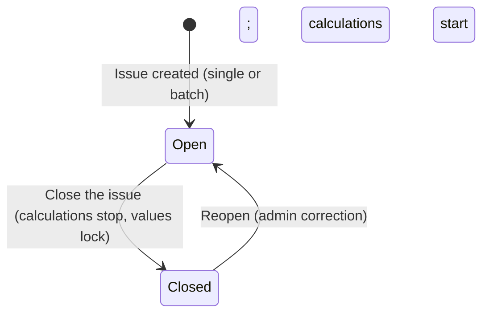
```mermaid
stateDiagram-v2
    [*] --> Open: Issue created (single or batch); calculations start
    Open --> Closed: Close the issue (calculations stop, values lock)
    Closed --> Open: Reopen (admin correction)
```

**Open.** The run is in progress. An issue is created directly in this state. Delivery inputs and payouts can change; payouts recalculate live from pay config + delivery inputs. Multiple issues can be Open at the same time without conflict, and every Open issue's cells stay attached to the live formula — so identical pay config and delivery inputs produce the same amount across cells.

**Closed.** The run is complete. Closing detaches every payout in the issue from the live calculation at once and makes the paid/unpaid marker toggleable (defaulting to unpaid). Reopening is a guarded admin correction (it also reopens the shared delivery recording); on reopen, unpaid cells resume live calculation while paid cells stay put.

Closing is a *lifecycle-level* detach: nothing is written to the individual cells, they simply stop being recalculated while the issue is Closed. That is a different mechanism from the per-cell **Frozen** state in §3b, which snapshots one cell's amount and survives independently of the issue's status. An unpaid cell in a Closed issue is still fully editable — it can be overridden, frozen, or given a substitute.

### 3b. Captain payout — calculation status

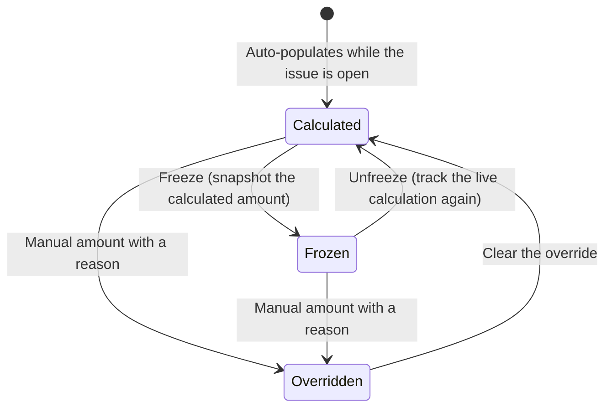
```mermaid
stateDiagram-v2
    [*] --> Calculated: Auto-populates while the issue is open
    Calculated --> Frozen: Freeze (snapshot the calculated amount)
    Frozen --> Calculated: Unfreeze (track the live calculation again)
    Calculated --> Overridden: Manual amount with a reason
    Frozen --> Overridden: Manual amount with a reason
    Overridden --> Calculated: Clear the override
```

**Calculated.** The amount is computed live from pay config + delivery inputs while the issue is open. A breakdown is viewable (for example 16 bundles x $1.25 = $20).

**Frozen.** The accounts manager snapshotted the calculated amount, typically on bundling day, so subsequent route or carrier edits cannot move the number. The snapshot records the amount and the date it was taken. Freezing does **not** mean the captain has been paid, and it does not require the issue to be closed — it is the manual control for "this figure is settled now". A frozen cell can be unfrozen while it is unpaid, which drops the snapshot and returns the cell to the live calculation.

**Overridden.** The accounts manager entered a manual amount with a required reason. The cell is flagged (asterisk / yellow) and shows the reason. It does not store or audit the previously calculated value. Clearing the override returns the cell to whatever it would otherwise resolve to.

**Precedence.** The amount owed is **override, else frozen, else calculated**. So an override wins over a freeze, and clearing an override on a still-frozen cell falls back to the snapshot rather than to the live figure. All three states are per cell; a single issue can hold a mix.

### 3c. Captain payout — payment status

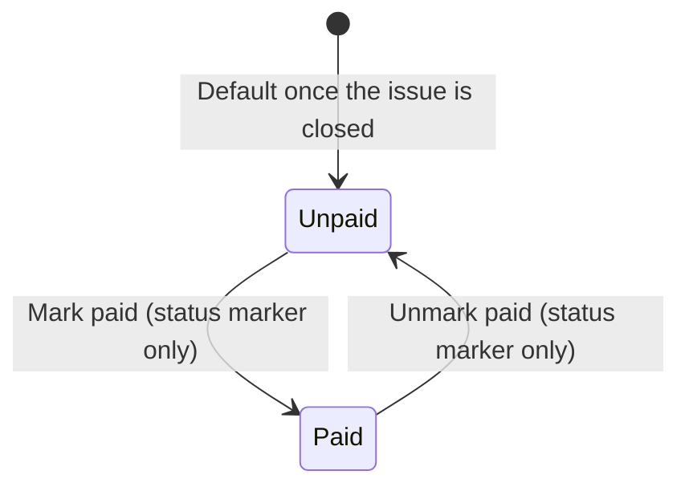
```mermaid
stateDiagram-v2
    [*] --> Unpaid: Default once the issue is closed
    Unpaid --> Paid: Mark paid (status marker only)
    Paid --> Unpaid: Unmark paid (status marker only)
```

**Unpaid / Paid.** A pure status marker recording whether the captain has been paid. It only becomes toggleable once the issue is closed, defaults to unpaid at that point, and never changes the payout amount. While a cell is paid it is locked from edits — override, freeze, unfreeze, substitute, and transfer are all refused until it is unmarked.

### 3d. Captain payout — coverage (substitute)

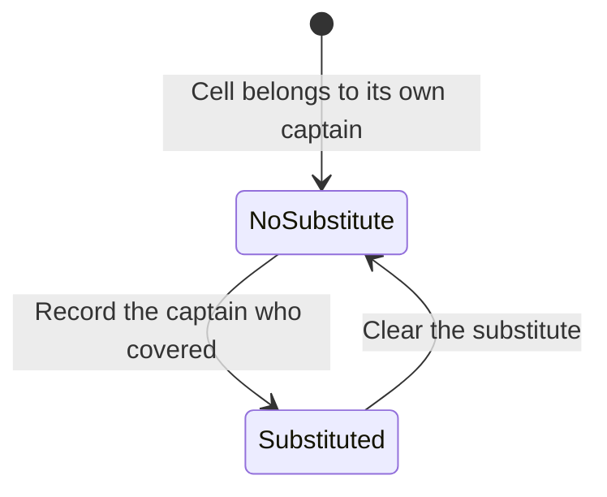
```mermaid
stateDiagram-v2
    [*] --> NoSubstitute: Cell belongs to its own captain
    NoSubstitute --> Substituted: Record the captain who covered
    Substituted --> NoSubstitute: Clear the substitute
```

**No substitute.** The default. The payment for this cell is owed to the captain whose column it sits in.

**Substituted.** Another captain covered this issue, and the payment is owed to them instead. The cell itself does not move — it stays on the original captain, so the issue × captain grid keeps its shape and the covered captain's history still shows the issue they were responsible for. Only the *attribution of the money* changes.

The substitute must be an existing, non-retired captain, and a captain cannot substitute for themselves. Coverage is recorded per issue, so a stand-in covering several issues is recorded on each one. Clearing the substitute returns the payment to the cell's own captain.

This is what reporting reads to separate the two questions the office actually asks: what a captain earned on their own territory, and what they are owed for covering someone else. A captain's own payment line excludes issues they were covered on, so the two figures never double-count.

---

## 4. Flows

### 4a. Create a yearly table

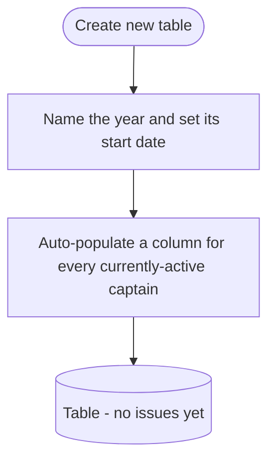
```mermaid
flowchart TD
    Start([Create new table]) --> Name[Name the year and set its start date]
    Name --> Populate[Auto-populate a column for every currently-active captain]
    Populate --> Empty[(Table - no issues yet)]
```

Entry: Create new table on the finance page. Naming the year and setting its start date creates the table and snapshots the set of active captains into columns. Tables are independent of the calendar year and can be created or archived at any time. The start date is required because reporting quarters are measured from it, not from January — a year starting in March has Q1 = March–May. New captains added later (people management) appear in subsequent issues; retired captains stop appearing in new issues.

### 4b. Add issues (single or batch)

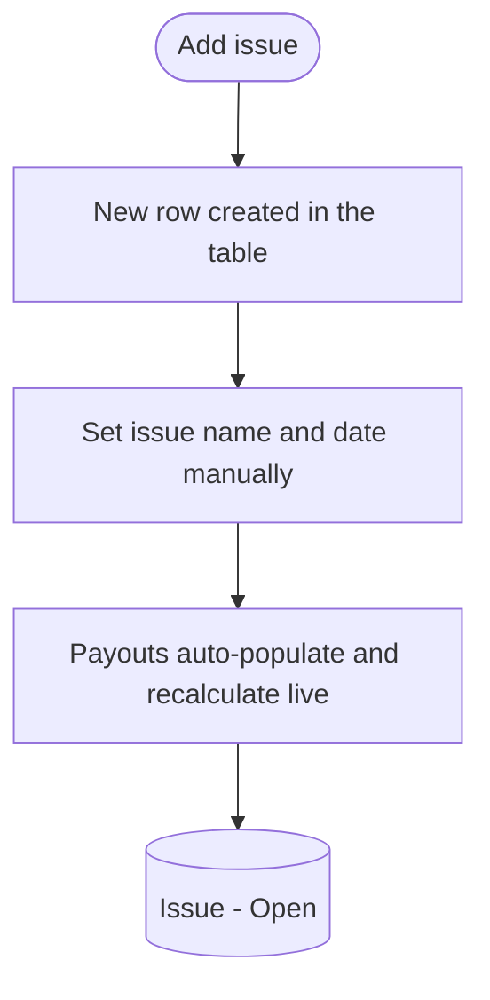
```mermaid
flowchart TD
    Start([Add issue]) --> Row[New row created in the table]
    Row --> NameDate[Set issue name and date manually]
    NameDate --> Live[Payouts auto-populate and recalculate live]
    Live --> Open[(Issue - Open)]
```

Entry: Add issue button. A new row appears and the manager sets the issue name/date. New issues are created Open, and their payout cells begin auto-calculating immediately from each captain's pay config and the issue's delivery inputs. A whole year can be laid out by adding many issues; each is Open from creation and can sit alongside other Open issues without conflict. Adding an issue never closes any existing one — closing is always manual (4e).

### 4c. Review a captain payout

Data view per cell. Clicking a payout shows the calculation breakdown (quantity x rate, with any missed deduction), which of the three calculation states it is in, and the substitute if one is recorded. Zero-rate captains still show their bundle/paper counts even though the amount is zero.

Actions on a cell, all of which require it to be unpaid: Override and clear-override (4d); Transfer to another captain (4g); Freeze and unfreeze (4j); Record or clear a substitute (4k). Once the issue is closed, Mark paid / unpaid (4f) becomes available — and marking paid locks out every action above.

### 4d. Manual override a payout

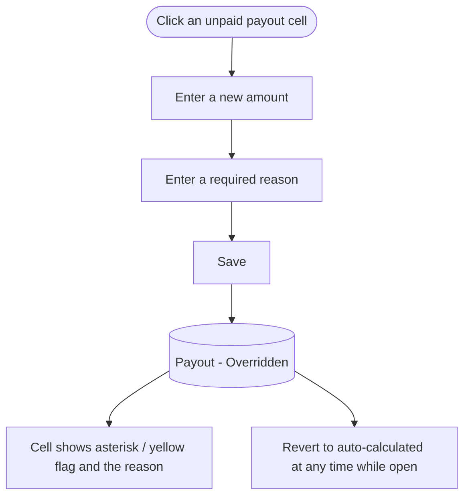
```mermaid
flowchart TD
    Start([Click an unpaid payout cell]) --> Enter[Enter a new amount]
    Enter --> Note[Enter a required reason]
    Note --> Save[Save]
    Save --> Flagged[(Payout - Overridden)]
    Flagged --> Show[Cell shows asterisk / yellow flag and the reason]
    Flagged --> Revert[Revert to auto-calculated at any time while open]
```

Override is how irregular cases are handled without special-casing the model: captains who calculate their own amount, donate-back arrangements, and legacy mixed rates are all just entered directly in the cell. A cell can be overridden as long as it is unpaid, whether the issue is Open or Closed. The override sits on top of whatever the cell would otherwise resolve to and wins over a freeze; clearing it falls back to the snapshot if the cell is frozen, or to the live calculation if it is not. Marking the cell paid locks it from further edits. The override carries a required reason but does not store or audit the previously calculated value. `[OPEN]` any rounding or validation rules on override amounts.

### 4e. Close an issue

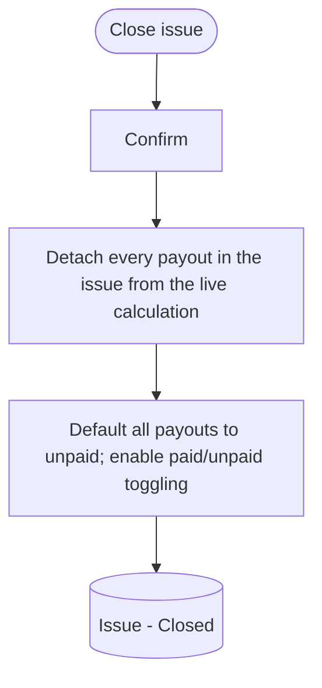
```mermaid
flowchart TD
    Start([Close issue]) --> Confirm[Confirm]
    Confirm --> Stop[Detach every payout in the issue from the live calculation]
    Stop --> Unpaid[Default all payouts to unpaid; enable paid/unpaid toggling]
    Unpaid --> Closed[(Issue - Closed)]
```

Closing marks a run complete. It detaches every payout in the issue from the live calculation, so later changes to rates or delivery inputs no longer affect it. Nothing is written to the cells themselves — they simply stop being recalculated while the issue is Closed, which is what distinguishes this from the per-cell Freeze in 4j. An unpaid cell in a closed issue remains fully editable; marking a payout paid is what locks an individual cell against further edits. Closing is always manual; adding a new issue never closes an open one. On close, all payouts default to unpaid and the paid/unpaid marker becomes toggleable (4f). Reopening a closed issue is a guarded admin correction: unpaid cells resume live calculation, paid cells do not.

### 4f. Mark a payout paid or unpaid

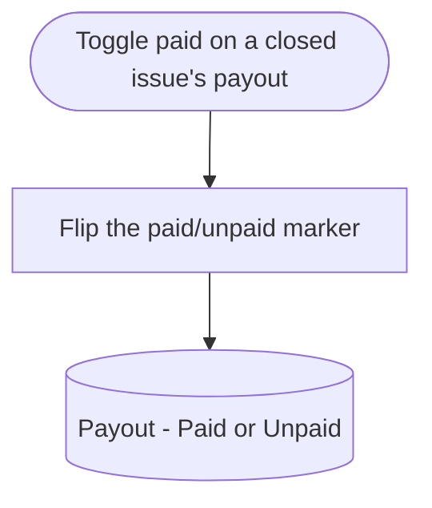
```mermaid
flowchart TD
    Start([Toggle paid on a closed issue's payout]) --> Mark[Flip the paid/unpaid marker]
    Mark --> Done[(Payout - Paid or Unpaid)]
```

Once the issue is closed, each payout can be marked paid or unpaid. This is a status marker tracked per captain per issue — it records whether the captain has been paid and changes nothing about the amount (the value is already frozen by the close). Marking a cell paid also locks it from further edits; unmark it to edit again. Paid/unpaid cannot be toggled while an issue is Open.

### 4g. Transfer a payout to another captain

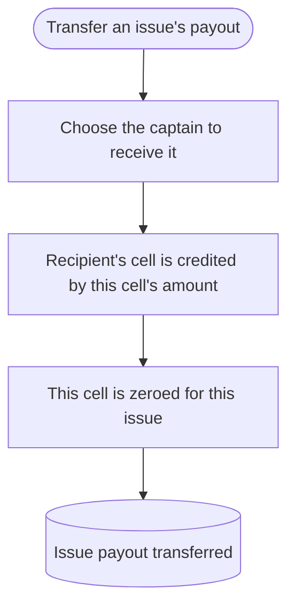
```mermaid
flowchart TD
    Start([Transfer an issue's payout]) --> Choose[Choose the captain to receive it]
    Choose --> Credit[Recipient's cell is credited by this cell's amount]
    Credit --> ZeroOriginal[This cell is zeroed for this issue]
    ZeroOriginal --> Done[(Issue payout transferred)]
```

For a given issue, the manager can move a cell's amount into another captain's cell, crediting the recipient and zeroing the source. It is implemented as a pair of overrides with auto-generated reasons, so it is undone by clearing those overrides. The recipient must already have a cell in this issue (a captain added after the issue was created has none), and neither side may be paid.

The transfer is finance-only: it moves money for that one issue and does not change routes or territory.

**Use a substitute, not a transfer, to record coverage.** Transfer used to be the stand-in mechanism, but it moved money between cells and left the reason as free text, which made substitute pay impossible to total or filter on. Coverage is now recorded with a substitute (4k), which keeps the cell where it belongs and makes the money reportable. Transfer remains for genuine reallocation — cases where the money really does belong in a different captain's cell.

### 4h. Filter, compact, and export

Data view. The table supports filtering by paid/unpaid, by date range, and toggling captain visibility (a compact view). Export to CSV / spreadsheet is available for any table or filtered view. Export is read-only.

### 4i. Archive and historical access

A table can be archived; archived tables remain fully accessible and intact for historical lookup and budget planning. Archived years refuse new issues. Historical years predating the system are migrated by manual entry from cloud backups (`[OPEN]` migration mechanics).

### 4j. Freeze and unfreeze a payout

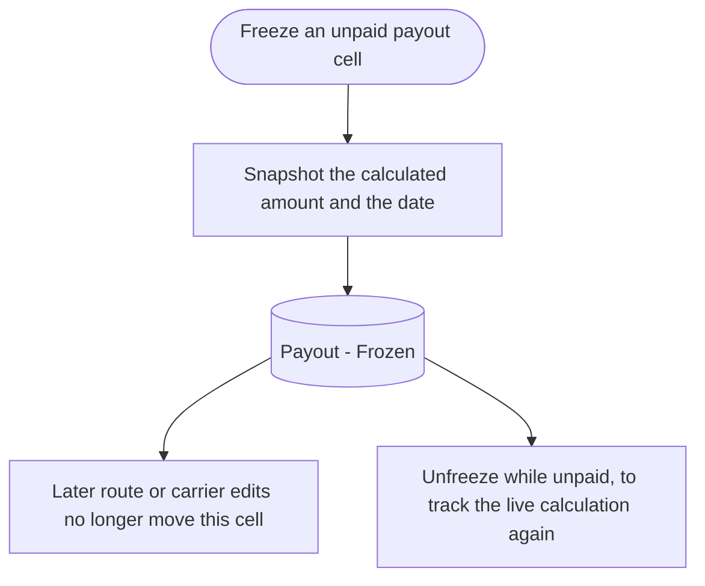
```mermaid
flowchart TD
    Start([Freeze an unpaid payout cell]) --> Snap[Snapshot the calculated amount and the date]
    Snap --> Frozen[(Payout - Frozen)]
    Frozen --> Later[Later route or carrier edits no longer move this cell]
    Frozen --> Unfreeze[Unfreeze while unpaid, to track the live calculation again]
```

Freeze is the manual "this figure is settled" control, used on bundling day: the calculated amount is snapshotted so subsequent edits to routes, carriers, or delivery actuals cannot move it. It is deliberately **not** the same as paid — the office settles amounts on bundling day and pays later, and conflating the two is what forced awkward workarounds before.

Freezing does not require the issue to be closed, and it applies to one cell at a time rather than the whole issue. A frozen cell can be unfrozen as long as it is unpaid, which drops the snapshot and reattaches it to the live calculation. An override still wins over a freeze (§3b precedence).

### 4k. Record a substitute captain

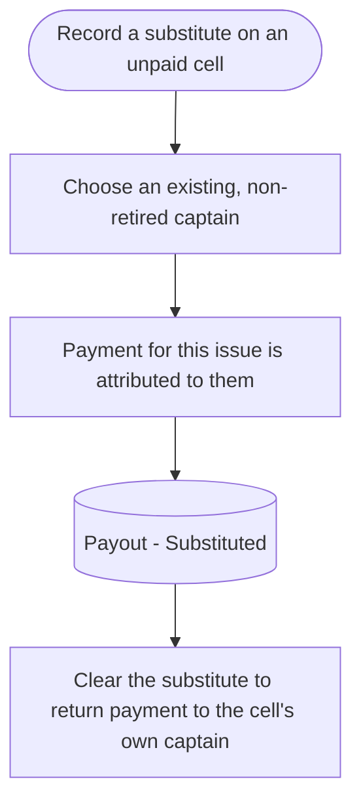
```mermaid
flowchart TD
    Start([Record a substitute on an unpaid cell]) --> Choose[Choose an existing, non-retired captain]
    Choose --> Attribute[Payment for this issue is attributed to them]
    Attribute --> Done[(Payout - Substituted)]
    Done --> Clear[Clear the substitute to return payment to the cell's own captain]
```

When another captain covers an issue, the manager records them as the substitute on that cell. The payment for that issue is then owed to the substitute, while the cell itself stays on the original captain so the issue × captain grid and the covered captain's history are both unchanged.

The substitute must be an existing, non-retired captain, and cannot be the cell's own captain. Coverage is per issue, so a stand-in covering several issues is recorded on each. Reporting totals substitute pay separately from a captain's own territory pay, and excludes covered issues from the original captain's own line so nothing is counted twice.

---

## 5. Calculations

Confirmed math:

- **Per bundle:** bundle count x rate.
- **Per paper:** paper count x rate.
- **Per drop:** drop count x rate.
- **Each bundle counts as one** for per-bundle pay regardless of its size. Example: 70 papers becomes a 50-bundle plus a 20-paper bundle, which is 2 bundles, paid as 2.
- **Missed deduction:** the missed count reduces the billable quantity, measured in the same unit as the pay type. Per-bundle pay deducts missed bundles, per-paper pay deducts missed papers, per-drop pay deducts missed drops. Example: 20 bundles with 3 missed pays for 17.
- **Zero-rate captains:** counts are tracked, amount is zero.

Bundle auto-calc (paper count to bundles):

- Greedy: take 50s first, then 25s, then the remainder as a final tied bundle. Each bundle's paper count is stored individually (`RouteBundle`) and never assumed to be 25 or 50 (some 25/50 bundles are labeled, some are not); the greedy split seeds them and they are hand-editable, with the bundle count derived from them. The bundles always sum to the route's paper count, and changing the paper count reseeds the split unless the bundles were entered manually.

Irregular cases (entered directly via override, 4d):

- Captains who calculate their own amount, donate-back arrangements, and legacy mixed rates are all handled by editing the cell directly rather than by a special formula or flag. There is no separate external / self-invoiced model.

Pay cadence:

- Captains are paid bi-weekly or monthly (cadence stored on the captain in people management). The cadence is informational only — the system does not aggregate per-issue payouts into scheduled disbursements. The per-issue payout is the unit of record.

Amount owed (precedence):

- **Override, else frozen, else calculated.** Each cell resolves to the first of those that is set. Reporting totals use this resolved amount, and attribute it to the cell's substitute when one is recorded.

---

## 6. State transition quick reference

**Issue.**

- (none) -> Open: issue created (single or batch); calculations start
- Open -> Closed: close the issue (every cell detaches from live calculation, payouts default unpaid)
- Closed -> Open: admin reopen (guarded; unpaid cells resume live calculation, paid cells do not; reopens the shared delivery recording too)

**Captain payout — calculation status.**

- (none) -> Calculated: auto-populates when the issue is opened
- Calculated <-> Frozen: freeze snapshots the calculated amount (bundling day), unfreeze drops the snapshot; allowed while unpaid, and independent of the issue's status
- Calculated | Frozen -> Overridden: manual amount with a required reason (flagged)
- Overridden -> Calculated | Frozen: clear the override; falls back to the snapshot if still frozen, else to the live calculation
- Amount owed resolves as override, else frozen, else calculated

**Captain payout — payment status.**

- Unpaid (default once the issue is closed) <-> Paid: pure status marker, only toggleable when the issue is closed, never changes the amount; marking paid locks the cell against override, freeze, unfreeze, substitute, and transfer

**Captain payout — coverage.**

- (none) -> Substituted: record an existing, non-retired captain who covered this issue; payment is attributed to them, the cell stays on its own captain
- Substituted -> (none): clear the substitute; payment returns to the cell's own captain

---

## 7. Edge cases and open questions

- **Three different locks, deliberately separate.** *Closing* an issue detaches every cell in it from live calculation without writing to the cells. *Freezing* snapshots one cell's amount and is reversible. *Paying* locks one cell against all edits. Only the third is a lock in the strict sense; the first two only stop the number from moving on its own. Conflating freeze with paid is the specific mistake this model exists to avoid.
- **Only unpaid cells are editable.** Override, clear-override, freeze, unfreeze, substitute, clear-substitute, and transfer all require the cell to be unpaid — whether the issue is Open or Closed. Marking it paid locks it; unmark to edit again.
- **Substitutes record coverage; transfers move money.** A substitute leaves the cell on its own captain and re-attributes the payment, which is what makes substitute pay reportable. A transfer actually moves the amount into another cell and zeroes the source. Reaching for transfer to record coverage is the older workaround and loses the reporting.
- **Override keeps a reason, not the old value.** An overridden cell is flagged and keeps the required reason, but does not store or audit the previously calculated value. It can be reverted to auto-calculated while the issue is open.
- **Irregular pay is just an override.** Self-calculated captains, donate-back, and legacy mixed rates are entered directly in the cell. The system needs adjustable rates plus override, not a special external / self-invoiced model.
- **Missed matches the pay unit.** Missed counts deduct in the same unit as the captain's pay type (bundles, papers, or drops).
- **No disbursement aggregation.** Cadence (bi-weekly / monthly) is informational; payouts are tracked per issue and not rolled up into scheduled disbursements.
- **Quarters are relative to the year's start month.** Reporting periods are measured from the financial year's own start date, not from January — a year starting in March has Q1 = March–May. This is why the start date is a required field rather than inferred from the year's name.
- **Zero-rate captains.** Still tracked for bundle/paper counts (paper reporting) even though they pay out zero; some captains decline reimbursement.
- **No unscoped messaging.** The paid marker, override flag, and breakdown popover are explicit, scoped indicators called for by the design. Do not add other notifications or badges unless a spec calls for one.
- **`[OPEN]` items.** Override rounding / validation rules; historical data migration mechanics. Left blank for interpretation once the client's details are confirmed.
