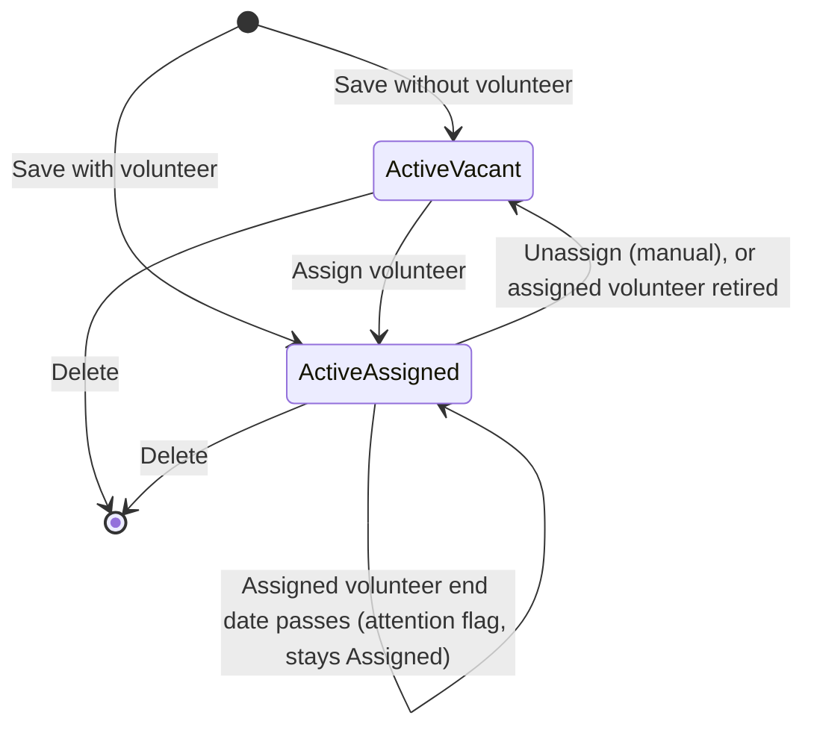
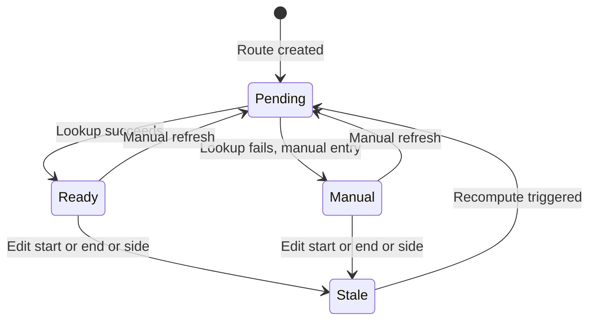
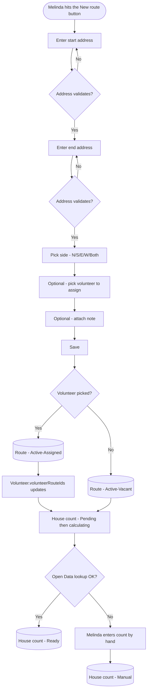
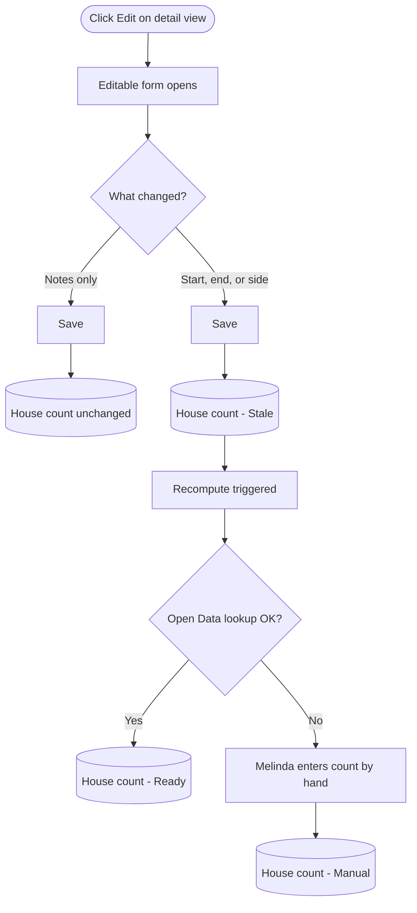
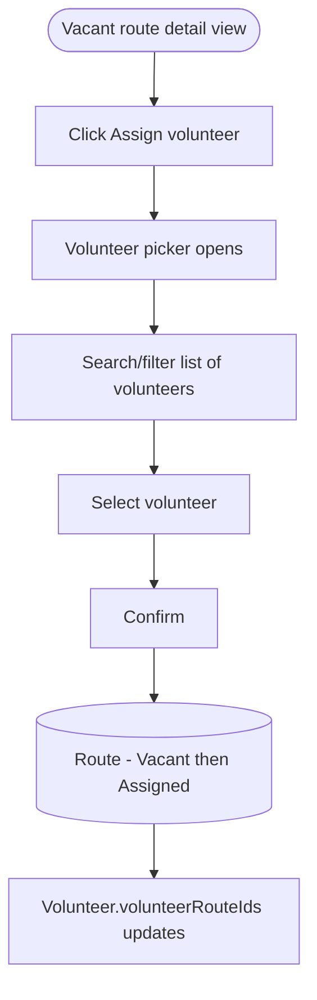
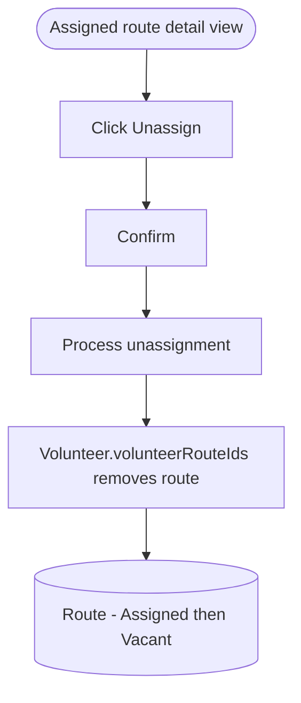
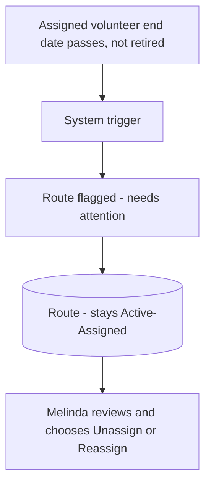
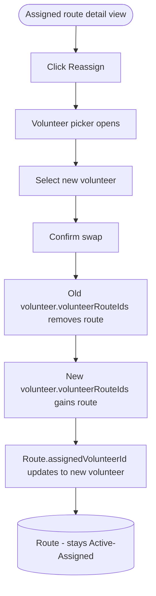
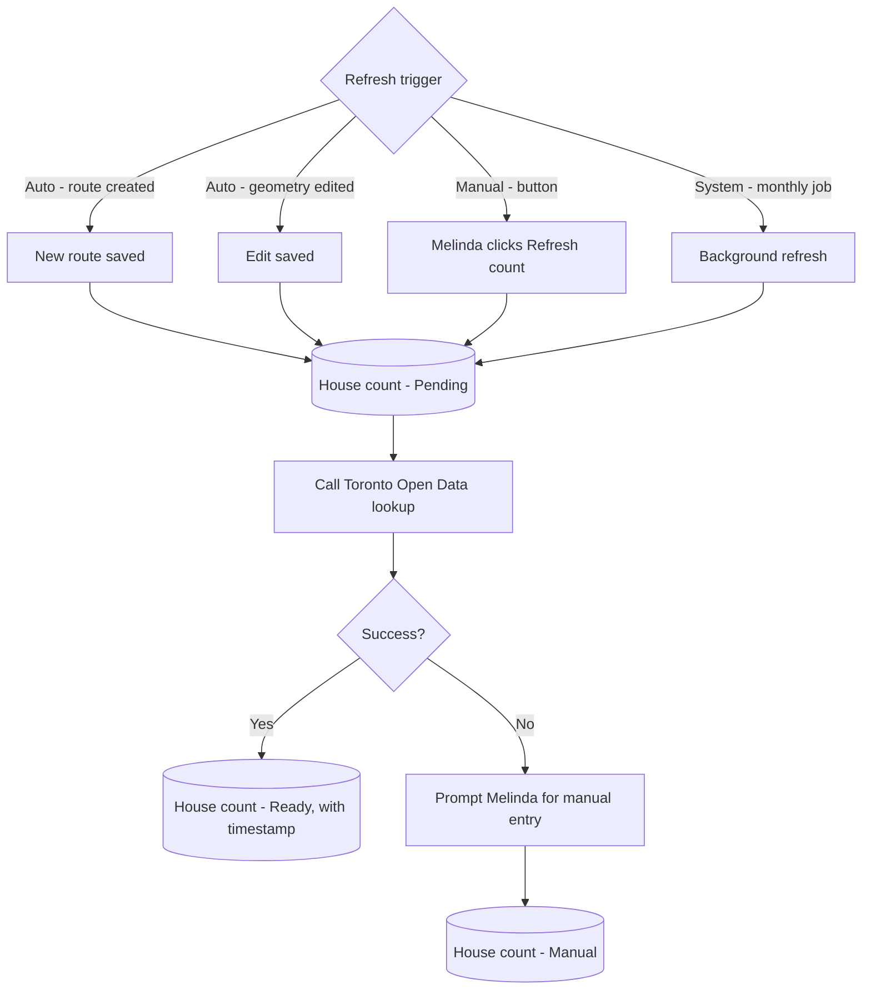
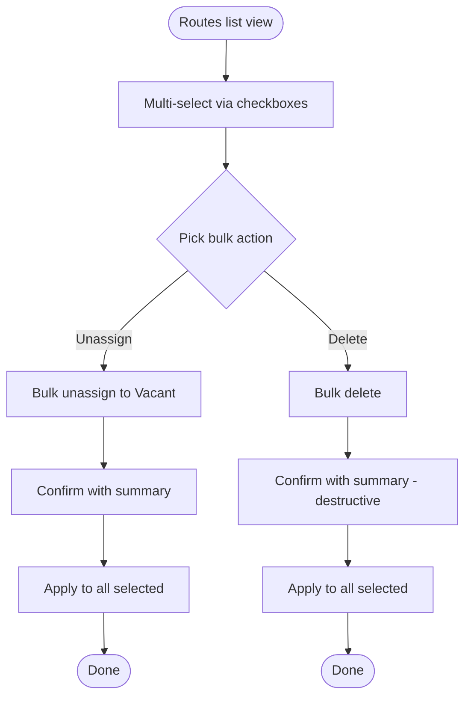

# Route Management Flow

---

## 1. Object overview

**What it is.** A Route is a street segment that a single volunteer delivers newspapers to. It is defined by a specific start address, a specific end address, and a side of the street.

**Who creates them.** Melinda only. Hope and captains consume routes but never define them.

**When they\'re created.** When Melinda adds coverage for a street that doesn\'t have a route yet, or when she splits an existing route by shrinking its range and needs to cover the leftover houses.

**Key relationships.**
- Is not assigned a captain or territory here. The captain link is indirect: a route is carried by a Volunteer, and that Volunteer is connected to a Captain in the people management flow. Captains are associated with volunteers, never with routes directly.
- May or may not have an assigned Volunteer.
- Start and end are Address records, each linked to a Google Maps place_id via Address Validation.
- Has zero or one Note attached.
- Carries a list of RouteBundles (the standard bundle make-up) and a computed house count derived from Toronto Open Data.

**Two state machines run on every route:** a lifecycle machine (Active-Vacant, Active-Assigned) and a house-count freshness machine (Pending, Ready, Stale, Manual). They are independent and need to be surfaced separately in the UI.

---

## 2. Diagram legend

The diagrams below use these conventions:

- **Round / stadium shape** = start or end of a flow
- **Rectangle** = an action or system step
- **Diamond** = a decision or branch
- **Bracketed rectangle** = a resulting state of the entity (e.g. `(Route - Vacant)`)

---

## 3. State machines

### 3a. Lifecycle state

**Active, Vacant.** Route exists in operations but has no carrier. This is the state Melinda spends the most time triaging. A route is born here when created without an assigned volunteer.

**Active, Assigned.** Route has a volunteer carrying it. Steady state for the majority of routes. A route can also be born here if Melinda assigns a volunteer during route creation.

Routes are deleted (removed from the system entirely) rather than retired. There is no archived or hidden state.

**Assigned volunteer end date passes (attention flag, not a state).** When the assigned volunteer's end date passes but they have not been retired, the route does not become vacant. It stays Active-Assigned and the system raises an explicit "needs attention" flag in the UI, prompting Melinda to unassign or reassign it. This is a derived indicator, not a separate lifecycle state. (Retiring the volunteer in the people management flow is different: it detaches them and the route becomes Vacant.) See 4f.

**Suspended (derived flag, not a state).** When the assigned volunteer is On vacation (people management flow), the route is suspended: it stays Active-Assigned but is suppressed for the affected issues — not delivered, not reassigned, and its labels are suppressed. Suspension is a derived indicator computed from the assigned volunteer's On-vacation window, not a separate lifecycle state, and it clears automatically when the vacation window ends. During suspension the delivery flow skips the route (no delivery row; it contributes nothing to the issue). See the people management flow (volunteer vacation) and the delivery recording flow.

### 3b. House count state

**Pending.** Queued for calculation. Shown immediately after creation or after geometry edit.

**Ready.** Calculated from Toronto Open Data and cached. The number shown is current.

**Stale.** Geometry changed since last calc; system needs to recompute. Transitional, usually short-lived.

**Manual.** Open Data lookup failed (address not found, ambiguous match, or upstream API down) and Melinda entered the count by hand. Flagged visibly so it is obvious the number is not from Open Data.

---

## 4. Flows

### 4a. Create a route

Entry: "New route" button from the routes list or the map view.

Both addresses run through Address Validation API on entry; the form holds Melinda on the offending field until validation passes. The route is not persisted until the entire form validates and Save is clicked. If Melinda navigates away before saving, the in-progress form is discarded; nothing is stored.

The volunteer picker is optional. If Melinda picks one, the route is born Active-Assigned and the chosen volunteer\'s `volunteerRouteIds` updates immediately. If she leaves it empty, the route is born Active-Vacant and can be assigned later via the standalone Assign flow. This means the Assign flow is effectively integrated into route creation as an opt-in shortcut.

There is no captain or territory picker in route creation. A route's captain is determined indirectly by the volunteer who carries it, and the volunteer-to-captain connection is made in the people management flow. Creating or assigning a route never assigns a captain.

On save, the route appears in the list and on the map immediately with a spinner or "Calculating..." indicator on the house count column until the Open Data lookup returns. The lookup is async; the rest of the route is fully usable in the meantime.

### 4b. View the routes list

Entry: top-level nav, default landing for Melinda.

Default content: every Active route (Vacant or Assigned). Deleted routes are gone entirely; there is no "show deleted" toggle.

Per row, designers should expose enough to triage at a glance: street description, current volunteer (or a clear "Vacant" badge), the volunteer's captain (derived via the volunteer, read-only), house count with freshness indicator, a "needs attention" flag when the assigned volunteer has gone inactive, and a last-modified date.

Filters: vacancy, captain (via the volunteer), side, street, needs-attention. Sort: street, house count, vacancy, last modified. The "show vacant only" toggle is the single most-used filter; surface it prominently.

Multi-select column reserved for bulk operations (see section 5), even if the bulk actions ship later.

### 4c. View route detail

Information shown:
- Street description, start address, end address, side, and the volunteer's captain (derived, read-only)
- Current volunteer (or "Vacant")
- House count with freshness status and last-calculated timestamp
- Notes
- Small inline map preview of the segment
- A "needs attention" flag when the assigned volunteer has gone inactive (see 4f)

Available actions depend on lifecycle state:
- Always: Edit, Delete, Refresh house count
- If Vacant: Assign volunteer
- If Assigned: Unassign, Reassign

### 4d. Edit route definition

Editable fields: start address, end address, side, notes. There is no captain or territory field; that link is made via the volunteer in the people management flow.

Not editable here: the assigned volunteer (see Assign and Unassign/Reassign flows). Lifecycle state (use Delete).

Volunteer assignment is preserved across edits. If the route was Vacant before, it stays Vacant. If Assigned, the same volunteer stays assigned even if the geography changed.

**Important edge case (no smart split).** If Melinda shrinks the range, e.g. changes the end from #200 to #170, the houses between #171 and #200 are simply not part of any route anymore. The system does not auto-create a route for the leftover. Melinda must manually create a new route to cover those houses. Designers should consider whether to surface a soft notice ("you reduced coverage by ~30 houses, create a new route for the leftover?") or stay silent. My recommendation is a non-blocking notice with a "Create leftover route" shortcut that pre-fills the form.

### 4e. Assign a volunteer

Entry: "Assign volunteer" on a vacant route\'s detail view, or from the vacant-route panel on the map. This same logic is also available as an optional step during route creation (see 4a).

Picker shows active volunteers (status derived from startDate/endDate). Default sort is alphabetical. The picker is the natural home for the future "recommended by proximity" tab that uses the Routes API Compute Route Matrix.

### 4f. Unassign or reassign

These are two distinct paths. Unassign sends the route to Vacant; Reassign keeps it Assigned and just swaps the volunteer.

**Unassign (manual only)**

Unassign is manual only, performed by Melinda from the detail view; the route goes to Vacant. There is no automatic unassignment. A route also becomes Vacant when its assigned volunteer is retired in the people management flow: the volunteer is detached and the route returns to Vacant.

**Assigned volunteer end date passes (attention flag)**

When a volunteer's end date passes but they have not been retired, the system does not vacate their routes. Each affected route stays Active-Assigned and is flagged in the UI as needing attention, so Melinda can decide whether to unassign it (sending it to Vacant) or reassign it to another volunteer. This flag is an explicit, scoped indicator requested for this case, not an ambient notification, and it clears once the route is unassigned or reassigned. Retiring the volunteer in the people management flow is the other path: it detaches them and sends the route to Vacant directly.

**Reassign**

Reassign is an atomic volunteer swap. The route never passes through Vacant; its lifecycle state stays Active-Assigned throughout. The only data that changes is the two volunteers\' route lists and the route\'s `assignedVolunteerId`.

### 4g. House count refresh

The background refresh runs monthly. House counts change slowly in practice, so monthly is plenty frequent; running more often just adds load without surfacing meaningful change. Updated counts are written silently; no notifications or flags for review.

---

## 5. Bulk operations

Two highest-value bulk actions:

**Bulk unassign.** Send a set of routes to Vacant at once, for example after a carrier change. Reassigning a captain's coverage is no longer a route-level action: captains connect to volunteers in the people management flow, so moving a captain's coverage is done there and routes follow their volunteers.

**Bulk delete.** Useful when a block is being redeveloped or a coverage area is dropped. Confirmation should be especially prominent since this is destructive and irreversible.

UX implication for MVP: even if bulk doesn\'t ship in v1, design the list view with the checkbox column slot reserved so adding the actions later doesn\'t trigger a layout rework.

---

## 6. State transition quick reference

Every legal transition, so the state machine is unambiguous.

**Lifecycle.**
- (none) → Active-Vacant (Save in create, no volunteer picked)
- (none) → Active-Assigned (Save in create, volunteer picked)
- Active-Vacant → Active-Assigned (Assign)
- Active-Assigned → Active-Vacant (Unassign manually, or the assigned volunteer is retired in people management)
- Active-Assigned → Active-Assigned (Reassign with new volunteer; route stays Assigned)
- Active-Assigned → Active-Assigned (assigned volunteer's end date passes; route stays Assigned and is flagged for attention, not vacated)
- Active-Vacant or Active-Assigned → (none) (Delete)

**House count.**
- (none) → Pending (on create)
- Pending → Ready (lookup success)
- Pending → Manual (lookup fail + manual entry)
- Ready → Stale (edit to start/end/side)
- Manual → Stale (edit to start/end/side)
- Stale → Pending → Ready (recompute path)
- Ready or Manual → Pending → Ready (manual refresh path)

---

## 7. Error and edge cases

**Address Validation fails on create.** Form blocks save, holds Melinda on the bad field with the validation message. No partial route is persisted.

**Toronto Open Data API is down.** House count enters Pending and stays there. Detail view shows "Calculating, retry in N minutes." Manual entry available as escape hatch via "Enter manually" button. Background job retries on its next cycle.

**Open Data returns 0 houses.** Treated as a successful zero result. Detail view should flag this prominently because zero is suspicious for a residential route, but it is not an error. Melinda can override with manual entry if she knows the count.

**Two admins edit the same route concurrently.** Out of scope for MVP. Beach Metro effectively has one admin (Melinda) doing route management; Hope and any future admin operate on payments. If real concurrency becomes an issue, last-write-wins with an "updated since you loaded this" warning is acceptable.

**Volunteer\'s endDate passes (including set retroactively).** The route is not auto-vacated. On save, the system flags each of the volunteer\'s routes as needing attention and leaves them Active-Assigned, so Melinda resolves each one manually (unassign or reassign). This keeps "vacant" meaning a deliberate decision, not an automatic side effect. When the assigned volunteer is retired in the people management flow, by contrast, the volunteer is detached and the route becomes Vacant directly.

**Deleting a route.** Soft delete: the route row stays in the database with a `deletedAt` timestamp (or equivalent flag) and is hidden from all UI lists, the map, and operational views. The assigned volunteer\'s `volunteerRouteIds` removes the deleted route. Confirmation modal required because the route disappears from active workflows.

**Past data after delete.** Because delete is soft, all historical references continue to resolve normally. RouteDelivery records from past closed issues still link to the route row. Hope\'s payment audit data and the history of past route combinations are preserved untouched. Captain payouts are independently safe (amounts are snapshotted on `CaptainPayout` regardless).

**Reusing the geography of a deleted route.** A deleted route does not lock its addresses, street name, side, or house-number range. Melinda can create new routes using the same start address, end address, or overlapping spans without conflict. The deleted row exists in the database for historical lookup only; it does not participate in any uniqueness or coverage checks.
