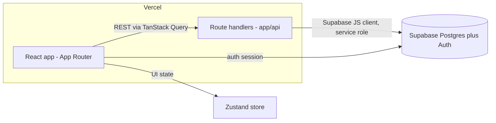

# Infrastructure Spec

The technical foundation for the Beach Metro distribution system: the stack,
architecture, repo layout, local development, environments, and the conventions a
contributor needs to start building. Decisions that were open in earlier drafts are
now resolved (see section 16).

---

## 1. Stack at a glance

| Layer | Choice |
|---|---|
| Language | TypeScript (end to end), strict mode |
| Runtime | Node.js 24 LTS |
| Framework | Next.js (React), App Router |
| Build / dev | Turbopack |
| Package manager | pnpm |
| Lint / format | ESLint (eslint-config-next) + Prettier |
| Server state | TanStack Query |
| Client / global state | Zustand |
| Styling / UI | Tailwind CSS + shadcn/ui |
| API style | REST, via Next App Router route handlers |
| Validation | Zod (shared request/response schemas) |
| Database | Supabase (Postgres; PostGIS when spatial work starts) |
| Data access | Supabase JS client, server-side only |
| Auth | Supabase email + password, with password reset |
| Authorization | Authenticated admin required; both admins have full access |
| Local dev | Supabase CLI local stack (Docker-backed) + `next dev` |
| Hosting (prod) | Vercel |
| Staging DB | Supabase branching (per-PR preview branches) |
| Unit / integration tests | Vitest |
| End-to-end tests | Playwright |
| CI | GitHub Actions |
| Python (only if added later) | Pytest |

---

## 2. Architecture

A single Next.js (App Router) application deployed to Vercel.

- **Frontend:** React Server and Client Components under the App Router. Tailwind + shadcn/ui for styling and components. Turbopack for dev and build.
- **State:** TanStack Query owns server state (fetching, caching, mutations against the REST API). Zustand owns client/global UI state that is not derived from the server (for example a detail panel being open, or in-progress filters). Keep server data in TanStack Query, not Zustand.
- **API:** REST endpoints implemented as App Router route handlers (`app/api/.../route.ts`). The browser does not talk to the database directly for app logic; it calls these endpoints, which use the Supabase client server-side. The app standardizes on its own REST layer (not Supabase's auto-generated REST) for validation, business rules, and consistent response shapes. The full endpoint catalog is the [API spec](../api/api_spec.md).
- **Data:** Supabase Postgres, accessed through the Supabase JS client inside route handlers using the service-role key (server-only, never shipped to the client).
- **Auth:** Supabase Auth (email + password + reset). Sessions are managed by Supabase; protected pages and handlers check the session.



---

## 3. Repo structure

Single Next.js app (not a monorepo for now).

```
/
├── app/                      # App Router: pages, layouts, route handlers
│   ├── (routes)/             # UI routes
│   └── api/                  # REST route handlers (see docs/api/api_spec.md)
├── components/               # Shared UI (shadcn/ui based)
├── features/                 # Feature modules (routes, people, finances, delivery)
├── lib/
│   ├── supabase/             # server + browser client setup
│   ├── api/                  # typed fetchers used by TanStack Query
│   ├── services/             # server-side business logic (the write/transition layer)
│   └── validation/           # shared Zod request/response schemas
├── stores/                   # Zustand stores (client/global state)
├── types/                    # shared TS types (generated; cross-checked vs docs/schema/data_model.md)
├── supabase/                 # migrations, seed.sql, config (Supabase CLI)
├── tests/                    # Vitest unit/integration
├── e2e/                      # Playwright
└── docs/                     # specs (this file, the PRD, flow docs, schema, api)
```

If a Python job is added later (for example Toronto Open Data ingestion), it gets its own top-level directory (such as `jobs/`) with Pytest, making the repo lightly polyglot rather than a full monorepo.

---

## 4. Frontend

- App Router with Server Components by default; Client Components only where interactivity needs them.
- Tailwind CSS for styling; shadcn/ui for the component base (owned in-repo and themeable).
- TanStack Query for all server data: queries for reads, mutations for writes, with per-feature query-key conventions.
- Zustand only for ephemeral or global client state.
- Turbopack for `next dev` and the production build.
- Responsive web for laptop and mobile browsers; no native app or PWA (per the PRD non-goals).

---

## 5. API (REST via route handlers)

- Endpoints live in `app/api/<resource>/route.ts` with RESTful resource naming. The full catalog, request/response shapes, and custom actions are in the [API spec](../api/api_spec.md).
- Each handler validates input with **Zod**, performs the operation through the server-side service layer (`lib/services/`), and returns a consistent JSON envelope (`{ data }` / `{ error }`).
- Business rules and state transitions (issue close-locks-values, payout calculation/override, route assignment, vacancy triggers) live in `lib/services/`, not in the handlers or the client.
- **Auth:** handlers read the Supabase session and reject unauthenticated requests (`401`). Both admin roles have identical access; the distribution-manager vs accounts-manager split is a UI/navigation concern, not enforced at the API.
- **Validation schemas** in `lib/validation/` are shared by the handler and the client fetchers so request/response shapes stay in sync.

---

## 6. Database (Supabase / Postgres)

- Supabase-hosted Postgres. The schema source of truth is the [data model](../schema/data_model.md) (typed interfaces), translated into SQL migrations.
- Migrations managed with the Supabase CLI under `supabase/migrations`, committed to the repo and applied per environment.
- **Row Level Security:** tables are locked down and all access goes through server-side route handlers using the service-role key; authorization happens in the handlers/services. RLS policies are not the primary gate (defense-in-depth only). This is the decided strategy.
- **PostGIS:** the route house-count feature needs spatial queries; the Supabase PostGIS extension is enabled via a migration when that feature is built.
- **Types:** `supabase gen types typescript` generates DB types into `types/`; these are cross-checked against the data model doc, which remains the human source of truth.

---

## 7. Auth (Supabase)

- Email + password sign-in with password reset, via Supabase Auth.
- Admin users only; volunteers and captains do not log in (per the PRD).
- Sessions handled by Supabase; Next middleware and route handlers enforce auth on protected pages and API routes.
- **Roles:** the PRD names a distribution manager and an accounts manager, but for MVP **both admins have full access**; roles drive UI/navigation only. If a hard split is needed later, it slots in as a role check (`403`) in the service layer.

---

## 8. Local development

Goal: one clone, a few commands, a full local stack that mirrors production.

**Prerequisites:** Node 24 LTS, pnpm, Docker (for the Supabase CLI's local stack), the Supabase CLI.

**First run:**

```bash
pnpm install
supabase start          # boots local Postgres + Auth + Studio (Docker-backed), prints local keys
supabase db reset       # applies migrations + seed.sql to the local DB
pnpm dev                # Next.js on http://localhost:3000
```

`supabase start` manages the Supabase services (Postgres, GoTrue/Auth, PostgREST, Realtime, Storage, Studio, the Kong gateway) as Docker containers — there is no hand-written compose file for these.

**When non-Supabase services arrive** (for example a Python Toronto Open Data ingestion worker, or a cache): do **not** replace the Supabase CLI stack. Add a small `docker-compose.yml` for *those extra services only*, run alongside `supabase start` (or, if a single `up` is wanted, containerize the Next app too and reference the running Supabase). The package/npm dependency count does not affect this choice — only additional backing *services* do.

---

## 9. Environment variables

Managed in Vercel project settings (production/preview) and a local untracked `.env.local`; a `.env.example` with placeholders is committed. The block-secrets hook and the no-secrets rule back this up.

| Variable | Scope | Purpose |
|---|---|---|
| `NEXT_PUBLIC_SUPABASE_URL` | client + server | Supabase project URL |
| `NEXT_PUBLIC_SUPABASE_ANON_KEY` | client | Supabase anon/publishable key (browser auth session) |
| `SUPABASE_SERVICE_ROLE_KEY` | server only | Privileged DB access from route handlers |
| `GOOGLE_MAPS_SERVER_KEY` | server only | Geocoding, Address Validation, Routes (API-restricted) |
| `NEXT_PUBLIC_GOOGLE_MAPS_BROWSER_KEY` | client | Maps JavaScript API (HTTP-referrer-restricted) |

Notes:
- The Google keys are restricted (server key by enabled-API; browser key by referrer) and have per-day quota caps set in Cloud Console — the primary cost guardrail (see section 12).
- Supabase is migrating `anon`/`service_role` keys to `publishable`/`secret` keys (rolling out through 2026); use whichever the project issues, keeping the same client/server split.
- Local keys are printed by `supabase start` and differ from production.

---

## 10. Database migrations and seed

- **Source of truth:** the [data model](../schema/data_model.md). New entities/fields are added there first, then expressed as SQL.
- **Author a migration:** `supabase migration new <name>`, write the SQL (tables, enums matching the data model's status types, foreign keys, indexes), commit it under `supabase/migrations`.
- **Apply locally:** `supabase db reset` (re-runs all migrations + seed from scratch) or `supabase migration up` (incremental).
- **Types:** regenerate `types/` after schema changes (`supabase gen types typescript`).
- **Seed:** `supabase/seed.sql` provisions a couple of admin users and a small set of sample volunteers, captains, routes, a financial year, and an issue, so a fresh local DB is usable and tests have fixtures.
- **PostGIS** is enabled by a migration when the house-count feature is built.

---

## 11. Environments and hosting

- **Production:** Vercel (frontend plus route handlers as serverless functions), auto-deployed from the default branch.
- **Preview:** Vercel preview deployments per pull request, paired with a Supabase branch (section 16) so previews run against an isolated database branch.
- **Database:** Supabase project for production; **Supabase branching** for per-PR/preview database branches rather than a separate standing staging project.

---

## 12. External integrations (from the PRD)

- **Google Maps Platform** (research: [google_maps_research.md](../integrations/google_maps_research.md)): Address Validation and Geocoding at signup; Routes (Compute Route Matrix) for nearest-vacant recommendations; Maps JS for the map view. Keys restricted and used server-side where possible; **per-day quota caps set in Cloud Console** are the main cost guardrail. The strategy is to stay inside the free tiers (geocode ~200 stable addresses once, store the durable `place_id`, refresh cached lat/lng on a ~30-day cycle).
- **Toronto Open Data:** house counts per route via the Centreline and Address Points datasets; likely a scheduled ingestion job loading into Postgres/PostGIS (a candidate for a Python job with Pytest, and the first likely trigger for the docker-compose escape hatch in section 8).

---

## 13. Testing

- **Vitest** for unit and integration tests (components, lib/services, route-handler logic).
- **Playwright** for end-to-end flows against a running app (a few smoke flows for MVP).
- **Pytest** for any Python jobs, if and when added.
- Coverage expectations and the test-on-stop hook live with the Claude Code setup.

---

## 14. CI/CD

- **GitHub Actions** on every PR: `pnpm install` → typecheck (`tsc --noEmit`) → lint (ESLint) → format check (Prettier) → unit/integration (Vitest) → `next build`; Playwright where feasible.
- Vercel handles preview (per-PR) and production deploys.
- Branch protection on the default branch: require a PR and green checks. (No commits directly to `main`.)

---

## 15. Conventions and tooling

- TypeScript strict mode; Node 24 LTS.
- pnpm for package management; ESLint (eslint-config-next) + Prettier for lint/format (the format-on-write hook runs the formatter).
- Commit, branch, and PR conventions, plus the LEARNINGS loop, live with the Claude Code setup (CLAUDE.md and the `blueprint-*` skills).

---

## 16. Resolved decisions

These were open questions in earlier drafts; now decided:

- **Package manager:** pnpm.
- **Lint/format:** ESLint (eslint-config-next) + Prettier.
- **Validation:** Zod, shared between handlers and client fetchers.
- **RLS / authz:** lock tables; authorize in server-side handlers/services using the service-role key (RLS as defense-in-depth only).
- **Roles:** both admins have full access for MVP; the route-vs-finance split is UI-only.
- **Local dev:** Supabase CLI local stack (Docker-backed); add a docker-compose only for future non-Supabase services.
- **Staging:** Supabase branching (per-PR), not a separate standing project.
- **Node runtime:** Node 24 LTS.
- **Observability & rate limiting:** deferred to post-MVP; for now, only per-day quota caps on the Google API keys in Cloud Console.

Remaining genuine unknowns (decide when relevant, not blocking):
- The exact Supabase publishable/secret key cutover timing.
- Whether the Toronto Open Data ingestion is a scheduled Vercel cron, a Supabase scheduled function, or a standalone Python job (decide when the house-count feature starts).
