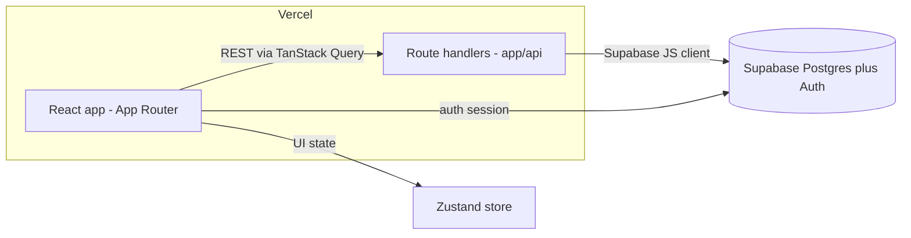

# Infrastructure Spec

The technical foundation for the Beach Metro distribution system: the stack, architecture, repo layout, environments, and the conventions a contributor needs to start building.

---

## 1. Stack at a glance

| Layer | Choice |
|---|---|
| Language | TypeScript (end to end) |
| Framework | Next.js (React), App Router |
| Build / dev | Turbopack |
| Server state | TanStack Query |
| Client / global state | Zustand |
| Styling / UI | Tailwind CSS + shadcn/ui |
| API style | REST, via Next App Router route handlers |
| Database | Supabase (Postgres) |
| Data access | Supabase JS client, server-side |
| Auth | Supabase email + password, with password reset |
| Hosting (prod) | Vercel |
| Unit / integration tests | Vitest |
| End-to-end tests | Playwright |
| Python (only if added later) | Pytest |

---

## 2. Architecture

A single Next.js (App Router) application deployed to Vercel.

- **Frontend:** React Server and Client Components under the App Router. Tailwind + shadcn/ui for styling and components. Turbopack for dev and build.
- **State:** TanStack Query owns server state (fetching, caching, mutations against the REST API). Zustand owns client/global UI state that is not derived from the server (for example a detail panel being open, or in-progress filters). Keep server data in TanStack Query, not Zustand.
- **API:** REST endpoints implemented as App Router route handlers (`app/api/.../route.ts`). The browser does not talk to the database directly for app logic; it calls these endpoints, which use the Supabase client server-side. Supabase's auto-generated REST/SDK is available, but the app standardizes on its own REST layer for validation and consistent response shapes.
- **Data:** Supabase Postgres, accessed through the Supabase JS client inside route handlers. The service-role key is server-only and never shipped to the client.
- **Auth:** Supabase Auth (email + password + reset). Sessions are managed by Supabase; protected pages and handlers check the session.



---

## 3. Repo structure

Single Next.js app (not a monorepo for now).

```
/
├── app/                      # App Router: pages, layouts, route handlers
│   ├── (routes)/             # UI routes
│   └── api/                  # REST route handlers
├── components/               # Shared UI (shadcn/ui based)
├── features/                 # Feature modules (routes, people, finances, ...)
├── lib/
│   ├── supabase/             # server + browser client setup
│   ├── api/                  # typed fetchers used by TanStack Query
│   └── validation/           # shared request/response schemas (see open questions)
├── stores/                   # Zustand stores (client/global state)
├── types/                    # shared TS types (from docs/schema.ts when it lands)
├── supabase/                 # migrations, seed, config (Supabase CLI)
├── tests/                    # Vitest unit/integration
├── e2e/                      # Playwright
└── docs/                     # specs (this file, the PRD, flow docs)
```

If a Python job is added later (for example Toronto Open Data ingestion), it gets its own top-level directory (such as `jobs/`) with Pytest, making the repo lightly polyglot rather than a full monorepo.

---

## 4. Frontend

- App Router with Server Components by default; Client Components only where interactivity needs them.
- Tailwind CSS for styling; shadcn/ui for the component base (owned in-repo and themeable).
- TanStack Query for all server data: queries for reads, mutations for writes, with per-feature query-key conventions.
- Zustand only for ephemeral or global client state.
- Turbopack for `next dev` and the production build.
- Responsive web for laptop and mobile browsers; no native app or PWA (per the PRD non-goals).

---

## 5. API (REST via route handlers)

- Endpoints live in `app/api/<resource>/route.ts` with RESTful resource naming.
- Each handler validates input, performs the operation through the Supabase server client, and returns a consistent JSON envelope (data plus error).
- Auth: handlers read the Supabase session, reject unauthenticated requests, and finance endpoints may require an elevated check (per the PRD's route-management vs finance-management split).
- Validation: a shared schema layer (candidate: Zod) used by both the handler and the client fetchers keeps request/response shapes in sync. See open questions.

---

## 6. Database (Supabase / Postgres)

- Supabase-hosted Postgres. The schema source of truth is `docs/schema.ts` (typed interfaces), translated into SQL migrations.
- Migrations managed with the Supabase CLI under `supabase/migrations`, committed to the repo and applied per environment.
- Row Level Security: because app access goes through server-side route handlers using a privileged key, the RLS strategy needs a decision (lock tables and authorize in handlers, vs. RLS policies as the primary gate). See open questions.
- PostGIS: the route house-count feature (per the PRD) needs spatial queries; Supabase supports the PostGIS extension, to be enabled when that feature is built.

---

## 7. Auth (Supabase)

- Email + password sign-in with password reset, via Supabase Auth.
- Admin users only; volunteers and captains do not log in (per the PRD).
- Sessions handled by Supabase; middleware and handlers enforce auth on protected pages and API routes.
- Roles: the PRD distinguishes route management from finance management, so model roles/claims such that finance sections can require elevated access. Exact mechanism is an open question.

---

## 8. Environments and hosting

- **Production:** Vercel (frontend plus route handlers as serverless functions), auto-deployed from the default branch.
- **Preview:** Vercel preview deployments per pull request.
- **Database:** a Supabase project per environment (production at minimum; ideally a separate dev/staging project or Supabase branch).
- **Env vars:** Supabase URL and anon key (client), Supabase service-role key (server only), plus any integration keys. Managed in Vercel project settings and a local `.env` (never committed; commit a `.env.example`). The block-secrets hook and the no-secrets rule on the `claude-code-setup` branch back this up.

---

## 9. Testing

- **Vitest** for unit and integration tests (components, lib, route-handler logic).
- **Playwright** for end-to-end flows against a running app.
- **Pytest** for any Python jobs, if and when added.
- Coverage expectations and the test-on-stop hook live with the Claude Code setup on the `claude-code-setup` branch.

---

## 10. CI/CD

- **GitHub Actions** running lint, typecheck, Vitest, and build on every PR (and Playwright where feasible). Vercel handles preview and production deploys.
- Branch protection on the default branch (require a PR and green checks).

---

## 11. Conventions and tooling

- TypeScript strict mode.
- Commit, branch, and PR conventions, plus the LEARNINGS loop, live on the `claude-code-setup` branch (CLAUDE.md and the `blueprint-*` skills).
- Lint/format and package manager are open questions below; the format-on-write hook supports either Biome or Prettier.

---

## 12. External integrations (from the PRD)

- **Google Maps Platform** (BM-11, research in progress): address validation and geocoding at signup; map view and proximity recommendations post-MVP. Keys restricted and used server-side where possible.
- **Toronto Open Data:** house counts per route via the Centreline and Address Points datasets; likely a scheduled ingestion job loading into Postgres/PostGIS (a candidate for a Python job with Pytest).

---

## 13. Open questions

- Package manager: pnpm, npm, or bun? (Recommend pnpm.)
- Lint/format: Biome, or ESLint + Prettier?
- Validation: standardize on Zod for shared request/response schemas?
- Supabase RLS: lock all tables and authorize in server handlers, or use RLS policies as the primary authz?
- Roles/permissions for the route-vs-finance split: Supabase claims, a roles table, or app-level checks?
- Staging: a separate Supabase project, or Supabase branching?
- Node runtime target on Vercel (Node LTS version)?
- Observability: error tracking (for example Sentry) and logging in scope for MVP?
- Rate limiting and quota caps on API routes and Google keys (per the PRD cost guardrails)?
