# People Management Flow (v1)

A prose-and-diagram walkthrough of how the distribution manager manages the people in the system: volunteer carriers and captains. Diagrams are Mermaid so they render in Notion, GitHub, and most markdown viewers, and stay editable as text. This reuses the conventions established by `route_management_flow_v2.md` (BM-12); read that first for the diagram legend rationale.

Ticket: BM-24. Scope: volunteer and captain profiles, their lifecycle (add, edit, vacation, retire), and the territory model (a captain's territory = its assigned volunteers + its commercial drop addresses).

Out of scope here and owned by other flows:
- Route assignment and route definition: route flow (BM-12). Routes are not part of a territory.
- Payout calculation, the issue lifecycle, and reimbursement amounts: finances flow (BM-25). Reimbursements appear here read-only.
- Admin/staff accounts (the distribution and accounts managers): authentication flow.

---

## 1. Object overview

**Volunteer.** One of roughly 200 carriers who walk routes to deliver papers, often high-school students, so there is a steady churn of people joining and leaving. A volunteer record holds name, a validated address, email, phone, free-form notes, an optional assigned captain, an optional vacation window, an optional end date, and the routes they currently carry (assigned in the route flow, shown read-only here). Created by the distribution manager only; volunteers do not log in. Status: Active, On vacation, or Retired.

**Captain.** One of the drivers who deliver bundles to volunteer houses and commercial drops. A captain record holds contact info, a validated address, a pay structure (a pay type of per bundle / per paper / per drop, a rate, and a pay cadence), an invoices-externally flag, the one territory they own, free-form notes, and a read-only reimbursement history sourced from the finances flow. Status: Active or Retired.

**Territory.** A captain's coverage area, owned by exactly one captain. A territory holds two lists: its **assigned volunteers** and its **commercial drop addresses**. It does not contain routes. People Management manages a territory's contents here (the volunteer list, via captain assignment, and the commercial drops directly).

**Commercial drop.** A non-residential address that collects bundles from a captain (for example a building, school, church, or food-and-beverage spot), as opposed to a volunteer's home. Each commercial drop is a validated address belonging to one territory.

**Key relationships.**
- A captain owns exactly one territory; a territory has at most one captain. Both can be temporarily unset during a handoff (see 4k).
- A territory holds a list of assigned volunteers and a list of commercial drop addresses. No routes.
- A volunteer is manually assigned to a captain. That assignment places the volunteer in the captain's territory: volunteer -> captain -> territory. A volunteer can be unassigned (no captain, and so in no territory) until the manager assigns one; reassigning them to a different captain moves them to that captain's territory.
- A volunteer carries zero or more routes (assigned in the route flow). Routes are independent of the territory model.
- Retiring a person is a manual, soft action; the record and history are preserved for past issues and payouts. There is no automatic retirement.

Status: volunteers run Active / On vacation / Retired; captains run Active / Retired. Vacation is the only date-driven automation that remains (a window that auto-applies and auto-resumes). Retirement is always a manual action; an end date passing never retires anyone on its own.

---

## 2. Diagram legend

Same conventions as the route management flow:
- Round / stadium shape = start or end of a flow
- Rectangle = an action or system step
- Diamond = a decision or branch
- Bracketed rectangle = a resulting state of the entity, e.g. `(Volunteer - Active)`

State diagrams use Mermaid stateDiagram-v2; flow diagrams use flowchart TD.

---

## 3. State machines

### 3a. Volunteer status

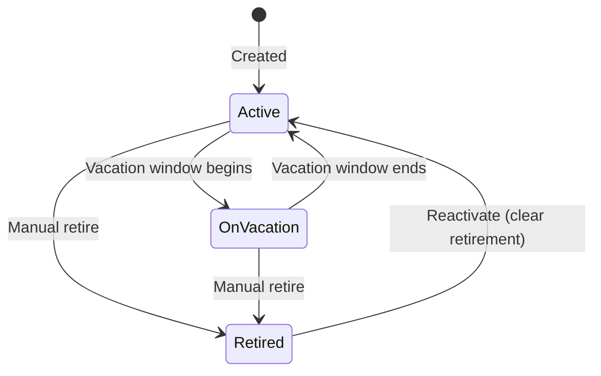

**Active.** Current and carrying routes normally.

**On vacation.** Today falls within the volunteer's vacation window. Their route(s) are Suspended (see the route flow): not delivered for the affected issues, and not reassigned. The volunteer returns to Active automatically when the window ends. Vacation is the one piece of date-driven automation kept in this flow.

**Retired.** Set by a manual Retire action (soft; the record and history are preserved). There is no automatic retirement: an end date passing never moves a volunteer here.

**End date is a planning flag, not a trigger.** A volunteer may carry an optional end date set ahead of time. If it passes while the volunteer is still active, the system raises a "needs attention" flag prompting the manager to retire them; it does not change status on its own. This mirrors the route flow's attention flag.

### 3b. Captain status

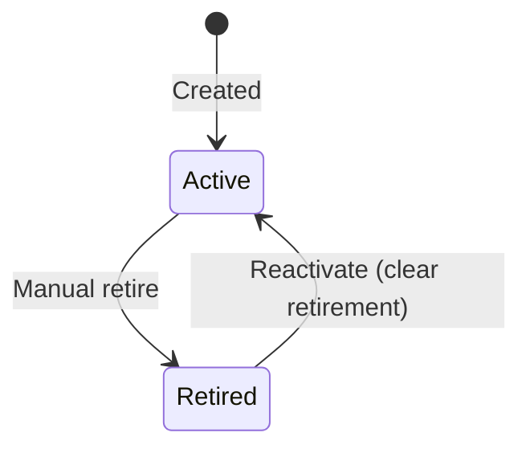

Captains have no vacation state. Retirement is manual; an end date passing only raises a "needs attention" flag, never an auto-retire. Retiring a captain leaves their territory captain-less and prompts a reassignment (see 4k).

---

## 4. Flows

### 4a. Add a volunteer

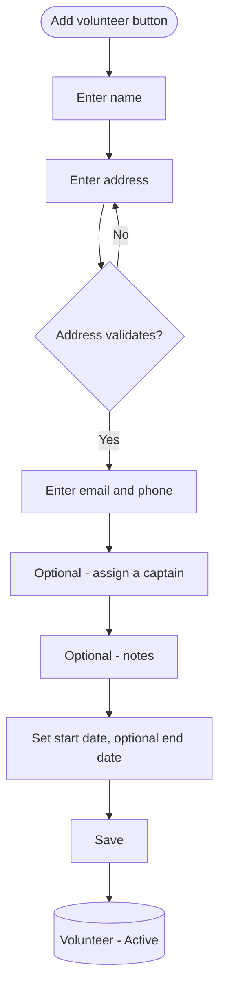

Entry: Add volunteer button on the volunteers list. The address runs through Address Validation, the same as routes; the form holds the manager on the field until it validates. Assigning a captain is optional and places the volunteer in that captain's territory; leaving it empty creates an unassigned volunteer who can be assigned later. Routes are not assigned here; a new volunteer usually starts with none and is matched to nearby vacant routes in the route flow. The volunteer is Active on save.

### 4b. View the volunteers list

Data view, not a state change. Entry: People nav, Volunteers tab.

Columns: name, route(s) carried, assigned captain (and that captain's territory), and status (Active / On vacation / Retired). Controls: search, filter (by captain, territory, status, has-route, needs-attention), CSV export (see 5), and Add volunteer. Surface a "needs attention" flag when a volunteer's end date has passed but they are not yet retired. Default content: active volunteers. Selecting a row opens the detail panel (4c). A multi-select column slot is reserved for future bulk operations (see 6).

### 4c. View volunteer detail

Data view, shown in a right-hand panel. Shows contact info (name, address, email, phone), start date and optional end date, the assigned captain and that captain's territory, the routes carried (read-only, linking into route detail), the vacation window if any, notes, status, and a "needs attention" flag if the end date has passed. Actions: Edit, Put on vacation, Retire.

### 4d. Edit a volunteer

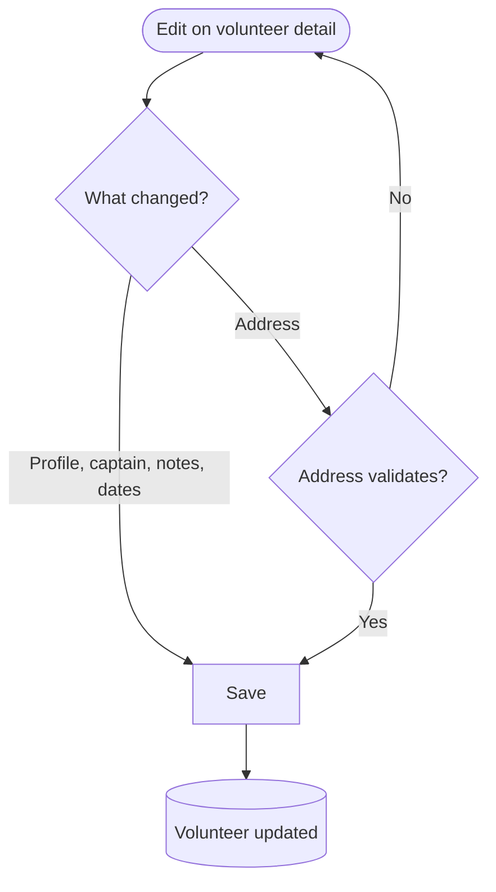

Editable: name, address (re-validates on change), email, phone, notes, assigned captain, start and end dates. Changing the assigned captain moves the volunteer into the new captain's territory immediately (and out of the old one). Clearing the captain leaves the volunteer unassigned. Route assignments are not edited here; they live in the route flow.

### 4e. Put a volunteer on vacation

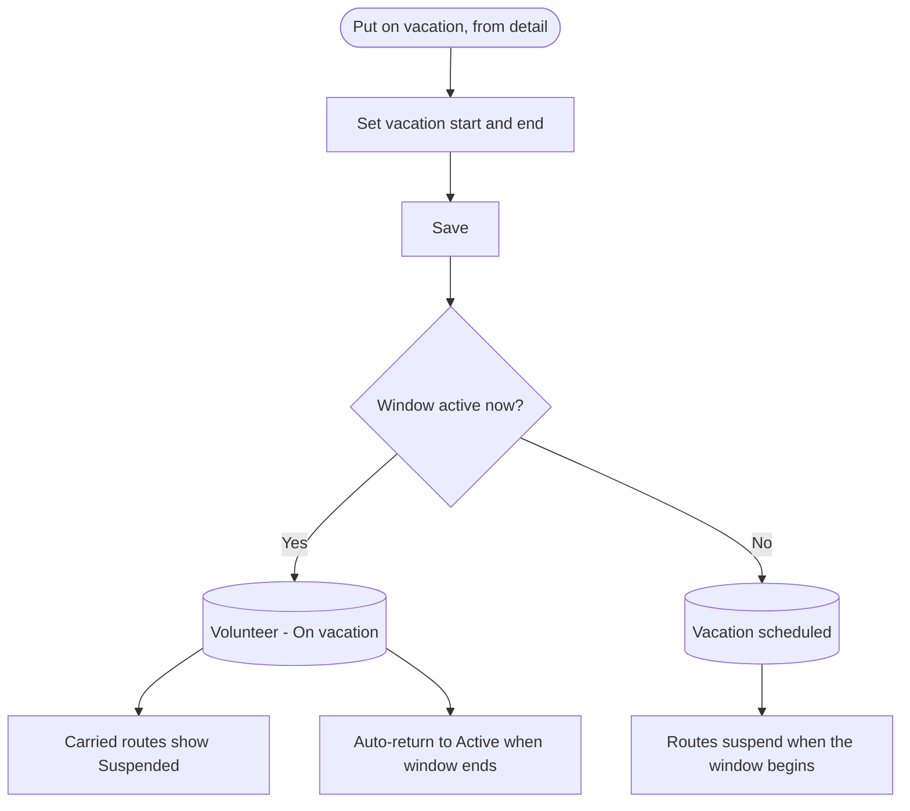

The manager sets a start and end date for the vacation. While today is within the window, the volunteer is On vacation and their route(s) are Suspended: not delivered for the affected issues, and not reassigned. When the window ends, the volunteer returns to Active and the route resumes. Vacation is intentionally the one date-driven automation kept here. The skipped delivery and any pay effect are recorded in the delivery and finances flow, not here. Editing or clearing the window is done the same way.

### 4f. Retire a volunteer (manual)

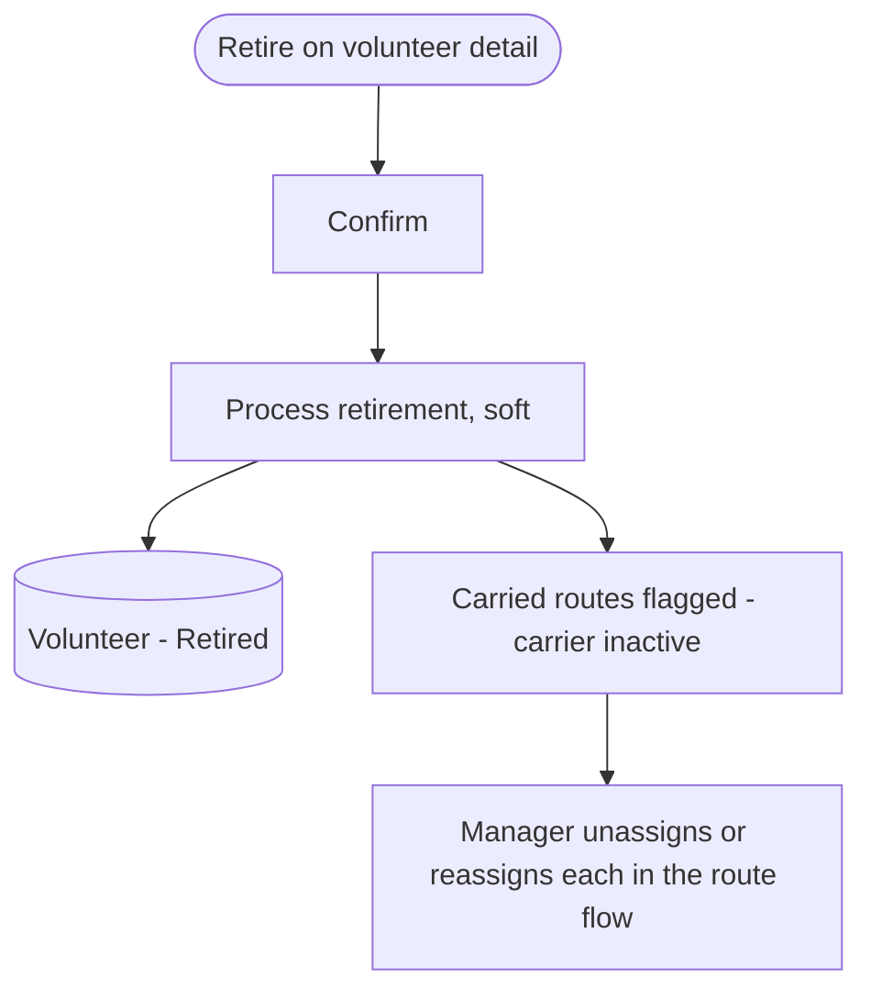

Retirement is a manual action only; there is no automatic retirement when an end date passes. Retiring is soft: the record and all past delivery history are preserved. The carried routes are not auto-vacated; each is flagged "needs attention" (carrier inactive) for the manager to unassign or reassign in the route flow, consistent with that flow's rule that a route only becomes vacant through a deliberate action.

Separately, if a volunteer has a future end date and it passes while they are still active, the system raises the same "needs attention" flag on the volunteer, prompting a manual retire. It does not retire them automatically.

### 4g. Add a captain

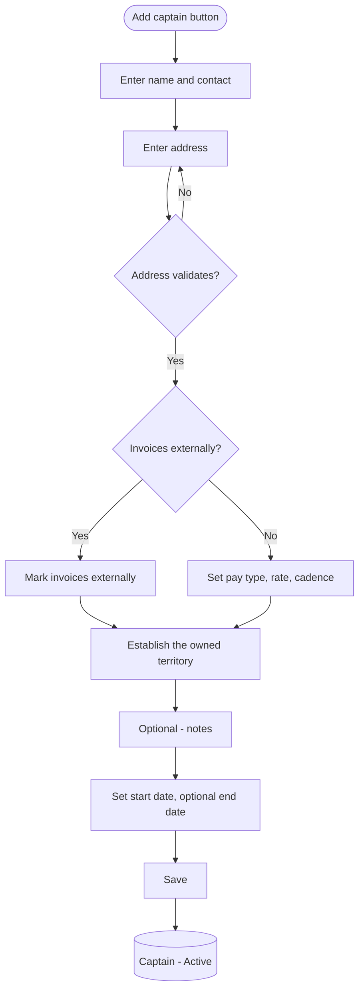

Entry: Add captain button on the captains list. The pay structure (pay type, rate, and cadence) is stored on the captain, so a captain carries one structure across their work. A captain who self-calculates is marked as invoicing externally, and the pay-structure inputs are skipped; the system stores their payouts but does not compute the amounts. Creating a captain establishes the one territory they own; it starts empty and is then filled with assigned volunteers (via captain assignment, 4a and 4d) and commercial drop addresses (4l).

### 4h. View the captains list

Data view. Entry: People nav, Captains tab.

Columns: name, territory, pay type, rate, and cadence, plus status. Controls: search, filter, CSV export, and Add captain. Surface a "needs attention" flag when a captain's end date has passed but they are not yet retired. Selecting a row opens the detail panel (4i).

### 4i. View captain detail

Data view, right-hand panel. Shows contact info, start date and optional end date, the owned territory with its assigned-volunteer list and its commercial drop addresses, the editable pay structure (pay type, rate, cadence, invoices-externally), the reimbursement history (read-only, sourced from the finances flow), notes, status, and a "needs attention" flag if the end date has passed. Actions: Edit, Retire, and Manage commercial drops (4l).

Routes are not shown here as territory contents (routes are not part of a territory); a captain's delivery scope is the volunteers and commercial drops in their territory.

### 4j. Edit a captain

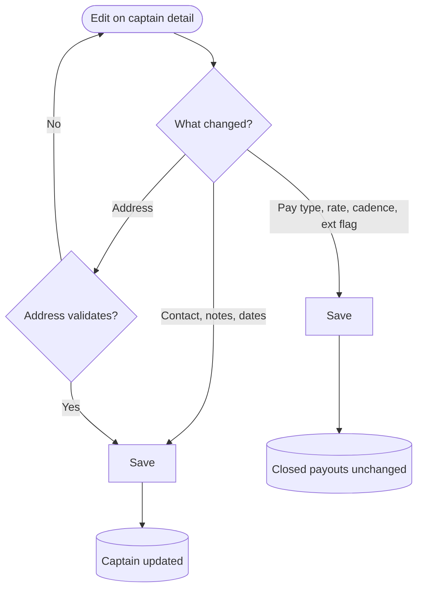

Editable: contact, address (re-validates), pay type, rate, cadence, the invoices-externally flag, and the start and end dates. Changing the pay structure does not change any already-closed payout: closed payouts are frozen snapshots, owned by the finances flow. The territory's contents are managed elsewhere: its volunteer list through volunteer-to-captain assignment (4a, 4d), and its commercial drops through 4l.

### 4k. Retire a captain (manual)

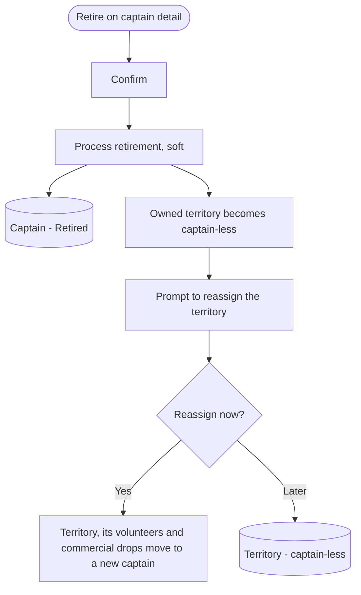

Manual only; there is no automatic retirement when an end date passes. Retiring is soft; history is preserved. The captain's territory, with its volunteers and commercial drops, becomes captain-less, and the manager is prompted to assign a replacement now or later. Until a new captain is set, that territory has no owner and its payouts have no captain. When reassigned, the whole territory moves to the new captain, so every volunteer in it is now under the new captain. A future end date that passes only raises a "needs attention" flag; pay-structure changes never touch closed payouts.

### 4l. Manage a territory's commercial drops

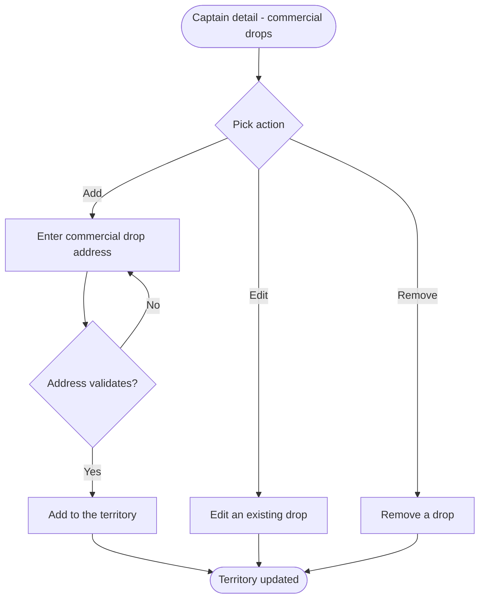

Commercial drops are the non-residential addresses where a captain drops bundles. They are added, edited, validated, and removed within a captain's territory here. Each drop is one validated address belonging to one territory. The territory's volunteer list, by contrast, is managed through volunteer-to-captain assignment (4a, 4d), not here.

---

## 5. CSV export

Both lists export to CSV for offline use and parity with the spreadsheet. The export reflects the current filters and the visible columns: for volunteers, name, address, email, phone, assigned captain, territory, status; for captains, name, contact, territory, pay type, rate, cadence, status. Export is read-only and changes nothing.

---

## 6. Side feature: bulk operations (post-MVP)

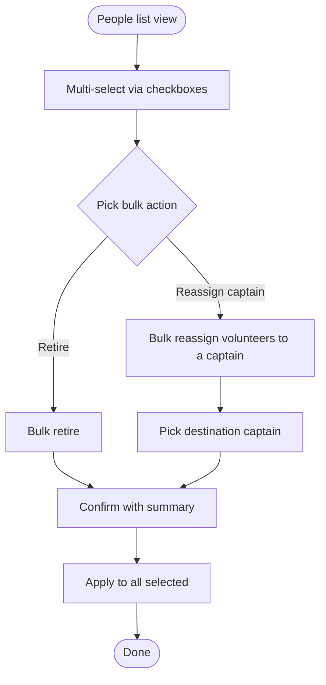

Highest-value bulk actions for later: bulk retire at a season changeover, and bulk-reassigning a set of volunteers to a different captain, which moves them into that captain's territory (for example when a captain leaves or a territory is rebalanced). The initial spreadsheet migration is a one-time developer-side data load, not a UI feature for MVP. As in the route list, reserve the checkbox column slot in the people lists now so these can be added later without a layout rework.

---

## 7. State transition quick reference

**Volunteer.**
- (none) -> Active: created
- Active -> On vacation: vacation window begins (auto); carried routes show Suspended
- On vacation -> Active: vacation window ends (auto); routes resume
- Active or On vacation -> Retired: manual retire only; carried routes are flagged (carrier inactive), not auto-vacated
- Retired -> Active: clear the retirement

**Captain.**
- (none) -> Active: created
- Active -> Retired: manual retire only; owned territory becomes captain-less and prompts reassignment
- Retired -> Active: clear the retirement

Flags (not state changes): a person whose end date has passed while still active is flagged "needs attention," prompting a manual retire. No end date ever retires a person automatically. A volunteer's territory is determined by their assigned captain; changing the captain moves the volunteer between territories.

---

## 8. Edge cases and open questions

- **Address validation fails.** Save is blocked and the manager is held on the address field; no partial record is persisted. Applies to volunteer, captain, and commercial drop addresses.
- **End date passes.** Never auto-retires. It raises a "needs attention" flag on the person; the manager retires manually.
- **Manual retire and routes.** Retiring a volunteer does not auto-vacate their routes; the routes are flagged (carrier inactive) for the manager to unassign or reassign in the route flow. (Confirm this matches the intended route handling.)
- **Captain-less territory.** Allowed as a transient state after a captain retires. The territory keeps its volunteers and commercial drops until a new captain is assigned.
- **Unassigned volunteer.** A volunteer can have no captain, and therefore be in no territory, until the manager assigns one.
- **Vacation.** The one retained date automation: a vacation window auto-suspends the route and auto-resumes after.
- **A person who is both volunteer and captain.** Modeled as two separate records; there is no shared person entity in MVP.
- **No unscoped messaging.** The confirmations, the reassignment prompt, and the "needs attention" flag in these flows are explicit, scoped indicators requested here. Per the product rule, do not add other notifications, badges, or banners unless a spec calls for one.
- **Substitution and volunteer credit.** Substitution is captured on the delivery record (finances and delivery flow), not on the volunteer. The per-volunteer advertising credit is post-MVP and not part of this flow.
