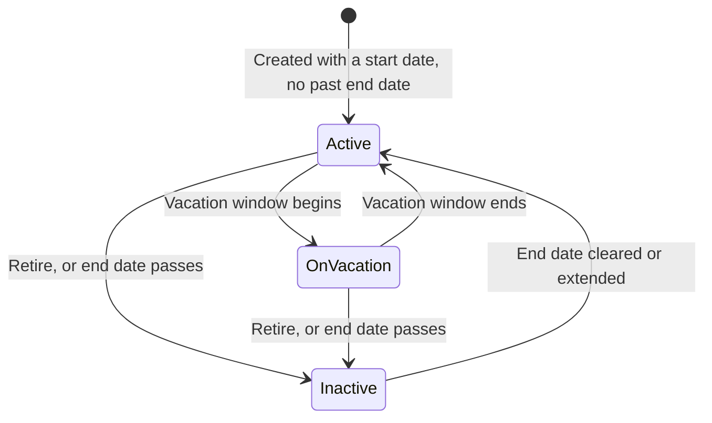
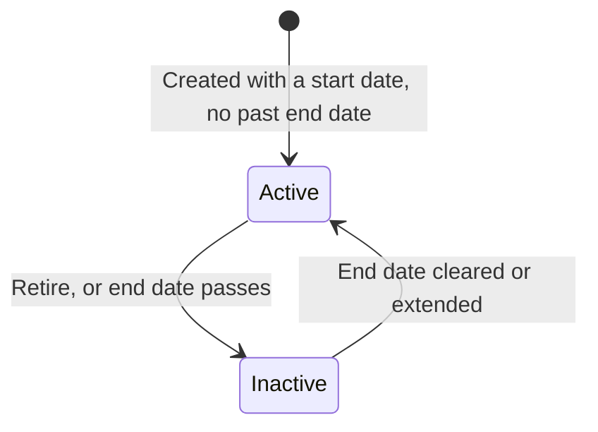
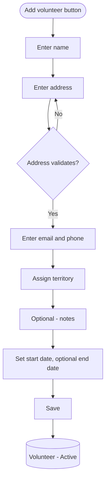
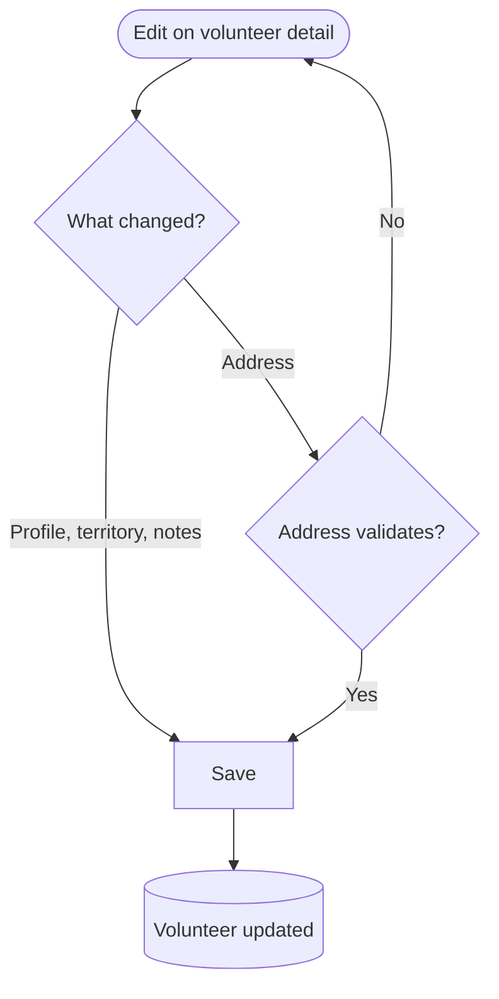
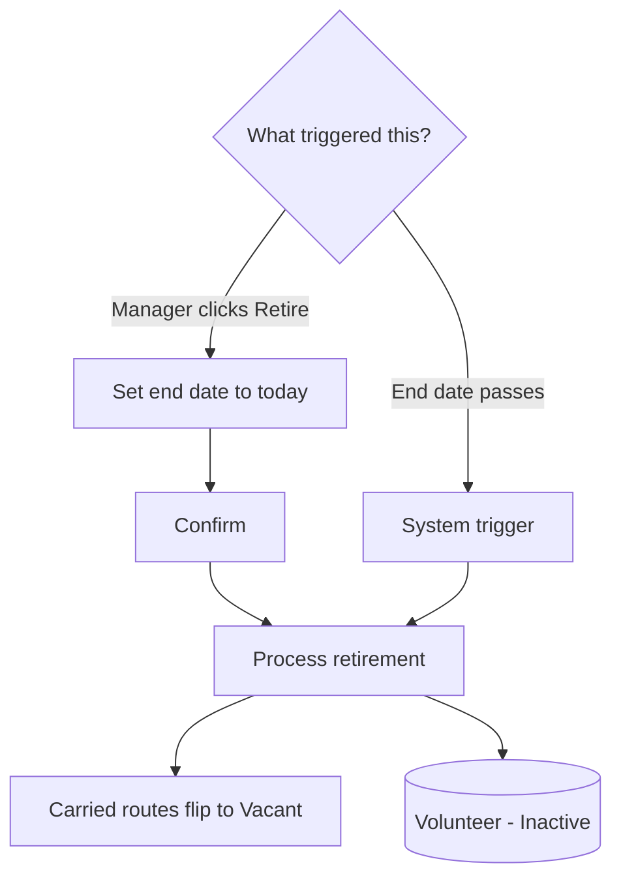
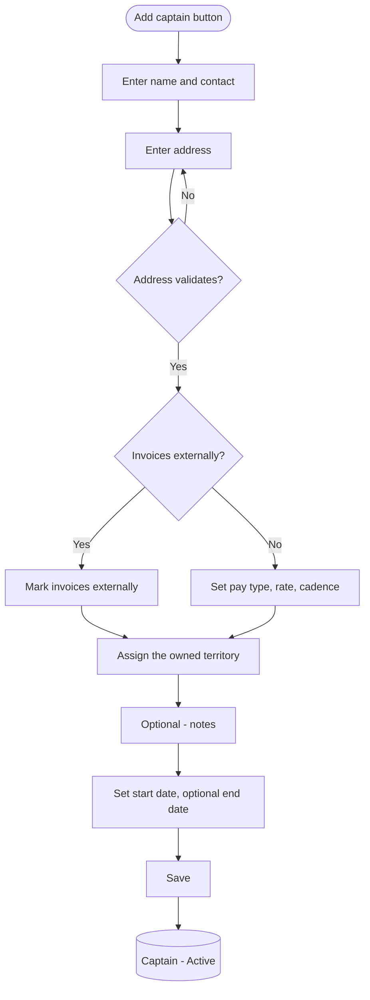
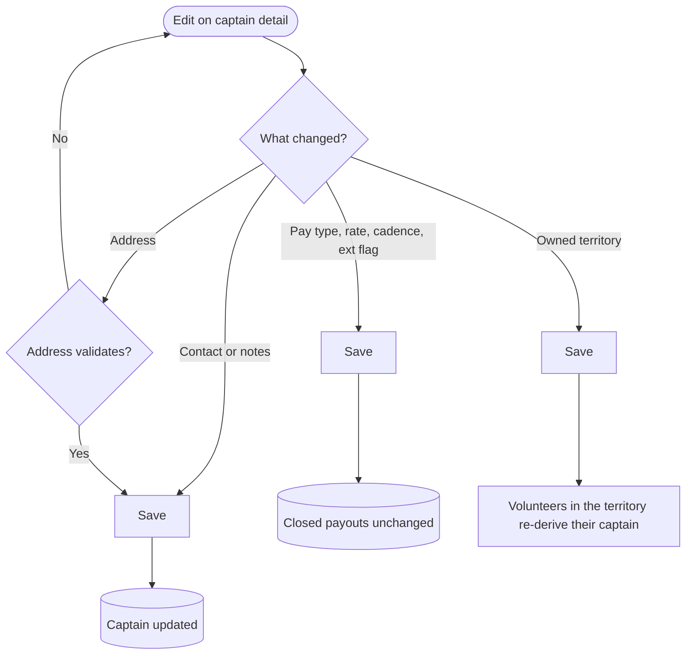
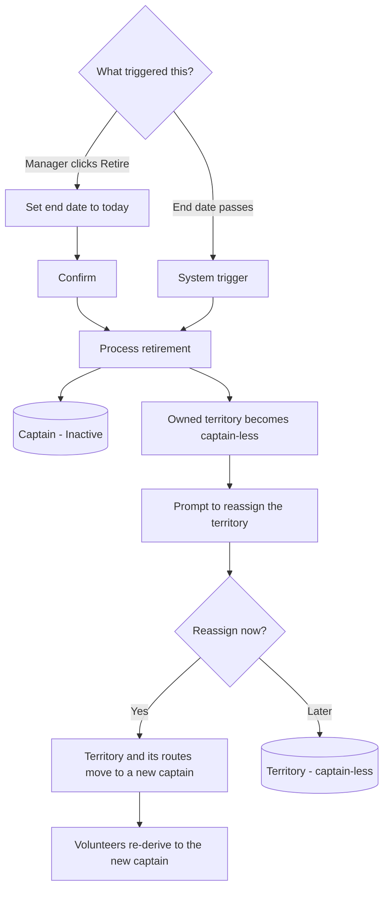
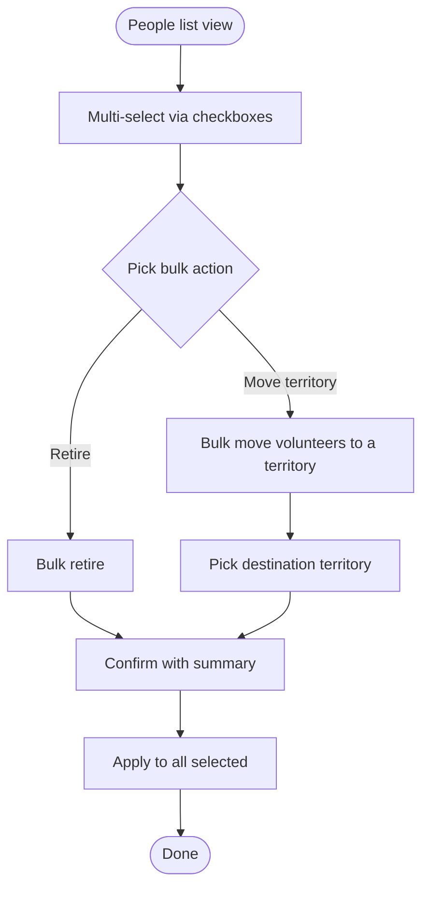

# People Management Flow (v1)

A prose-and-diagram walkthrough of how the distribution manager manages the people in the system: volunteer carriers and captains. Diagrams are Mermaid so they render in Notion, GitHub, and most markdown viewers, and stay editable as text. This reuses the conventions established by `route_management_flow_v2.md` (BM-12); read that first for the diagram legend rationale.

Ticket: BM-24. Scope: volunteer and captain profiles, their lifecycle (add, edit, vacation, retire), and their relationships (volunteer to territory to captain, captain to territory, captain pay structure).

Out of scope here and owned by other flows:
- Route assignment, route definition, and territory create / number / split and the map: route and territory flow (BM-12).
- Payout calculation, the issue lifecycle, and reimbursement amounts: finances flow (BM-25). Reimbursements appear here read-only.
- Admin/staff accounts (the distribution and accounts managers): authentication flow.

---

## 1. Object overview

**Volunteer.** One of roughly 200 carriers who walk routes to deliver papers, often high-school students, so there is a steady churn of people joining and leaving. A volunteer record holds name, a validated address, email, phone, free-form notes, an explicit territory, an optional vacation window, and the routes they currently carry (assigned in the route flow, shown read-only here). Created by the distribution manager only; volunteers do not log in. Status is derived from dates, never stored.

**Captain.** One of the drivers who deliver bundles to volunteer houses and commercial drops. A captain record holds contact info, a validated address, a pay structure (a pay type of per bundle / per paper / per drop, a rate, and a pay cadence), an invoices-externally flag, the one territory they own, free-form notes, and a read-only reimbursement history sourced from the finances flow. Status is derived from dates.

**Territory (referenced here, managed in the route and territory flow).** A territory is an area: a collection of volunteer drop addresses that one captain covers, and it contains many routes. People Management assigns which single territory a captain owns and which territory a volunteer sits in; it does not create, number, or split territories.

**Key relationships.**
- A captain owns exactly one territory; a territory has at most one captain. Both can be temporarily unset during a handoff (see 4k).
- A territory contains many routes and many volunteer drop addresses.
- A volunteer sits in exactly one territory, set explicitly based on where they live. The volunteer's captain is derived from that territory: volunteer -> territory -> captain. This is dynamic: changing the territory's captain, or moving the volunteer to another territory, updates the derived captain everywhere with no manual copy.
- A volunteer carries zero or more routes (assigned in the route flow).
- Retiring a person is a soft action driven by an end date; the record and history are preserved for past issues and payouts.

Status machines: volunteers run Active / On vacation / Inactive; captains run Active / Inactive. Both are derived from dates, unlike a route, which carries two independent machines.

---

## 2. Diagram legend

Same conventions as the route management flow:
- Round / stadium shape = start or end of a flow
- Rectangle = an action or system step
- Diamond = a decision or branch
- Bracketed rectangle = a resulting state of the entity, e.g. `(Volunteer - Active)`

State diagrams use Mermaid stateDiagram-v2; flow diagrams use flowchart TD.

---

## 3. State machines

### 3a. Volunteer status (derived)

**Active.** Current and carrying routes normally.

**On vacation.** Today falls within the volunteer's vacation window. Their route(s) are Suspended (see the route flow): not delivered for the affected issues, and not reassigned to anyone else. The volunteer returns to Active automatically when the window ends.

**Inactive.** Retired: the end date has passed. The record and history are preserved, the volunteer drops out of active lists and pickers, and their routes flip to Vacant.

Status is derived: the machine moves when today crosses a date boundary or the manager edits a date. A retroactive end date or vacation date takes effect on save, not at midnight.

### 3b. Captain status (derived)

Captains have no vacation state. Retiring a captain leaves their territory captain-less and prompts a reassignment (see 4k).

---

## 4. Flows

### 4a. Add a volunteer

Entry: Add volunteer button on the volunteers list. The address runs through Address Validation, the same as routes; the form holds the manager on the field until it validates. Assigning a territory sets the volunteer's captain by derivation. Routes are not assigned here; a new volunteer usually starts with none and is matched to nearby vacant routes in the route flow. The volunteer is Active immediately if the start date is today or earlier and there is no past end date.

### 4b. View the volunteers list

Data view, not a state change. Entry: People nav, Volunteers tab.

Columns: name, route(s) carried, captain (derived from territory), and status (Active / On vacation / Inactive). Controls: search, filter (by territory, captain, status, has-route), CSV export (see 5), and Add volunteer. Default content: active volunteers. Selecting a row opens the detail panel (4c). A multi-select column slot is reserved for future bulk operations (see 6).

### 4c. View volunteer detail

Data view, shown in a right-hand panel. Shows contact info (name, address, email, phone), start date, territory and derived captain, the routes carried (read-only, linking into route detail), the vacation window if any, notes, and derived status. Actions: Edit, Put on vacation, Retire.

### 4d. Edit a volunteer

Editable: name, address (re-validates on change), email, phone, notes, territory, start and end dates. Changing the territory re-derives the captain immediately. Route assignments are not edited here; they live in the route flow, mirroring how the route edit flow does not change the assigned volunteer.

### 4e. Put a volunteer on vacation

The manager sets a start and end date for the vacation. While today is within the window, the volunteer is On vacation and their route(s) are Suspended: not delivered for the affected issues, and not reassigned. When the window ends, the volunteer returns to Active and the route resumes. The skipped delivery and any pay effect are recorded in the delivery and finances flow, not here. Editing or clearing the window is done the same way.

### 4f. Retire a volunteer

Two triggers, mirroring route unassign: the manager retires the volunteer manually (Retire sets the end date to today), or a previously set end date simply passes. On retirement every carried route flips to Vacant and leaves the volunteer's list; the record and all past delivery history are preserved. A confirmation is required because the person leaves active workflows and their routes go vacant. Retirement is soft; there is no hard delete.

### 4g. Add a captain

Entry: Add captain button on the captains list. The pay structure (pay type, rate, and cadence) is stored on the captain, so a captain carries one structure across their work. A captain who self-calculates is marked as invoicing externally, and the pay-structure inputs are skipped; the system stores their payouts but does not compute the amounts. The captain is assigned the one territory they own; territories themselves are created, numbered, and split in the route and territory flow, so this step picks an existing territory, which may currently be captain-less.

### 4h. View the captains list

Data view. Entry: People nav, Captains tab.

Columns: name, territory, pay type, rate, and cadence, plus status. Controls: search, filter, CSV export, and Add captain. Selecting a row opens the detail panel (4i).

### 4i. View captain detail

Data view, right-hand panel. Shows contact info, start date, the owned territory and its managed routes (read-only, via the territory), the editable pay structure (pay type, rate, cadence, invoices-externally), the reimbursement history (read-only, sourced from the finances flow), and notes. Actions: Edit, Retire.

### 4j. Edit a captain

Editable: contact, address (re-validates), pay type, rate, cadence, the invoices-externally flag, the owned territory, and the start and end dates. Changing the pay structure does not change any already-closed payout: closed payouts are frozen snapshots, owned by the finances flow. Changing the owned territory re-derives the captain for every volunteer in that territory.

### 4k. Retire a captain

Two triggers like volunteers: manual retire, or the end date passing. Retiring is allowed even if the territory has not been handed off yet; the territory, with its routes and volunteers, becomes captain-less and the manager is prompted to assign a replacement. Reassignment can happen immediately or later. Until a new captain is set, that territory has no owner and its payouts have no captain. When reassigned, every volunteer in the territory re-derives to the new captain automatically. Retirement is soft; history is preserved, and pay-structure changes never touch closed payouts.

---

## 5. CSV export

Both lists export to CSV for offline use and parity with the spreadsheet. The export reflects the current filters and the visible columns: for volunteers, name, address, email, phone, territory, captain, status; for captains, name, contact, territory, pay type, rate, cadence, status. Export is read-only and changes nothing.

---

## 6. Side feature: bulk operations (post-MVP)

Highest-value bulk actions for later: bulk retire at a season changeover, and bulk-moving a set of volunteers into a different territory (for example when a territory is split). The initial spreadsheet migration is a one-time developer-side data load, not a UI feature for MVP. As in the route list, reserve the checkbox column slot in the people lists now so these can be added later without a layout rework.

---

## 7. State transition quick reference

**Volunteer.**
- (none) -> Active: created with a start date and no past end date
- Active -> On vacation: vacation window begins; carried routes show Suspended
- On vacation -> Active: vacation window ends; routes resume
- Active or On vacation -> Inactive: retire, or end date passes; carried routes flip to Vacant
- Inactive -> Active: end date cleared or extended

**Captain.**
- (none) -> Active: created with a start date and no past end date
- Active -> Inactive: retire, or end date passes; owned territory becomes captain-less and prompts reassignment
- Inactive -> Active: end date cleared or extended

Derived link: a volunteer's captain is recomputed whenever the volunteer's territory, or that territory's captain, changes. There is no hard delete; removal is always a soft retire.

---

## 8. Edge cases and open questions

- **Address validation fails.** Save is blocked and the manager is held on the address field; no partial record is persisted. Same as routes.
- **Retroactive end date or vacation date.** Takes effect on save, not at midnight, so vacancy and active-people views stay accurate.
- **Captain-less territory.** Allowed as a transient state after a captain retires. Volunteers in it have no derived captain until one is assigned; surfacing that is a route and territory concern, handled there.
- **Volunteer territory vs the territory of routes they carry.** Tracked independently and not enforced to match: a volunteer's territory reflects where they live (their drop), which need not equal the territory of a route they happen to carry.
- **Captain absence.** Vacation applies to volunteers only. A captain being temporarily away is out of scope for MVP; revisit if it comes up.
- **A person who is both volunteer and captain.** Modeled as two separate records; there is no shared person entity in MVP.
- **No unscoped messaging.** The confirmations and the reassignment prompt in these flows are explicit, scoped steps. Per the product rule, do not add other notifications, badges, or banners (for example a freshness or mismatch flag) unless a spec calls for one.
- **Substitution and volunteer credit.** Substitution is captured on the delivery record (finances and delivery flow), not on the volunteer. The per-volunteer advertising credit is post-MVP and not part of this flow.
