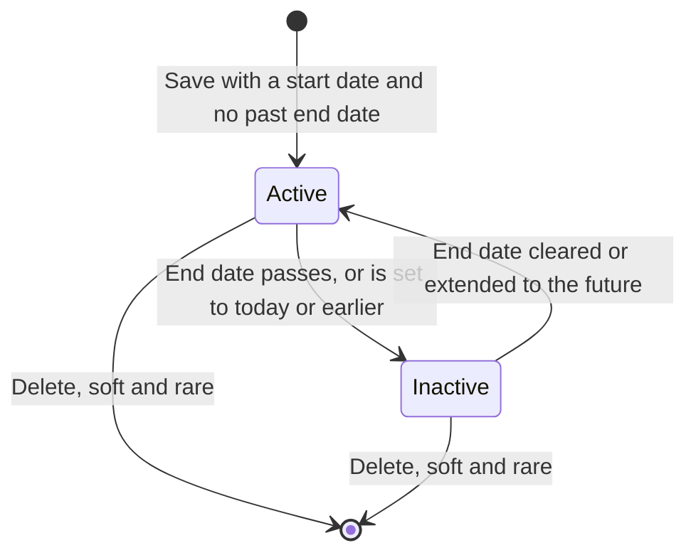
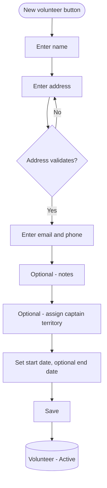
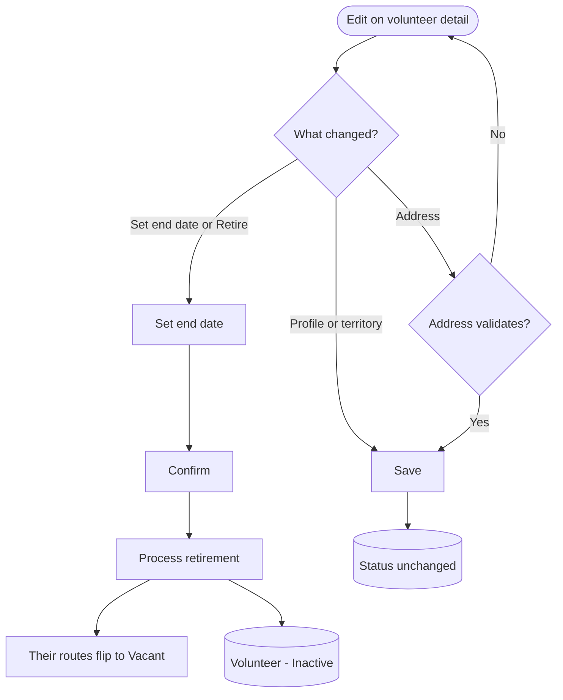
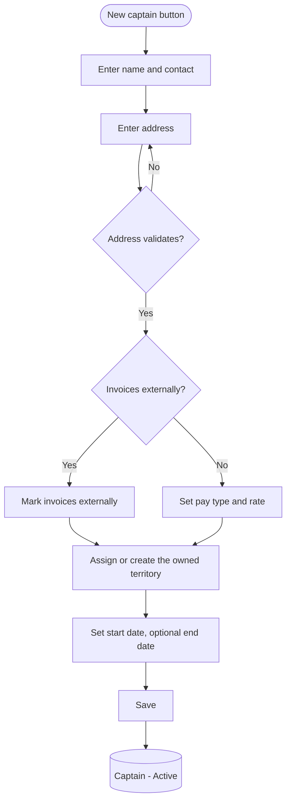
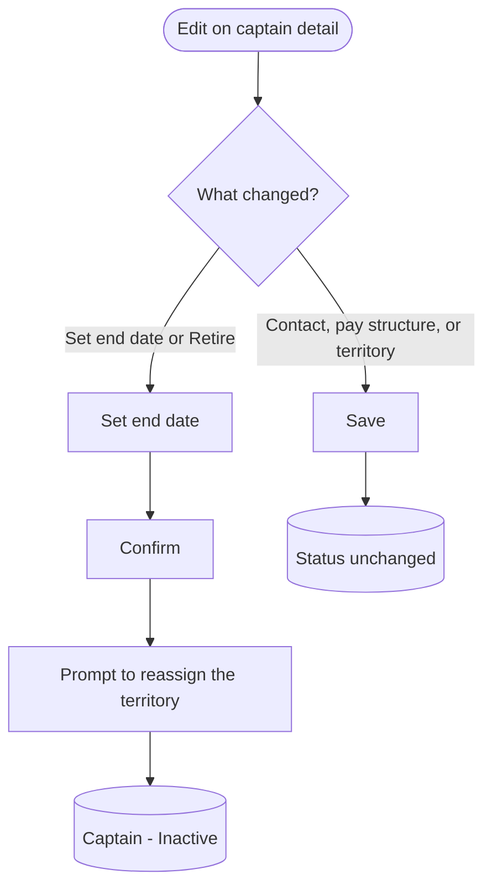
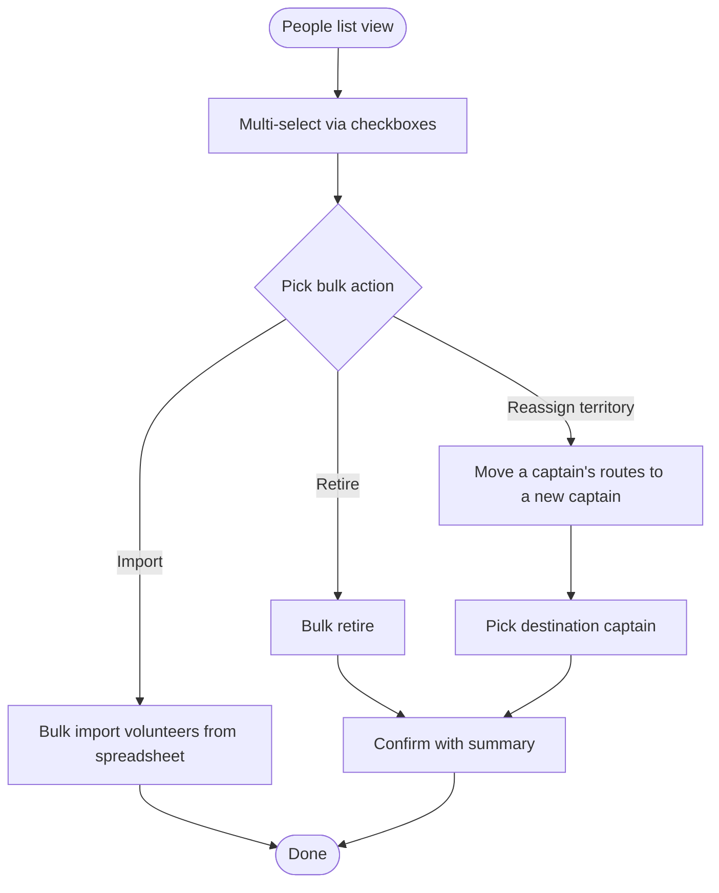

# People Management Flow (v1)

A prose-and-diagram walkthrough of how the distribution manager manages the people in the system: volunteer carriers and captains. Diagrams are Mermaid so they render in Notion, GitHub, and most markdown viewers, and stay editable as text. This reuses the conventions established by `route_management_flow_v2.md` (BM-12); read that first for the diagram legend rationale.

Ticket: BM-24. Scope: volunteer and captain profiles, their lifecycle (add, edit, retire), and their relationships (volunteer to route, volunteer to territory, captain to territory, captain pay structure). Out of scope here: route assignment mechanics (see the route management flow), captain payout calculation and issue close (see the finances flow, BM-25), and admin/staff account management.

---

## 1. Object overview

**Volunteer.** One of roughly 200 carriers who walk routes to deliver papers. Often high-school students, so there is a steady churn of people joining and leaving. A volunteer record holds name, a validated address, email, phone, free-form notes, the routes they currently carry, and an optional captain territory. Created by the distribution manager only; volunteers do not log in. Active vs inactive is derived from a start date and an optional end date, never stored as a field.

**Captain.** One of the (currently four) drivers who deliver bundles to volunteer houses and commercial drops. A captain record holds contact info, a validated address, a pay structure (a pay type of per bundle, per paper, or per drop, plus a rate), the territory they own, and a payout history. A captain may instead be marked as invoicing externally, in which case the system stores their payouts for completeness but does not compute the amounts. Active vs inactive is derived from start and end dates, the same as volunteers.

**Key relationships.**
- A volunteer may belong to one captain territory (optional). When unset, the volunteer is unaffiliated and does not appear in that territory's rollups.
- A volunteer carries zero or more routes. The route is the thing assigned; assignment is performed in the route management flow, and is reflected read-only on the volunteer profile.
- A captain owns one territory. The territory contains routes, and delivery of those routes is what the captain is paid for.
- Retiring a person is a soft action driven by the end date; the record and its history are preserved for past issues and payouts.

Each person runs a single status machine (Active, Inactive) derived from dates. This is simpler than a route, which carries two independent machines.

---

## 2. Diagram legend

Same conventions as the route management flow:
- Round / stadium shape = start or end of a flow
- Rectangle = an action or system step
- Diamond = a decision or branch
- Bracketed rectangle = a resulting state of the entity, e.g. `(Volunteer - Active)`

State diagrams use Mermaid stateDiagram-v2; flow diagrams use flowchart TD.

---

## 3. Status state machine

Volunteers and captains share the same derived status machine. The diagram shows a volunteer; a captain is identical.

**Active.** The person is current. A volunteer can carry routes; a captain can own a territory and earn payouts. This is the steady state for the people doing the work.

**Inactive.** The person has an end date that has passed. They keep their record and history but drop out of active lists, assignment pickers, and rollups. For a volunteer, becoming inactive releases their routes (see 4d).

Status is derived, not stored: the machine "transitions" when today crosses a date boundary, or when the manager edits a date. Like routes, a retroactive end date takes effect on save, not at midnight.

---

## 4. Flows

### 4a. Add a volunteer

Entry: New volunteer button on the volunteers list. The address runs through the same Address Validation step as routes; the form holds the manager on the field until it validates. Routes are not assigned here; a new volunteer typically starts unassigned and is matched to nearby vacant routes in the route management flow. Territory is optional and can be set later via Edit. The volunteer is Active immediately if the start date is today or earlier and there is no past end date.

### 4b. View the volunteers list

Data view, not a state change. Entry: top-level People nav.

Default content: active volunteers. Per row, surface enough to triage: name, contact, territory or captain, number of routes carried, status, and start date. Filters: territory, status, captain, has routes vs unassigned. Sort: name, territory, route count, start date. A multi-select column is reserved for future bulk operations (see 6).

### 4c. View volunteer detail

Data view. Shows the profile (name, address, email, phone, notes), the territory and captain, the routes currently carried (a read-only list linking into route detail), and derived status with the start and end dates. Actions: Edit, Retire, and a link into the route management flow to assign or change routes.

### 4d. Edit and retire a volunteer

Editable: name, address (re-validates on change), email, phone, notes, territory, start and end dates. Route assignments are not edited here; they are managed in the route management flow, mirroring how the route edit flow does not change the assigned volunteer.

Retiring is the same as setting an end date. There are two triggers, mirroring route unassign: the manager retires the person manually (Retire sets the end date to today), or a previously set end date simply passes. On retirement, every route the volunteer carried flips to Vacant and is removed from their route list; the volunteer record and all past delivery history are preserved. A confirmation step is required because the person leaves active workflows and their routes go vacant.

### 4e. Add a captain

Entry: New captain button on the captains list. The pay structure (pay type plus rate) is stored on the captain, not the territory, so a captain carries one rate across their work. A captain who self-calculates is marked as invoicing externally, and the pay type and rate inputs are skipped. The captain owns one territory; it can be created during this flow or an existing unowned territory can be picked.

### 4f. Edit and retire a captain

Editable: contact, address (re-validates), pay type, rate, the invoices-externally flag, the owned territory, and the start and end dates. Changing the rate or pay type does not change any already-closed payout: closed payouts are frozen snapshots (see the finances flow).

Retiring a captain marks them inactive. Their territory and the routes inside it do not disappear, but they now have no active captain, so the manager is prompted to reassign the territory to another captain. Until reassigned, payouts for that territory have no owner. Bulk reassignment of a departing captain's routes is a post-MVP convenience (see 6); for MVP this is a manual reassignment.

---

## 5. Address and validation

Volunteer and captain addresses use the same Address Validation step as routes. A failed validation blocks the save and holds the manager on the address field. A validated address yields the canonical place reference used elsewhere, for example proximity matching of new volunteers to nearby vacant routes in the route management flow. Editing an address re-validates it.

---

## 6. Side feature: bulk operations (post-MVP)

The highest-value bulk actions: a one-time bulk import of volunteers during the spreadsheet migration, bulk retire at a season changeover, and moving a departing captain's territory and routes to a replacement in one step. As in the route list, design the people list with the checkbox column slot reserved so these can be added later without a layout rework.

---

## 7. State transition quick reference

Volunteers and captains share the same status transitions.

- (none) -> Active: saved with a start date and no past end date
- Active -> Inactive: end date passes, or is set to today or earlier
- Inactive -> Active: end date cleared or extended to the future
- Active or Inactive -> (none): delete (soft, rare)

Side effects:
- Volunteer Active -> Inactive flips all carried routes to Vacant.
- Captain Active -> Inactive leaves the territory ownerless and prompts a reassignment.

---

## 8. Edge cases and open questions

- **Address validation fails.** Save is blocked; the manager is held on the address field with the validation message. No partial record is persisted.
- **Retroactive end date.** Status flips on save, not at midnight, so vacant-route and active-people views stay accurate. This matches the route flow's unassign behavior.
- **Retiring a volunteer mid-issue.** Their routes go vacant immediately, but any delivery already recorded against a closed or in-progress issue is preserved; delivery history is not rewritten.
- **Captain owns one territory vs many.** Drafted here as one territory per captain, per the current PRD. Source material also describes a captain temporarily covering a departed captain's territory. For MVP this is handled by reassigning the territory rather than letting one captain own several. Confirm the intended model with the client. (Open question, BM-24.)
- **Duplicate people.** No hard uniqueness on name or address; people move, leave, and rejoin, and the same address can host more than one volunteer. Soft-match warnings are out of scope for MVP.
- **Substitution.** When someone other than the assigned volunteer delivers a route, that is captured on the delivery record, not on the volunteer profile. It belongs to the finances and delivery flow, not people management.
- **Volunteer credit ledger.** The per-volunteer advertising credit is post-MVP and is not part of this flow.
