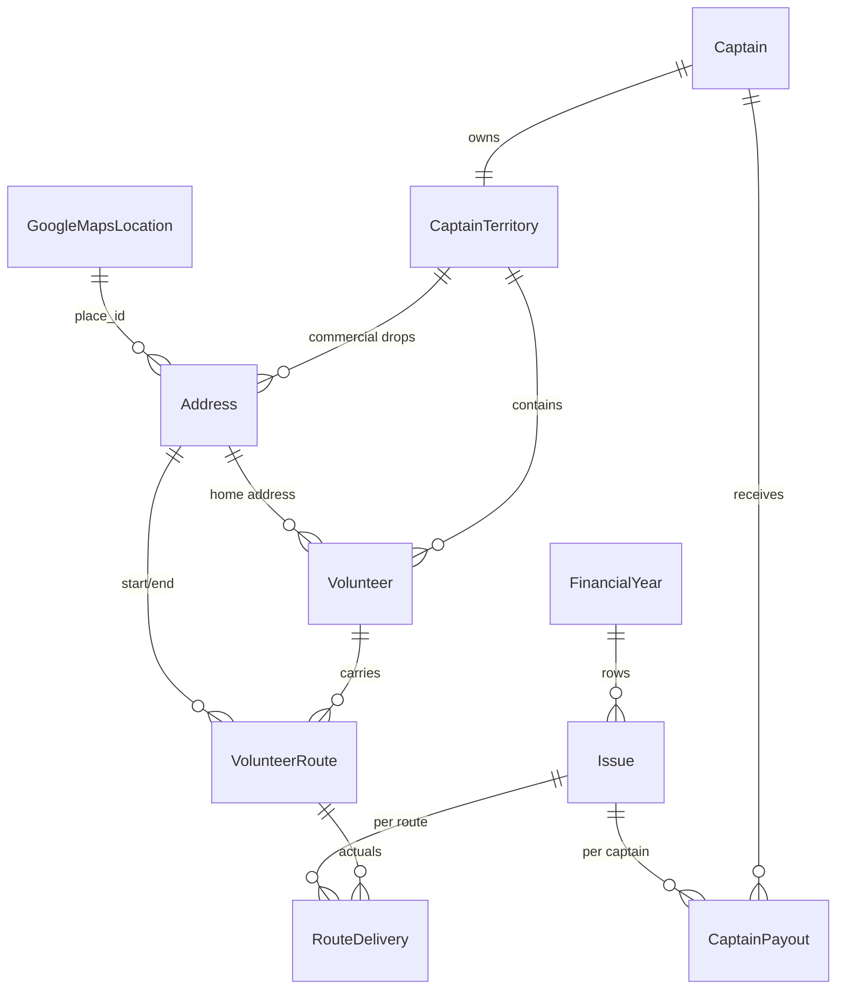

# Data Model (Schema) — Source of Truth

Consolidated TypeScript interfaces for every backend entity, reconciled against the
five flow specs in `docs/flows/`.

Read alongside: the flow specs in [`docs/flows/`](../flows/), the Google Maps
research in [`docs/integrations/google_maps_research.md`](../integrations/google_maps_research.md),
and the living decision log in [`../design_decisions.md`](../design_decisions.md).

## Conventions

- Every entity primary key is a **UUID**, except `GoogleMapsLocation`, whose key is
  Google's `place_id` (see the Google research doc, §1.3–1.4).
- Foreign keys reference another interface via `Entity["id"]` (e.g. `Volunteer["id"]`)
  rather than embedding the object.
- **One-to-many is stored on the child** (the "many" side holds the FK); parents do
  not carry id arrays. This matches the Postgres target (a column with a foreign key,
  not a `uuid[]`) and keeps a single source of truth. The inverse is derived (e.g. a
  captain's territory's volunteers = the Volunteers whose `captainTerritoryId` points
  to it).
- **Optional FK** (`?: ... | null`) means the relationship can be absent (e.g. a
  vacant route has no assigned volunteer).
- **Derived** fields are computed at runtime and not stored; they are described in
  comments, not declared.
- `SUBJECT TO CHANGE` marks fields we have explicitly flagged as not finalized.
- `PLACEHOLDER` marks shapes we have not figured out yet.
- Status enums match the state machines in the flow docs.

---

## 1. Shared primitives & value types

```ts
export type UUID = string;
export type Timestamp = string; // ISO-8601 datetime, e.g. "2026-05-28T04:28:41.329Z"
export type DateOnly = string; // ISO-8601 date, e.g. "2026-05-28"
export type Email = string;
export type Url = string;
export type Phone = string;

// Google place_id (durable identifier; see Google research doc §1.3).
export type PlaceId = string;

// Spelled-out compass sides; "BOTH" added per the PRD (N / S / E / W / Both).
export type RouteSide = "NORTH" | "SOUTH" | "EAST" | "WEST" | "BOTH";

// Captain pay configuration.
export type PayType = "bundle" | "paper" | "drop";
export type PayCadence = "weekly" | "biweekly"; // informational; payouts not aggregated

// AdminUser role. SUBJECT TO CHANGE (the whole role concept is not finalized).
export type AdminRole = "distribution manager" | "accounts manager";

// Issue lifecycle (shared by finance + delivery). See finance flow §3a.
export type IssueStatus = "open" | "closed";

// Geocode confidence, from Geocoding geometry.location_type.
export type LocationType =
  | "ROOFTOP"
  | "RANGE_INTERPOLATED"
  | "GEOMETRIC_CENTER"
  | "APPROXIMATE";
```

---

## 2. External / Google shapes

### GoogleMapsLocation

The cached result of geocoding an address. The `id` is Google's `place_id`
(storable indefinitely); the `cached*` lat/lng fields are a 30-day TTL cache per
Google's ToS. Full rationale in the Google research doc, §1.3–1.4.

```ts
export interface GoogleMapsLocation {
  id: PlaceId; // Google place_id — durable, our join key from Address.googleMapsId
  // Short-term cache (refresh within 30 days; re-resolve via Geocoding when stale).
  cachedLatitude?: number | null;
  cachedLongitude?: number | null;
  cachedFormattedAddress?: string | null;
  cachedAt?: Timestamp | null;
  // Structured components extracted from address_components at fetch time.
  streetNumber?: string | null;
  streetName?: string | null; // the "route" component
  locality?: string | null; // city
  sublocality?: string | null; // neighbourhood
  administrativeArea?: string | null; // province
  postalCode?: string | null;
  countryCode?: string | null;
  locationType?: LocationType | null;
}
```

### Address

A residential or commercial address used by volunteers, route endpoints, and
commercial drops. Links to its Google record by `place_id`.

```ts
export interface Address {
  id: UUID;
  googleMapsId: GoogleMapsLocation["id"]; // a place_id
  type: "residential" | "commercial";
  // Commercial drops belong to one territory; set only when type === "commercial".
  // (This is the inverse FK that makes a territory's commercial drops queryable.)
  territoryId?: CaptainTerritory["id"] | null;
  // (ideation's `bundleCount` removed — per-issue bundle counts live on RouteDelivery)
  // SUBJECT TO CHANGE: standing per-drop expectations for commercial drops may need a home.
}
```

---

## 3. People domain

### AdminUser

```ts
export interface AdminUser {
  id: UUID;
  firstName: string;
  lastName: string;
  email: Email;
  passwordHash: string; // SUBJECT TO CHANGE — auth likely handled by Supabase Auth, not stored here
  role: AdminRole; // SUBJECT TO CHANGE
}
```

> Notes are a plain free-form `notes?: string` field on the entities that have them
> (Volunteer, Captain, VolunteerRoute) — not a separate entity. The flows only ask
> for free-form notes with no length limit; author/timestamp tracking was dropped as
> unneeded for MVP.

### Volunteer

Status (Active / On vacation / Retired) is **derived**, not stored:
`retiredAt` set → Retired; today within `[vacationStart, vacationEnd]` → On vacation;
otherwise Active. An end date passing never retires — it only raises an attention flag.

```ts
export interface Volunteer {
  id: UUID;
  firstName: string;
  lastName: string;
  email: Email;
  phone: Phone;
  addressId: Address["id"]; // volunteer's own (residential) address
  notes?: string | null;
  captainTerritoryId?: CaptainTerritory["id"] | null; // direct assignment; may be unassigned
  // Routes carried = VolunteerRoutes whose assignedVolunteerId points here (inverse FK).
  startDate: DateOnly;
  endDate?: DateOnly | null;
  // Vacation window — the one date-driven automation (auto-suspends routes, auto-resumes).
  vacationStart?: DateOnly | null;
  vacationEnd?: DateOnly | null;
  // Manual (soft) retirement; retiring detaches routes (they become vacant).
  retiredAt?: DateOnly | null;
  // (ideation's `LuckyVolunteerDate` dropped — post-MVP volunteer advertising credit.)
}
```

### Captain

No address. Pay config lives here. Status (Active / Retired) is derived from
`retiredAt`; captains have no vacation state — absences are handled by reallocating
the issue's payout to another captain (finance flow §4g).

```ts
export interface Captain {
  id: UUID;
  firstName: string;
  lastName: string;
  email: Email;
  phone: Phone;
  // Pay config (on the captain, not the route/territory):
  payType: PayType;
  payRate: number; // a zero rate is valid; counts still tracked, payout is zero
  payCadence: PayCadence;
  startDate: DateOnly;
  endDate?: DateOnly | null;
  retiredAt?: DateOnly | null;
  notes?: string | null;
  // 1:1 territory: the CaptainTerritory whose assignedCaptainId points here (inverse FK).
  // Territory-less captain = no territory points here; captain-less territory is also allowed.
}
```

### CaptainTerritory

A captain's territory = its assigned volunteers + its commercial drop addresses.
Both attach via inverse FKs, so neither is duplicated as an array here: volunteers
via `Volunteer.captainTerritoryId`, commercial drops via `Address.territoryId`.

```ts
export interface CaptainTerritory {
  id: UUID;
  assignedCaptainId?: Captain["id"] | null; // captain-less transient allowed (after retire)
  color?: string | null; // SUBJECT TO CHANGE — map colour assignment
  // Volunteers = Volunteers whose captainTerritoryId points here.
  // Commercial drops = Addresses (type "commercial") whose territoryId points here.
}
```

---

## 4. Routes domain

### RouteBundle (value type)

A single bundle within a delivery, identified only by its paper count. Bundle paper
counts are stored individually — **embedded** on the `RouteDelivery` (a JSONB array,
not a separate child table) — and never assumed to be 25 or 50 (finance flow §5).

```ts
export interface RouteBundle {
  papers: number; // papers in this one bundle (e.g. 50, 25, or a remainder)
}
```

### VolunteerRoute

The street segment a volunteer walks. The captain link is **indirect** (through the
assigned volunteer); there is no `territoryId` on the route. Lifecycle
(Active-Vacant / Active-Assigned) is derived from `assignedVolunteerId`; "suspended"
is a derived flag when the assigned volunteer is on vacation (route flow §3a).

```ts
export interface VolunteerRoute {
  id: UUID;
  // Geography
  startAddressId: Address["id"];
  endAddressId: Address["id"];
  streetName: string;
  side?: RouteSide;
  // Assignment — optional; a vacant route has no volunteer.
  assignedVolunteerId?: Volunteer["id"] | null;
  // Counts
  houseCount: number; // manual entry for MVP (auto-calc via Toronto Open Data is post-MVP)
  houseCountOverride?: number | null; // SUBJECT TO CHANGE: only relevant once auto-calc exists
  papers: number; // standing paper count; drives the bundle auto-calc
  notes?: string | null;
  deletedAt?: Timestamp | null; // soft delete: hidden from views, row retained so past RouteDelivery still resolves
  // No territoryId: territory/captain derive via assignedVolunteerId -> captainTerritoryId.
}
```

---

## 5. Finance domain

Replaces the ideation `Reimbursement`. See the finance flow for the full state
machines and calculations.

### FinancialYear

```ts
export interface FinancialYear {
  id: UUID;
  name: string; // e.g. "2026–2027" (runs ~March–Feb, not calendar-locked)
  archived: boolean; // archived tables stay fully accessible
  // Issues (rows) = Issues whose financialYearId points here (inverse FK).
  // Columns auto-populate for captains active at creation.
  // SUBJECT TO CHANGE: whether the captain column set is snapshotted or derived live.
}
```

### Issue

One publication run; shared with the delivery flow. Open → Closed; closing
freezes payout values and delivery actuals together.

```ts
export interface Issue {
  id: UUID;
  financialYearId: FinancialYear["id"];
  name: string; // manual label, e.g. "June 9" or "I01-26"
  date: DateOnly; // manual
  status: IssueStatus; // shared open/close governs finance + delivery
}
```

### CaptainPayout

One cell per captain per issue. The effective amount is
`overrideAmount ?? calculatedAmount`, frozen when the issue closes. Payment is a
separate marker, only toggleable once the issue is closed.

```ts
export interface CaptainPayout {
  id: UUID;
  issueId: Issue["id"];
  captainId: Captain["id"]; // the captain receiving this payout
  // Calculation status is derived: overrideAmount present => "overridden", else "calculated".
  calculatedAmount: number; // auto from pay config + delivery rollup (while open)
  overrideAmount?: number | null; // manual override
  overrideReason?: string | null; // required when overridden; no audit of prior values
  // Payment (separate from calculation; only toggleable once the issue is Closed).
  paid: boolean;
  paidAt?: DateOnly | null;
}
```

---

## 6. Delivery domain

### RouteDelivery

One record per route per issue, the input the payout math consumes. Auto-seeded
from the route's standing counts when the issue is created; **actuals only** (no
stored planned baseline). Editability is derived from the issue status (Editable →
Locked). Vacant and suspended routes are skipped (no row). See the delivery flow.

```ts
export interface RouteDelivery {
  id: UUID;
  issueId: Issue["id"];
  routeId: VolunteerRoute["id"];
  paperCount: number;
  // Per-bundle paper counts (embedded JSONB, not a child table). Seeded by the
  // greedy split of paperCount and hand-editable; the source of truth for the
  // breakdown. `bundleCount` is DERIVED = bundles.length (not stored separately).
  // Invariant: sum(bundles[].papers) === paperCount. Editing paperCount reseeds the
  // split unless the bundles were set manually.
  bundles: RouteBundle[];
  dropCount: number;
  missedCount: number; // in the unit matching the route's captain pay type
}
```

---

## 7. Relationships (ERD)



Key chains:

- **Pay attribution:** `RouteDelivery` → `VolunteerRoute` → `Volunteer` →
  `CaptainTerritory` → `Captain` → `CaptainPayout`. The captain link is always
  indirect through the volunteer.
- **Issue lifecycle:** one `Issue` drives both `CaptainPayout` (finance) and
  `RouteDelivery` (delivery); a single close freezes both.
- **Territory:** 1:1 `Captain` ↔ `CaptainTerritory`; volunteers attach via the
  inverse FK; commercial drops are addresses held on the territory.

---

## 8. Deferred / open items

- **`VolunteerInstruction` (PLACEHOLDER, deferred).** The ideation board had a
  bundle-instruction shape; it belongs to the not-yet-specced Label Printing flow
  (PRD Flow 6). Defer until that flow is written.
- **Auth (`AdminUser.passwordHash`, `role`).** Likely handled by Supabase Auth; the
  stored shape and the role model are SUBJECT TO CHANGE.
- **Commercial-drop standing counts.** Per-drop expectations for commercial drops
  may need a field or a small per-drop record; not modeled yet.
- **House count.** Manual entry for MVP; auto-calc (Toronto Open Data + PostGIS) and
  the `houseCountOverride` it implies are post-MVP.
- **Territory column snapshotting.** Whether a `FinancialYear`'s captain columns are
  snapshotted at creation or derived live.
- **Post-MVP:** volunteer advertising credit ("lucky volunteer"), the reporting
  dashboard's derived aggregates, and the papers-to-order spare allowance.
